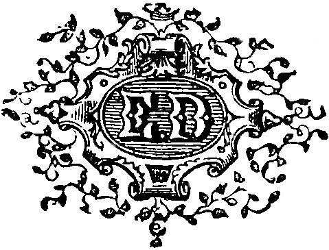

<h1 id="cover" align="center"  style="font-weight: 100; border: none;">
  LE 
  DOSSIER 
  N° 113 
  PAR 
  ÉMILE GABORIAU
</h1>

  

  PARIS 
  E. DENTU, ÉDITEUR 
  LIBRAIRE DE LA SOCIÉTÉ DES GENS DE LETTRES 
  PALAIS-ROYAL, 17 ET 19, GALERIE D’ORLÉANS 
  — 
  1867 
  Tous droits réservés

* * *

  À MON AMI 
  MAURICE DE LA MAIN

* * *

<h2 id="I" align="center" style="font-weight: 100; border: none; font-size: 2em;">
  I
</h2>

On lisait dans tous les journaux du soir du mardi 28 février 186., le _fait divers_ suivant:

« Un vol très-considérable, commis au préjudice d’un honorable banquier de la capitale, M. André Fauvel, a mis ce matin en émoi tout le quartier de la rue de Provence. Des malfaiteurs d’une audace et d’une habileté extraordinaires ont réussi à pénétrer dans les bureaux, et là, forçant une caisse qu’on avait tout lieu de croire inattaquable, ils se sont emparés de la somme énorme de 350,000 francs en billets de banque. »

« La police, aussitôt prévenue, a déployé son zèle accoutumé, et ses investigations ont été couronnées de succès. Déjà, dit-on, un employé de la maison, le sieur P. B., est arrêté; tout fait espérer que ses complices seront bientôt sous la main de la justice. »

Quatre jours durant, Paris entier ne s’occupa que de ce vol.

Puis, de graves événements survinrent, un acrobate se cassa la jambe au Cirque, une demoiselle débuta sur

  3

* * *

un petit théâtre, et le fait divers du 28 février fut oublié.

Mais les journaux, pour cette fois, avaient été, — peut-être à dessein, — mal ou du moins inexactement renseignés.

Une somme de 350,000 francs avait été, il est vrai, soustraite chez M. André Fauvel, mais non de la façon indiquée. Un employé, en effet, avait été arrêté provisoirement, mais on n’avait recueilli contre lui aucune charge décisive. Ce vol, d’une importance insolite, restait sinon inexplicable, du moins inexpliqué.

Au surplus, voici les faits, tels qu’ils se trouvent relatés avec une exactitude méticuleuse aux procès-verbaux d’enquête.

<h2 id="II" align="center" style="font-weight: 100; border: none; font-size: 2em;">
  II
</h2>

La maison de banque André Fauvel, rue de Provence, n° 87, est très-importante, et, grâce à son nombreux personnel, a presque les apparences d’un ministère.

C’est au rez-de-chaussée que sont situés les bureaux, et les fenêtres, qui prennent jour sur la rue, sont garnies de barreaux assez gros et assez rapprochés pour décourager toutes les tentations.

Une large porte vitrée donne accès dans un immense vestibule où stationnent du matin au soir trois ou quatre garçons.

À droite, se trouvent les pièces où le public est admis et un couloir qui conduit au guichet de la caisse principale.

Les bureaux de la correspondance, du grand-livre et de la comptabilité générale sont à gauche.

Au fond, on aperçoit une petite cour vitrée sur laquelle

  4

* * *

ouvrent sept ou huit guichets, inutiles en temps ordinaire, indispensables lors de certaines échéances.

Le cabinet de M. André Fauvel est au premier, à la suite de ses beaux appartements.

Ce cabinet communique directement avec les bureaux par un petit escalier noir, étroit et fort raide, qui débouche dans la pièce occupée par le caissier principal.

Cette pièce, que dans la maison on appelle: la caisse, est à l’abri d’un coup de main, et presque d’un siége en règle, blindée qu’elle est, ni plus ni moins qu’un _monitor_.

D’épaisses plaques de tôle garnissent les portes et la cloison où est pratiqué le guichet, et une forte grille obstrue le conduit de la cheminée.

Là se trouve, scellé dans le mur par d’énormes crampons, le coffre-fort, un de ces meubles fantastiques et formidables qui font rêver le pauvre diable dont la fortune entière tient à l’aise dans un porte-monnaie.

Chef-d’œuvre de la maison Becquet, ce coffre-fort a deux mètres de haut sur un mètre et demi de large. Entièrement en fer forgé, il est à triple paroi, et à l’intérieur se trouvent des compartiments isolés pour le cas d’incendie.

Une clé, petite et mignonne, ouvre ce meuble. C’est que, pour ouvrir, la clé est la moindre des choses. Cinq boutons d’acier mobiles, sur lesquels sont gravées toutes les lettres de l’alphabet, constituent surtout la force de l’ingénieux et puissant appareil de fermeture. Avant de songer à introduire la clé dans la serrure, il faut pouvoir replacer les lettres des boutons dans l’ordre où elles se trouvaient quand on a fermé.

Aussi, chez M. Fauvel, comme partout, du reste, ferme-t-on la caisse avec un mot qu’on change de temps à autre.

Ce mot, le chef de la maison et le caissier le connaissent seuls. Ils ont aussi chacun une clé.

Avec un tel meuble, possédât-on plus de diamants

  5

* * *

que le duc de Brunswick, on doit dormir sur les deux oreilles.

On ne court, ce semble, qu’un danger, celui d’oublier le mot qui est le « Sésame ouvre-toi » de la porte de fer…

Cependant, le 28 février au matin, les employés de la maison Fauvel arrivèrent à leurs bureaux comme d’ordinaire.

À neuf heures et demie, chacun était à sa besogne, lorsqu’un homme d’un certain âge, très-brun, à tournure militaire, en grand deuil, se présenta dans le bureau qui précède la caisse, et où travaillent cinq ou six employés.

Il demandait à parler au caissier principal.

Il lui fut répondu que le caissier n’était pas encore arrivé, et que d’ailleurs la caisse n’ouvre qu’à dix heures, ainsi que l’annonce un grand écriteau placé dans le vestibule.

Cette réponse parut déconcerter et contrarier au dernier point le nouveau venu.

— Je pensais, dit-il d’un ton sec frisant l’impertinence, que je trouverais quelqu’un à qui m’adresser, m’étant entendu hier avec M. Fauvel. Je suis le comte Louis de Clameran, maître de forges à Oloron; je viens retirer 300,000 francs confiés à la maison par mon frère, dont je suis l’héritier. Il est surprenant qu’on n’ait pas donné d’ordres…

Ni le titre du noble maître de forges, ni ses raisons ne parurent toucher les employés.

— Le caissier n’est pas arrivé, répétèrent-ils, nous ne pouvons rien.

— Alors, conduisez-moi près de M. Fauvel.

Il y eut une certaine hésitation, mais un jeune employé nommé Cavaillon, qui travaillait près de la fenêtre, prit la parole.

— Le patron est toujours sorti à cette heure, répondit-il.

— Je repasserai donc, fit M. de Clameran.

  6

* * *

Et il sortit, sans saluer ni même toucher le bord de son chapeau, comme il était entré.

— Pas poli, le client, fit le petit Cavaillon, mais il n’a pas de chance, car voici justement Prosper.

Le caissier principal de la maison André Fauvel, Prosper Bertomy, est un grand beau garçon de trente ans, blond, avec des yeux bleus, soigné jusqu’à la recherche et mis à la dernière mode.

Il serait vraiment très-bien s’il n’outrait le genre anglais, se faisant froid et gourmé à plaisir, et si un certain air de suffisance ne gâtait sa physionomie naturellement riante.

— Ah! vous voilà! s’écria Cavaillon, on est déjà venu vous demander.

— Qui? un maître de forges, n’est-ce pas?

— Précisément.

— Eh bien! il reviendra. Sachant que j’arriverais tard ce matin, j’ai pris mes mesures hier.

Prosper avait ouvert son bureau, tout en parlant, il y entra refermant la porte sur lui.

— À la bonne heure! s’écria un des employés, voilà un caissier qui ne se fait pas de bile. Le patron lui a fait vingt scènes parce qu’il arrive toujours trop tard, il s’en soucie comme de l’an quarante.

— Il a, ma foi! bien raison, puisqu’il obtient tout ce qu’il veut du patron.

— D’ailleurs, comment viendrait-il matin; un garçon qui mène une vie d’enfer, qui passe toutes les nuits. Avez-vous remarqué sa mine de déterré, ce matin?

— Il aura encore joué, comme le mois passé; j’ai su par Couturier qu’en une seule séance il a perdu quinze cents francs?

— Sa besogne en est-elle moins bien faite? interrompit Cavaillon. Si vous étiez à sa place…

Il s’arrêta court. La porte de la caisse venait de s’ouvrir et le caissier s’avançait d’un pas chancelant.

— Volé! balbutiait-il, on m’a volé!…

La physionomie de Prosper, sa voix rauque, le trem-

  7

* * *

blement qui le secouait exprimaient si bien une affreuse angoisse, que tous les employés ensemble se levèrent et coururent à lui.

Il se laissa presque tomber entre leurs bras, il ne pouvait plus se soutenir, il se trouvait mal, il fallut l’asseoir.

Cependant ses collègues l’entouraient, l’interrogeant tous à la fois, le pressant de s’expliquer.

— Volé, disaient-ils; où, comment, par qui?

Peu à peu, Prosper revenait à lui.

— On a pris, répondit-il, tout ce que j’avais en caisse.

— Tout?

— Oui, trois paquets de cent billets de mille francs et un de cinquante. Les quatre paquets étaient entourés d’une feuille de papier et liés ensemble.

Avec la rapidité de l’éclair la nouvelle d’un vol s’était répandue dans la maison de banque; les curieux accoururent de toutes parts; le bureau était plein.

— Voyons, disait à Prosper le jeune Cavaillon, on a donc forcé la caisse?

— Non, elle est intacte.

— Eh bien, alors…

— Alors il n’en est pas moins un fait, c’est qu’hier soir j’avais 350,000 francs, et que je ne les retrouve plus ce matin.

Tout le monde se taisait; seul, un vieil employé ne partagea pas la consternation générale.

— Ne perdez donc pas ainsi la tête, M. Bertomy, dit-il; songez que le patron doit avoir disposé des fonds.

Le malheureux caissier se dressa tout d’une pièce; il s’accrochait à cette idée.

— Oui, s’écria-t-il, en effet, vous avez raison; ce sera le patron.

Puis réfléchissant:

— Non, reprit-il d’un ton de découragement profond, non, ce n’est pas possible. Jamais, depuis cinq ans que je tiens la caisse, M. Fauvel ne l’a ouverte sans moi. Deux ou trois fois il a eu besoin de fonds, et il m’a at-

  8

* * *

tendu ou envoyé chercher plutôt que d’y toucher en mon absence.

— Peu importe, objecta Cavaillon; avant de se désoler, il faut l’avertir.

Mais déjà M. André Fauvel était prévenu. Un garçon de bureau était monté à son cabinet et lui avait dit ce qui se passait.

Au moment où Cavaillon proposait de l’aller chercher, il parut.

M. André Fauvel est un homme de cinquante ans environ, de taille moyenne, aux cheveux grisonnants. Il est assez gros, légèrement voûté, comme tous les travailleurs acharnés, et il a l’habitude de se dandiner en marchant.

Jamais une seule de ses actions n’a démenti l’expression de bonté de son visage. Il a l’air ouvert, l’œil vif et franc, la lèvre rouge et bien épanouie. Né aux environs d’Aix, il retrouve, quand il s’anime, un léger accent provençal qui donne une saveur particulière à son esprit; car il est spirituel.

La nouvelle portée par le garçon l’avait ému, car, lui d’ordinaire assez rouge, il était fort pâle.

— Que me dit-on? demanda-t-il aux employés qui s’écartaient respectueusement devant lui, qu’arrive-t-il?

La voix de M. Fauvel rendit au caissier l’énergie factice des grandes crises; le moment décisif et redouté était arrivé; il se leva et s’avança vers son patron.

— Monsieur, commença-t-il, ayant pour ce matin le remboursement que vous savez, j’ai, hier soir, envoyé prendre à la Banque 350,000 francs.

— Pourquoi hier, monsieur? interrompit le banquier. Il me semble que cent fois je vous ai ordonné d’attendre au jour même.

— Je le sais, monsieur, j’ai eu tort, mais le mal est fait. Hier soir j’ai serré ces fonds, ils ont disparu, et cependant la caisse n’a pas été forcée.

— Mais vous êtes fou s’écria M. Fauvel, vous rêvez!

Ces quelques mots anéantissaient toute espérance, mais

  9

* * *

l’horreur-même de la situation donnait à Prosper, non le sang-froid d’une résolution réfléchie, mais cette sorte d’indifférence stupide qui suit les catastrophes inattendues.

C’est presque sans trouble apparent qu’il répondit:

— Je ne suis pas fou, par malheur, je ne rêve pas, je dis ce qui est.

Cette placidité dans un tel moment parut exaspérer M. Fauvel. Il saisit Prosper par le bras, et le secouant rudement:

— Parlez! cria-t-il, parlez! qui voulez-vous qui ait ouvert la caisse?

— Je ne puis le dire.

— Il n’y a que vous et moi qui sachions le mot; il n’y a que vous et moi qui ayons une clé!

C’était là une accusation formelle, du moins tous les auditeurs le comprirent ainsi.

Pourtant, le calme effrayant du caissier ne se démentit pas. Il se débarrassa doucement de l’étreinte de son patron, et, bien lentement, il dit:

— En effet, monsieur, il n’y a que moi qui aie pu prendre, cet argent…

— Malheureux!

Prosper se recula, et, les yeux obstinément attachés sur les yeux de M. André Fauvel, il ajouta:

— Ou vous!

Le banquier eut un geste de menace, et on ne sait ce qui serait arrivé si tout à coup on n’avait entendu à la porte, donnant sur le vestibule, le bruit d’une discussion.

Un client voulait absolument entrer, malgré les protestations des garçons, et, en effet, il entra. C’était M. de Clameran.

Tous les employés réunis dans le bureau se tenaient debout, immobiles, glacés; le silence était profond, solennel. Il était aisé de voir que quelque question terrible, question de vie ou de mort se débattait entre tous ces hommes.

  10

* * *

Le maître de forges ne voulut rien voir. Il s’avança, toujours le chapeau sur la tête, et du même ton impertinent, il dit:

— Il est dix heures passées, messieurs.

Personne ne répondit et M. de Clameran allait poursuivre, lorsqu’il aperçut le banquier qu’il n’avait pas vu. Il marcha droit à lui.

— Enfin! monsieur, s’écria-t-il, je vous trouve, et c’est vraiment fort heureux. Déjà une fois, ce matin, je me suis présenté, la caisse n’était pas ouverte, le caissier n’était pas arrivé; vous étiez absent.

— Vous vous trompez, monsieur, j’étais dans mon cabinet.

— On m’a cependant affirmé le contraire, et tenez, c’est monsieur que voici qui me l’a assuré.

Et du doigt le maître de forges désignait Cavaillon.

— Cela d’ailleurs importe peu, reprit-il; je reviens, et cette fois non-seulement la caisse est fermée, mais on me refuse l’entrée des bureaux. Bien m’en a pris de violer la consigne; vous allez me dire si je puis, oui ou non, retirer mes fonds.

M. Fauvel écoutait tremblant de colère; de blême il était devenu cramoisi; pourtant il se contenait.

— Je vous serais obligé, monsieur, dit-il enfin d’une voix sourde, de vouloir bien m’accorder un délai.

— Il me semble que vous m’aviez dit…

— Oui, hier. Mais ce matin, à l’instant, j’apprends que je suis victime d’un vol de 350,000 francs.

M. de Clameran s’inclina ironiquement.

— Et faudra-t-il attendre bien longtemps? demanda-t-il.

— Le temps d’aller à la Banque.

Aussitôt, tournant le dos au maître de forges, M. Fauvel revint à son caissier.

— Préparez un bordereau, lui dit-il; envoyez au plus vite; qu’on prenne une voiture pour retirer les fonds disponibles à la Banque.

Prosper ne bougea pas.

  11

* * *

— M’avez-vous entendu? répéta le banquier près d’éclater.

Le caissier tressaillit; on eût dit qu’il sortait d’un songe.

— Envoyer est inutile, répondit-il froidement, la créance de monsieur est de trois cent mille francs, et il ne nous reste pas cent mille francs à la Banque.

Cette réponse, on eût juré que M. de Clameran l’attendait, car il murmura:

— Naturellement…

Il ne prononça que ce mot; mais sa voix, son geste, sa physionomie signifiaient clairement:

— La comédie est bien jouée, mais c’est une comédie, et je n’en suis pas dupe.

Hélas! pendant que le maître de forges laissait ainsi percer brutalement son opinion, les employés, après la réponse de Prosper, ne savaient que penser.

C’est que Paris, à ce moment, venait d’être éprouvé par d’éclatants sinistres financiers. La tourmente de la spéculation avait fait chanceler de vieilles et solides maisons. On avait vu des hommes honorables et des plus fiers aller de porte en porte implorer aide et assistance.

Le crédit, cet oiseau rare du calme et de la paix, hésitait à se poser, prêt à ouvrir ses ailes au moindre bruit suspect.

C’est dire que cette idée d’une comédie convenue à l’avance entre le banquier et son caissier pouvait fort bien se présenter à l’esprit de gens, sinon prévenus, au moins très à même de comprendre tous les expédients qui, en faisant gagner du temps, peuvent assurer le salut.

M. Fauvel avait trop d’expérience pour ne pas deviner l’impression produite par la phrase de Prosper; il lisait le doute le plus mortifiant dans tous les yeux.

— Oh! soyez tranquille, monsieur, dit-il vivement à M. de Clameran; ma maison a d’autres ressources, veuillez prendre patience, je reviens.

Il sortit, monta jusqu’à son cabinet, et, au bout de cinq minutes, reparut tenant à la main une lettre et une liasse de titres.

  12

* * *

— Vite, Couturier, dit-il à un de ses employés, prenez ma voiture qu’on attelle, et allez avec monsieur jusque chez M. de Rothschild. Vous remettrez la lettre et les titres que voici, et, en échange, on vous comptera 300,000 fr. que vous donnerez à monsieur.

Le désappointement du maître de forges était visible; il sembla vouloir excuser son impertinence.

— Croyez, monsieur, commença-t-il, que je n’avais aucune intention offensante. Voici des années, déjà, que nous sommes en relations et jamais…

— Assez, monsieur, interrompit le banquier, je n’ai que faire de vos excuses. Il n’y a, en affaires, ni connaissances ni amis. Je dois, je ne suis pas en mesure, vous êtes… pressant; c’est juste, vous êtes dans votre droit. Suivez mon commis, il vous remettra vos fonds.

Puis se tournant vers les employés qu’avait attirés la curiosité:

— Quant à vous, messieurs, dit-il, veuillez regagner vos bureaux.

En un moment la pièce qui précède la caisse fut vide. Seuls les commis qui y travaillent y étaient restés, et assis devant leur pupitre, le nez sur leur papier, ils semblaient absorbés par leur besogne.

Encore sous le coup des rapides événements qui venaient de se succéder, M. André Fauvel se promenait de long en large, agité, fiévreux, laissant par intervalles échapper quelque sourde exclamation.

Prosper, lui, était resté debout, appuyé à la cloison. Pâle, anéanti, les yeux fixes, il paraissait avoir perdu jusqu’à la faculté de penser.

Enfin, après un long silence, le banquier s’arrêta devant Prosper; il avait pris son parti et arrêté ses déterminations.

— Il faut pourtant nous expliquer, dit-il; passez dans votre bureau…

Le caissier obéit sans mot dire, presque machinalement, et son patron le suivit, prenant bien soin de refermer la porte derrière lui.

  13

* * *

Rien dans ce bureau n’annonçait le passage de malfaiteurs étrangers à la maison. Tout était en place; pas un papier n’avait été dérangé.

Le coffre-fort était ouvert et sur la tablette supérieure on voyait un certain nombre de rouleaux d’or, oubliés ou dédaignés par les voleurs.

M. Fauvel, sans se donner la peine de rien examiner, prit une chaise et ordonna à son caissier de s’asseoir. Il était devenu parfaitement maître de soi et sa physionomie avait repris son expression habituelle.

— Maintenant que nous sommes seuls, Prosper, commença-t-il, n’avez-vous rien à m’apprendre?

Le caissier tressaillit, comme si cette question eût pu l’étonner.

— Rien, monsieur, dit-il, que je ne vous aie appris.

— Quoi! rien… Vous vous obstinez à soutenir une fable ridicule, absurde, que personne ne croira. C’est de la folie. Confiez-vous à moi, là est le salut. Je suis votre patron, c’est vrai, mais je suis aussi et avant tout votre ami, votre meilleur ami. Je ne saurais oublier que voici quinze ans que vous m’avez été confié par votre père et que depuis ce temps je n’ai eu qu’à me louer de vos bons et loyaux services. Oui, il y a quinze ans que vous êtes chez moi. Je commençais alors l’édifice de ma fortune, et vous l’avez vu grandir pierre à pierre, assise par assise. Et à mesure que je m’enrichissais, je m’efforçais d’améliorer votre position à vous, qui, tout jeune encore, êtes le plus ancien de mes employés. À chaque inventaire j’ai augmenté vos appointements.

Jamais Prosper n’avait entendu son patron s’exprimer d’une voix si douce, si paternelle. Une surprise profonde se lisait sur ses traits.

— Répondez, poursuivait M. Fauvel, n’ai-je pas toujours été pour vous comme un père? Dès le premier jour, ma maison vous a été ouverte; je voulais que ma famille fût la vôtre. Longtemps vous avez vécu comme mon fils, entre mes deux fils et ma nièce Madeleine. Mais vous vous êtes lassé de cette vie heureuse. Un jour, il y

  14

* * *

a un an de cela, vous avez commencé à nous fuir, et depuis…

Les souvenirs de ce passé évoqué par le banquier se présentaient en foule à l’esprit du malheureux caissier; peu à peu il s’attendrissait; à la fin, il fondit en larmes, cachant sa figure entre ses mains.

— On peut tout dire à son père, reprit M. André Fauvel, que l’émotion de Prosper gagnait, ne craignez rien. Un père n’offre pas le pardon, mais l’oubli. Ne sais-je pas les tentations terribles qui, dans une ville comme Paris, peuvent assaillir un jeune homme? Il est de ces convoitises qui brisent les plus solides probités. Il est des heures d’égarement et de vertige où l’on n’est plus soi, où l’on agit comme un fou, comme un forcené, sans avoir, pour ainsi dire, la conscience de ses actes. Parlez, Prosper, parlez.

— Eh! que voulez-vous que je vous dise?

— La vérité. Un homme vraiment honnête peut faillir, mais il se relève et rachète sa faute. Dites-moi: Oui, j’ai été entraîné, ébloui, la vue de ces masses d’or que je remue a troublé ma raison, je suis jeune, j’ai des passions!…

— Moi! murmura Prosper, moi!

— Pauvre enfant, dit tristement le banquier, croyez-vous donc que j’ignore votre vie, depuis un an que vous avez déserté mon foyer? Vous ne comprenez donc pas que tous vos confrères vous jalousent, qu’ils ne vous pardonnent pas de gagner douze mille francs par an. Jamais vous n’avez fait une folie que je n’en aie été prévenu par une lettre anonyme. Je pourrais vous dire le nombre de vos nuits passées au jeu et les sommes perdues. Oh! l’envie a de bons yeux et l’oreille fine. Je sais quel cas on doit faire des lâches dénonciations, mais j’ai dû m’informer. Il n’est que juste que je sache comment vit l’homme auquel je confie ma fortune et mon honneur.

Prosper essaya un geste de protestation.

— Oui, mon honneur, insista M. Fauvel, d’une voix que le ressentiment de l’humiliation essuyée rendait plus

  15

* * *

vibrante; oui, mon crédit, qui aurait pu être compromis aujourd’hui par cet homme. Savez-vous ce que vont me coûter les fonds qu’on va donner à M. de Clameran? Et ces titres que je sacrifie, je pouvais ne pas les avoir, vous ne me les connaissiez pas!

Le banquier s’arrêta comme s’il eût espéré un aveu qui ne vint pas.

— Allons, Prosper, du courage, un bon mouvement!… Je vais me retirer, et vous visiterez de nouveau la caisse; je parierais que, dans votre trouble, vous n’avez pas bien cherché… Ce soir, je reviendrai, et je suis sûr que dans la journée vous aurez retrouvé, sinon les 350,000 fr., au moins la majeure partie de cette somme… et ni vous ni moi nous ne nous souviendrons demain de cette fausse alerte.

Déjà M. Fauvel s’était levé et s’avançait vers la porte; Prosper le retint par le bras.

— Votre générosité est inutile, monsieur, dit-il d’un ton amer; n’ayant rien pris, je ne puis rien rendre. J’ai bien cherché, les billets de banque ont été volés.

— Mais par qui, pauvre fou! par qui!

— Sur tout ce qu’il y a de sacré au monde, je jure que ce n’est pas par moi.

Un flot de sang empourpra le front du banquier.

— Misérable! s’écria-t-il, que voulez-vous dire? Ce serait donc par moi?

Prosper baissa la tête et ne répondit pas.

— Ah! c’est ainsi, reprit M. Fauvel, hors d’état de se contenir, vous osez!… Alors, entre vous et moi, M. Prosper Bertomy, la justice prononcera. Dieu m’est témoin que j’ai tout fait pour vous sauver. Ne vous en prenez qu’à vous de ce qui va arriver. J’ai fait prier le commissaire de police de vouloir bien venir jusqu’ici; il doit m’attendre dans mon cabinet; dois-je le faire prévenir?

Prosper eut ce geste d’affreuse résignation de l’homme qui s’abandonne, et d’une voix étouffée, il répondit:

— Faites!

Le banquier était près de la porte, il l’ouvrit, et après un dernier regard jeté à son caissier, il cria à un garçon de bureau:

— Anselme, priez monsieur le commissaire de police de prendre la peine de descendre.

<h2 id="III" align="center" style="font-weight: 100; border: none; font-size: 2em;">
  III
</h2>

S’il est un homme du monde que nul évènement ne doive émouvoir ni surprendre, toujours en garde contre les mensonges des apparences, capable de tout admettre et de tout s’expliquer, c’est à coup sûr un commissaire de police de Paris.

Pendant que le juge, du haut de son tribunal, ajuste aux actes qui lui sont soumis des articles du Code, le commissaire de police observe et surveille tous les faits odieux que la loi ne saurait atteindre. Il est le confident obligé des infamies de détail, des crimes domestiques, des ignominies tolérées.

Peut-être avait-il encore, lorsqu’il est entré en charge, quelques illusions; après un an, il n’en conserve plus.

S’il ne méprise pas absolument l’espèce humaine, c’est que souvent, à côté d’abominations sûres de l’impunité, il a découvert des générosités sublimes qui resteront sans récompense. C’est que, s’il voit d’impudents coquins voler la considération publique, il se console en songeant aux héros modestes et obscurs qu’il connaît.

Tant de fois ses prévisions ont été trompées qu’il en est arrivé au scepticisme le plus complet. Il ne croit à rien, pas plus au mal qu’au bien absolu, pas plus à la vertu qu’au vice.

Forcément, il en arrive à cette conclusion navrante,

  16

* * *

qu’il n’y a pas des hommes, mais bien des événements.

Prévenu par le garçon de bureau, le commissaire de police mandé par M. Fauvel ne tarda pas à paraître.

C’est de l’air le plus calme, il faudrait dire le plus indifférent, qu’il entra dans le bureau.

Un petit homme, tout de noir habillé, portant cravate en corde autour d’un faux-col douteux, le suivait.

C’est à peine si le banquier prit la peine de saluer.

— Sans doute, monsieur, commença-t-il, on vous a appris quelles circonstances pénibles me forcent à avoir recours à vos bons offices?

— Il s’agit, m’a-t-on dit, d’un vol.

— Oui, monsieur, d’un vol odieux, inexplicable, commis dans ce bureau où nous sommes, dans cette caisse que vous voyez là, ouverte, et dont mon caissier — et il montrait Prosper — a seul le mot et la clé.

Cette déclaration parut tirer le malheureux caissier de sa morne stupeur.

— Pardon, monsieur le commissaire, dit-il d’une voix éteinte, mon patron, lui aussi, a la clé et le mot.

— Bien entendu, cela va sans dire.

Ainsi, dès les premiers mots, le commissaire était fixé.

Évidemment, ces deux hommes s’accusaient réciproquement. De leur aveu même, l’un d’eux pouvait seul être le coupable.

Et l’un était le chef d’une maison de banque très-importante, l’autre un simple caissier. L’un était le patron, l’autre l’employé.

Mais le commissaire de police était bien trop habitué à dissimuler ses impressions pour que rien, au dehors, trahît ce qui se passait en lui. Pas un muscle de sa figure ne bougea.

Seulement, devenu plus grave, il observait alternativement le caissier et M. Fauvel, comme si de leur contenance, de leur attitude, il eût pu tirer quelque induction profitable.

Prosper était toujours fort pâle et aussi abattu que pos-

  17

* * *

sible; il était affaissé sur sa chaise et ses bras pendaient inertes le long de son corps.

Le banquier, au contraire, se tenait debout, rouge, animé, l’œil étincelant, s’exprimant avec une violence extraordinaire.

— Et l’importance de la soustraction est énorme, poursuivait M. Fauvel; on m’a pris une fortune, 350,000 fr.! Ce vol pouvait avoir pour moi des suites désastreuses. Il est tel moment où, faute de cette somme, le crédit de la plus riche maison peut être compromis.

— Je le crois, en effet, le jour d’une échéance…

— Eh bien! monsieur, j’avais précisément pour aujourd’hui un remboursement considérable.

— Ah! vraiment!…

Il n’y avait pas à se méprendre à l’intonation du commissaire de police; un soupçon, le premier, venait d’effleurer son esprit. Le banquier le comprit, il tressaillit et reprit très-vite:

— J’ai fait face à mes engagements, mais au prix d’un sacrifice désagréable. Je dois ajouter que si on eût exécuté mes ordres, ces 350,000 fr. ne se seraient pas trouvés dans la caisse.

— Comment cela?

— Je n’aime pas à avoir chez moi, la nuit, de grosses sommes. Mon caissier avait la consigne d’attendre toujours à la dernière heure pour envoyer chercher les fonds qui étaient déposés à la Banque de France. Je lui avais surtout formellement défendu de rien garder en caisse le soir.

— Vous entendez? dit le commissaire à Prosper.

— Oui, monsieur, répondit le caissier, ce que dit M. Fauvel est parfaitement exact.

À la suite de cette explication, le soupçon du commissaire de police, loin de s’affirmer, se dissipait.

— Enfin, reprit-il, un vol a été commis. Par qui? Le voleur est-il venu du dehors?

Le banquier hésita un moment.

— Je ne le crois pas, répondit-il enfin.

  18

* * *

— Et moi, déclara Prosper, je suis sûr que non.

Le commissaire de police avait préparé ces réponses, il les attendait. Mais il ne pouvait lui convenir d’en poursuivre sur-le-champ toutes les conséquences.

— Cependant, objecta-t-il, on doit tout prévoir.

Et s’adressant à l’homme qui l’accompagnait:

— Voyez donc, M. Fanferlot, dit-il, si vous ne découvrirez pas quelque indice échappé à l’attention de ces messieurs.

M. Fanferlot, dit l’Écureuil, doit à une agilité qui tient du prodige le sobriquet dont il est fier. De grêle et chétive apparence, en dépit de ses muscles d’acier, on le prendrait, à le voir boutonné jusqu’au menton dans sa mince redingote noire, pour un sixième clerc d’huissier. Sa physionomie est de celles qui inquiètent. Il a le nez odieusement retroussé, des lèvres minces et de petits yeux ronds d’une agaçante mobilité.

Employé depuis cinq ans à la police de sûreté, Fanferlot brûle de se distinguer, de se faire un nom; il est ambitieux. Hélas! toujours les occasions lui ont manqué, ou le génie.

Déjà, avant que le commissaire eût parlé, il avait fureté partout, étudié les portes, sondé les cloisons; examiné le guichet, fouillé les cendres de la cheminée.

— Il me paraît bien difficile, répondit-il, qu’un étranger ait pu pénétrer ici.

Il tournait autour du bureau.

— Cette porte, demanda-t-il, est fermée le soir?

— Toujours à clé.

— Et qui garde cette clé?

— Le garçon de bureau, auquel je la remets chaque soir en me retirant, répondit Prosper.

— Lequel garçon, ajouta M. Fauvel, couche dans la pièce d’entrée sur un lit de sangle qu’il tend tous les soirs et qu’il détend tous les matins.

— Est-il ici? demanda le commissaire.

— Oui, monsieur, répondit le banquier.

Aussitôt; il entr’ouvrit la porte et appela:

  19

* * *

— Anselme!

Ce garçon, homme de confiance s’il en fut, était depuis dix ans au service de M. Fauvel. Certes, il ne pouvait être soupçonné, et il le savait; mais l’idée d’un vol est terrible, et il tremblait comme la feuille en se présentant.

— Avez-vous couché cette nuit dans la pièce voisine? lui demanda le commissaire de police.

— Oui, monsieur, comme d’ordinaire.

— À quelle heure vous êtes-vous couché?

— Vers les dix heures et demie; j’avais passé la soirée au café d’à côté, avec le valet de chambre de monsieur.

— Et vous n’avez entendu aucun bruit cette nuit?

— Aucun! et cependant j’ai le sommeil si léger que, si parfois monsieur descend à la caisse lorsque je suis endormi, le bruit de ses pas me réveille.

— Monsieur Fauvel vient donc souvent à la caisse la nuit?

— Non, monsieur, très-rarement, au contraire.

— Y est-il venu la nuit dernière?

— Non, monsieur, j’en suis parfaitement sûr, ayant à peine fermé l’œil à cause du café que j’avais bu avec le valet de chambre.

— C’est bien, mon ami, fit le commissaire de police, vous pouvez vous retirer.

Anselme sorti, M. Fanferlot reprit ses recherches. Il avait ouvert la porte du petit escalier du banquier.

— Où conduit cet escalier? demanda-t-il.

— À mon cabinet, répondit M. Fauvel.

— N’est-ce pas là, dit le commissaire, qu’on m’a conduit en arrivant?

— Précisément.

— J’aurais besoin de le voir, déclara M. Fanferlot, je voudrais étudier cette issue.

— Rien n’est si facile, fit avec empressement M. Fauvel; venez, messieurs, venez aussi, Prosper.

Le bureau particulier de M. André Fauvel est com-

  20

* * *

posé de deux pièces: d’abord le salon d’attente, somptueusement décoré; puis le cabinet de travail ayant pour tous meubles un immense bureau, trois ou quatre fauteuils de cuir, et, de chaque côté de la cheminée, un secrétaire et un cartonnier.

Ces deux pièces n’ont que trois portes: l’une est celle de l’escalier dérobé, l’autre donne dans la chambre à coucher du banquier; la troisième ouvre sur le vestibule du grand-escalier, et c’est par cette dernière que sont introduits les clients et les visiteurs.

D’un coup d’œil, M. Fanferlot eut inventorié la pièce où se trouve le bureau. Il semblait dépité, en homme qui s’est flatté de l’espoir de saisir quelque indice et qui ne trouve rien.

— Voyons de l’autre côté, dit-il.

Aussitôt il passa dans le salon d’attente, suivi du banquier et du commissaire de police.

Prosper restait seul dans le cabinet de travail.

Si grand que fût le désordre de ses idées, il ne pouvait pas ne pas comprendre que de minute en minute sa situation s’aggravait.

Il avait demandé, il avait accepté la lutte avec son patron, cette lutte était engagée, et désormais il ne dépendait plus de sa volonté de la faire cesser ou d’en arrêter les conséquences.

Ils allaient maintenant combattre, sans trêve ni merci, utilisant toutes armes, jusqu’à ce que l’un des deux succombât, payant de son honneur sa défaite.

Aux yeux de la justice, quel serait l’innocent?

Hélas! le malheureux employé ne sentait que trop combien peu les chances étaient égales, et le sentiment de son infériorité l’accablait.

Jamais, non jamais, il n’aurait cru que son patron réaliserait ses menaces. Car enfin, dans un procès comme celui qui allait s’engager, M. Fauvel avait autant à risquer et bien plus à perdre que son commis.

Assis dans un fauteuil près de la cheminée, il s’abî-

  21

* * *

mait dans les plus sombres réflexions, lorsque la porte de la chambre à coucher du banquier s’ouvrit.

Une jeune fille remarquablement belle parut sur le seuil.

Elle était assez grande, svelte, et son peignoir du matin, serré au-dessus des hanches par une cordelière de soie faisait valoir toutes les richesses de sa taille. Brune, avec de grands yeux doux et profonds, son teint avait la pâleur mate et unie de la fleur du camélia blanc, et ses beaux cheveux noirs encore en désordre, échappant au léger peigne d’écaille qui les retenait, retombaient à profusion, en grappes bouclées, sur son cou du dessin le plus exquis.

C’était là cette nièce de M. André Fauvel, dont il avait parlé tout à l’heure: Madeleine.

En apercevant Prosper Bertomy dans ce cabinet où, probablement, elle croyait rencontrer son oncle seul, elle ne put retenir une exclamation de surprise:

— Ah!…

Prosper, lui, s’était levé comme s’il eut reçu un choc électrique. Ses yeux si complètement éteints brillèrent tout à coup, comme s’il eût entrevu une messagère d’espérance.

— Madeleine! prononça-t-il, Madeleine!

La jeune fille était devenue plus rouge qu’une pivoine. Elle semblait tout d’abord disposée à se retirer, elle fit même un pas en arrière; mais Prosper s’étant avancé vers elle, un sentiment plus fort que sa volonté l’emporta et elle lui tendit sa main qu’il prit et serra respectueusement.

Ils restèrent ainsi en présence, immobiles, oppressés; si émus que tous deux ils baissaient la tête, redoutant la rencontre de leurs regards; ayant tant de choses à se dire, que ne sachant comment commencer, ils se taisaient.

Enfin, Madeleine murmura d’une voix à peine intelligible:

— Vous, Prosper, vous!

  22

* * *

Ces seuls mots rompirent le charme. Le caissier abandonna cette main si blanche qu’il tenait, et c’est du ton le plus amer qu’il répondit:

— Oui, c’est bien Prosper, votre compagnon d’enfance, soupçonné, accusé aujourd’hui du vol le plus lâche et le plus honteux; Prosper, que votre oncle vient de livrer à la justice, et qui, avant la fin de la journée, sera arrêté et jeté en prison.

Madeleine eut un geste du plus sincère effroi, ses yeux exprimèrent une compassion profonde.

— Grand Dieu! s’écria-t-elle, que voulez-vous dire?

— Quoi, mademoiselle, vous ne le savez pas? Madame votre tante, vos cousins ne vous ont rien dit?

— Rien. J’ai à peine vu mon cousin ce matin, et ma tante est si souffrante que je venais tout inquiète chercher mon oncle. Mais, de grâce, parlez, dites, que vous arrive-t-il?

Le caissier hésita. Peut-être eut-il l’idée d’ouvrir son cœur à Madeleine, de lui découvrir ses pensées les plus secrètes: un souvenir du passé, qui traversa son cœur, glaça sa confiance. Il secoua tristement la tête et dit:

— Merci, mademoiselle, de cette preuve d’intérêt, la dernière sans doute que je recevrai de vous; mais permettez-moi, en me taisant, de vous épargner un chagrin, de m’épargner la douleur de rougir devant vous.

Madeleine l’interrompit d’un geste impérieux.

— Je veux savoir, prononça-t-elle.

— Hélas! mademoiselle, répondit le caissier, vous n’apprendrez que trop tôt mon malheur et ma honte; et alors, oui, alors vous vous applaudirez de ce que vous avez fait.

Elle voulut insister; au lieu de commander, elle pria, mais la détermination de Prosper était prise.

— Votre oncle est à côté, mademoiselle, reprit-il, avec le commissaire et un agent de police, ils vont revenir; de grâce, retirez-vous, qu’ils ne vous voient pas…

Tout en parlant, il la repoussait doucement, bien qu’elle résistât un peu, et il parvint à refermer la porte.

  23

* * *

Il était temps, le commissaire de police et M. Fauvel rentraient. Ils avaient visité le salon d’attente, examiné le grand escalier et ils n’avaient pu rien entendre de ce qui se passait dans le cabinet.

Mais Fanferlot avait entendu pour eux.

Ce limier excellent n’avait pas perdu le caissier de vue. Il s’était dit: « Il va se croire seul, son visage parlera, je surprendrai un sourire, un clignement d’yeux qui m’éclaireront. »

Laissant donc M. Fauvel et le commissaire à leurs recherches, il s’était mis en observation. Il avait vu la porte s’ouvrir et Madeleine entrer, il n’avait perdu ni un geste ni un mot de la scène rapide qui venait d’avoir lieu entre Prosper et la jeune fille.

Ce n’était rien, il est vrai, que cette scène, chaque phrase laissait deviner une réticence; mais M. Fanferlot est assez habile pour compléter tous les sous-entendus.

Il n’avait encore qu’un soupçon; mais c’était un soupçon, quelque chose, une hypothèse, un point de départ.

Même il lui semblait, tant il est prompt à bâtir tout un plan sur le moindre incident, que dans le passé de ces gens qu’il ne connaissait pas, il entrevoyait un drame.

C’est que si le commissaire de police est un sceptique, l’agent de la sûreté a la foi: il croit au mal.

— Voici, pensait-il, ce qui est: le jeune homme aime cette jeune fille, qui est, ma foi! fort jolie, et comme de son côté il est très-bien, il en est aimé. Ces amours ont contrarié le banquier, je comprends cela, et ne sachant comment se débarrasser honnêtement de cet amoureux importun, il a imaginé cette accusation de vol qui est assez ingénieuse.

Ainsi, dans la pensée de M. Fanferlot, le banquier s’était simplement volé lui-même, et le caissier, innocent, était victime de la plus odieuse machination.

Mais cette conviction de l’agent de la sûreté ne devait guère, pour le moment du moins, servir Prosper.

Fanferlot, l’ambitieux, l’homme qui veut arriver, qui

  24

* * *

a soif de renommée, était parfaitement décidé à garder pour lui seul ses conjectures.

— Je vais laisser marcher les autres, se disait-il, et j’irai seul de mon côté. Quand, plus tard, grâce à un incessant espionnage, à force de patientes investigations, j’aurai réuni les éléments d’une belle et bonne condamnation; je démasquerai le coquin.

Du reste, il était radieux. Il trouvait donc enfin ce crime tant cherché qui devait le faire célèbre. Rien n’y manquait, ni les circonstances odieuses, ni le mystère, ni l’élément romanesque et sentimental représenté par Prosper et Madeleine.

Réussir semblait difficile, presque impossible; mais Fanferlot, dit l’Écureuil, est plein de confiance en son génie d’investigation.

Cependant la visite de l’étage supérieur était terminée et on était redescendu dans le bureau de Prosper.

Le commissaire de police, si calme à son entrée, devenait de plus en plus soucieux. Le moment de prendre un parti approchait, et il hésitait encore, on le voyait.

— Vous le voyez, messieurs, commença-t-il, nos recherches n’ont fait que confirmer nos opinions premières.

M. Fauvel et le caissier eurent le même signe d’assentiment.

— Et vous, monsieur Fanferlot, continua le commissaire, que pensez-vous?

L’agent de la sûreté ne répondit pas.

Occupé à étudier à la loupe la serrure du coffre-fort, il donnait les signes les plus manifestes de surprise. Sans doute il venait de faire quelque découverte de la dernière importance.

Sous le coup, en apparence, d’une émotion pareille, M. Fauvel, Prosper et le commissaire de police se levèrent vivement et entourèrent l’agent de la sûreté.

— Vous avez trouvé quelque indice? demanda le banquier.

Fanferlot se retourna d’un air contrarié. Il se repro-

  25

* * *

chait de n’avoir pas su dissimuler mieux ses impressions.

— Oh! fit-il insoucieusement, c’est bien peu de chose, ce que j’ai constaté.

— Encore, voudrions-nous savoir… insista Prosper.

— Je viens simplement d’acquérir la preuve que ce coffre-fort a été tout récemment ouvert ou fermé, je ne sais lequel, avec une certaine violence et une grande précipitation.

— Comment cela? demanda le commissaire de police devenu attentif.

— Ici, monsieur, tenez, sur la porte, apercevez-vous cette éraillure qui part de la serrure?

Le commissaire prit la loupe dont venait de se servir l’agent de la sûreté, se baissa, et, à son tour, examina longuement et attentivement le coffre-fort. On distinguait très-bien une éraillure légère, qui avait enlevé une couche de vernis sur une longueur de douze ou quinze centimètres, de haut en bas.

— Je vois, dit le commissaire, mais qu’est-ce que-cela prouve?

— Oh! rien du tout, répondit Fanferlot; c’est précisément ce que je disais.

Oui, en effet, Fanferlot disait cela, mais il ne le pensait pas.

Cette égratignure — récente, on ne pouvait le nier — avait pour lui une signification qui échappait aux autres; il y découvrait une confirmation de ses suppositions. Il se disait que le caissier, eût-il pris des millions, n’avait aucune raison de se presser. Le banquier, au contraire, descendant de nuit, à pas de loup, dans la crainte d’éveiller le garçon couché à côté, venant pour dévaliser sa propre caisse, avait mille raisons de trembler, de se hâter, de retirer précipitamment la clé qui, glissant hors de la serrure, avait éraillé le vernis.

Résolu de démêler seul l’écheveau embrouillé de cette affaire, l’agent de la sûreté devait garder pour lui ses

  26

* * *

conjectures, de même qu’il taisait l’entrevue surprise entre Madeleine et Prosper.

Bien plus, il se dépêcha de faire oublier, autant qu’il le pouvait, cet incident.

— Pour conclure, reprit-il en s’adressant au commissaire de police, je déclare que personne d’étranger n’a pu s’introduire ici. Cette caisse d’ailleurs, est parfaitement intacte. On n’a exercé sur les boutons mobiles aucune pression suspecte. Je puis affirmer qu’on n’a essayé sur la serrure aucun instrument d’effraction, on n’y a pas introduit un cure-dent. Ceux qui ont ouvert connaissaient le mot et avaient la clé.

Cette affirmation si formelle d’un homme qu’il savait habile mit fin aux hésitations du commissaire de police.

— Voilà qui est dit, prononça-t-il, il ne me reste plus qu’à demander à M. Fauvel un moment d’entretien.

— Je suis à vos ordres, monsieur, répondit le banquier.

Prosper comprit, il plaça avec affectation son chapeau bien en évidence sur une table, comme pour montrer qu’il n’avait pas l’intention de s’éloigner, et passa dans le bureau voisin.

Fanferlot sortit également; mais le commissaire de police avait eu le temps de lui faire un signe que les autres ne virent pas, et auquel il répondit.

Il signifiait, ce signe: — « Vous me répondez de cet homme.

L’agent de la sûreté n’avait nul besoin de cet encouragement à une attentive surveillance. Ses soupçons étaient trop vagues, trop vif était son désir de réussir, pour qu’il pût consentir à perdre Prosper de vue, à cesser de l’étudier.

C’est pourquoi, entré dans le bureau sur les pas du caissier, il alla s’établir tout au fond, dans l’ombre, sur une banquette, parut chercher une position commode, se tourna, se retourna, bâilla à se démettre la mâchoire, et finalement ferma les yeux.

  27

* * *

Prosper, lui, était allé s’asseoir à la place et devant le pupitre d’un des employés absent pour le moment. Les autres brûlaient de connaître le résultat de l’enquête sommaire, la plus ardente curiosité brillait dans leurs yeux, pourtant ils n’osaient interroger.

N’y tenant plus, le petit Cavaillon, le défenseur du caissier, se risqua:

— Eh bien! hasarda-t-il.

Prosper haussa les épaules.

— On ne sait pas, répondit-il.

Était-ce conscience de son innocence, certitude de l’impunité, insouciance du résultat? Les employés remarquaient, non sans une stupéfaction profonde, que le caissier avait repris son attitude accoutumée, cette sorte de hauteur glaciale qui tient les gens à distance et qui lui avait fait tant d’ennemis dans la maison.

De son émotion, si grande tout à l’heure qu’il faisait pitié à voir, il n’avait gardé d’autres traces qu’une pâleur plus grande, un cercle plus brun autour de ses yeux rougis et le désordre de ses cheveux encore humides de la sueur froide de l’épouvante.

Jamais un étranger, entrant, n’aurait supposé que ce jeune homme, qui était là, assis, jouant machinalement avec un crayon, était sous le coup d’une accusation de vol et allait être arrêté.

Bientôt, cependant, il cessa de remuer le crayon qu’il tenait; il attira à lui une feuille de papier et y traça en hâte quelques lignes.

— Eh! eh! pensa Fanferlot, dit l’Écureuil, dont l’ouïe et la vue fonctionnaient à miracle, malgré son profond sommeil, eh! eh! on fait ses petites confidences au papier; nous allons donc enfin savoir quelque chose de positif.

Sa courte lettre écrite, Prosper la plia soigneusement, la réduisant au moindre volume possible, et, après un regard furtif donné à l’agent de la sûreté, toujours immobile dans son coin, il la jeta au petit Cavaillon avec ce seul mot:

  28

* * *

— Gypsy!

Tout cela fut exécuté avec un tel sang-froid, si prestement, avec une si rare habileté, que Fanferlot — un amateur — en fut émerveillé, confondu, et même un peu inquiet.

— Diable! se dit-il, pour un innocent, mon jeune homme a plus d’estomac et de nerf que beaucoup de mes vieilles pratiques. Ce que c’est pourtant que l’éducation.

Oui, innocent ou coupable, il fallait que Prosper fût doué d’une robuste énergie pour affecter cet imperturbable calme, pour faire preuve de cette présence d’esprit; car enfin, de l’autre côté, en ce moment même, son sort, son avenir, son honneur, sa vie se décidaient. Et il avait trente ans!…

Avant d’agir, soit déférence fort naturelle, soit espoir de faire jaillir quelque lueur d’une conversation plus intime, le commissaire de police avait tenu à prévenir le banquier.

— Le doute n’est plus possible, monsieur, dit-il dès qu’ils furent seuls; c’est ce jeune homme qui vous a volé. Je manquerais à mon devoir si je ne m’assurais provisoirement de sa personne; le parquet ensuite l’élargira ou maintiendra son arrestation.

Cette déclaration parut toucher singulièrement le banquier.

— Pauvre Prosper! murmura-t-il.

Et, voyant l’étonnement de son interlocuteur, il ajouta:

— Jusqu’aujourd’hui, monsieur, j’ai eu en sa probité la foi la plus absolue; je lui aurais, sans hésiter, confié ma fortune. Je me suis presque mis à ses genoux pour obtenir l’aveu d’un moment d’égarement, lui promettant pardon et oubli: je n’ai pu le toucher. Je l’aimais, et maintenant encore, malgré les soucis et les humiliations que je prévois, je ne saurais le haïr.

Le commissaire eut l’air de ne pas comprendre.

— Comment, demanda-t-il, des humiliations?

  29

* * *

— Quoi! monsieur, fit vivement M. Fauvel, la justice ne doit-elle pas être et n’est-elle pas une pour tous? De ce que je suis chef de maison pendant qu’il n’est qu’employé, s’ensuit-il qu’on doive me croire sur parole? Pourquoi ne me serais-je pas volé moi-même? On connaît des exemples. On me demandera des faits, je serai obligé d’exposer à un juge la situation exacte de ma maison, de lui expliquer mes affaires, de lui dévoiler le secret et le mécanisme de mes opérations.

— Il se peut, en effet, monsieur, qu’on vous demande quelques explications, mais votre honorabilité bien connue…

— Hélas! lui aussi était honnête. Qui eût été soupçonné si ce matin je n’avais pu trouver à l’instant cent mille écus? Qui serait soupçonné si je ne pouvais prouver que mon actif disponible dépasse mon passif de plus de trois millions?…

Pour tout homme de cœur, la pensée, la possibilité, l’apparence d’un soupçon est une souffrance cruelle; le banquier souffrait, le commissaire s’en aperçut.

— Soyez tranquille, monsieur, dit-il, avant huit jours la justice aura réuni assez de preuves pour établir la culpabilité de ce malheureux, que nous pouvons maintenant faire revenir.

Prosper rappelé, revint avec M. Fanferlot, qu’on avait eu bien du mal à éveiller, et c’est sans un tressaillement, avec tous les dehors de l’insensibilité la plus complète qu’il s’entendit annoncer qu’il était arrêté.

Il répondit simplement, sans la moindre emphase.

— Je jure que je suis innocent!

M. Fauvel, bien plus troublé que son caissier, essaya une dernière tentative:

— Il en est temps encore, mon enfant, fit-il, au nom du ciel, réfléchissez…

Prosper ne sembla pas l’entendre. Il tira de sa poche une petite clé qu’il plaça sur la cheminée.

— Voici, monsieur, dit-il, la clé de votre caisse. J’espère, pour moi, que vous reconnaîtrez un jour que je ne

  30

* * *

vous ai rien pris; j’espère pour vous que vous ne le reconnaîtrez pas trop tard.

Puis, comme tout le monde se taisait, il reprit:

— Avant de partir, voici les livres, les papiers, les états nécessaires à celui qui me remplacera. Je dois en outre vous avertir, que sans parler des 350,000 francs volés, je laisse en caisse un déficit.

Déficit!… Ce mot sinistre dans la bouche d’un caissier éclata comme un obus aux oreilles des auditeurs de Prosper.

Sa déclaration devait d’ailleurs être bien diversement interprétée:

— Un déficit! pensa le commissaire de police; comment, après cela, douter de la culpabilité de ce jeune homme? avant de voler sa caisse en gros, il se faisait la main par des filouteries de détail.

— Un déficit! se dit l’agent de la sûreté; il faut maintenant, pour douter de l’innocence de ce pauvre diable, lui supposer une perversité de préméditation inadmissible; coupable, il eût évidemment remis l’argent dont il a disposé.

L’explication que donna Prosper devait singulièrement diminuer et la signification et la gravité du fait.

— Il manque à ma caisse, reprit-il, trois mille cinq cents francs, qui se décomposent ainsi: deux mille francs pris par moi en avance sur mon traitement, quinze cents francs avancés à plusieurs de mes collègues. Nous sommes aujourd’hui le dernier jour du mois, on paye demain les appointements, par conséquent…

Le commissaire de police l’interrompit.

— Étiez-vous autorisé, demanda-t-il sévèrement, à puiser à la caisse selon vos besoins et à faire des avances?

— Non, mais il est évident que M. Fauvel ne m’aurait pas refusé la permission d’obliger des camarades. Ce que j’ai fait se fait partout; j’ai simplement suivi l’exemple de mon prédécesseur.

Le banquier répondit par un geste d’approbation.

  31

* * *

— Pour ce qui m’est personnel, continua le caissier, j’avais en quelque sorte le droit que je me suis arrogé, ayant dans la maison toutes mes économies, c’est-à-dire une quinzaine de mille francs.

— C’est exact, appuya M. Fauvel, M. Bertomy a cette somme au moins chez moi.

Ce dernier incident vidé, la mission du commissaire de police était terminée, son procès-verbal d’enquête sommaire était clos. Il annonça qu’il allait se retirer et ordonna au caissier de se préparer à le suivre.

D’ordinaire, ce moment où la réalité brutale éclate, où on sent qu’on ne s’appartient plus, qu’on perd sa liberté, ce moment est affreux.

À cette injonction fatale: « Suivez-moi! » qui ouvre, pour ainsi dire, les portes de la prison, on voit les plus insouciants et les plus endurcis faiblir, verser des larmes et demander grâce.

Prosper, lui, ne perdit rien de ce flegme étudié qu’il affectait, et qu’intérieurement le commissaire de police taxait d’impudence extraordinaire.

Lentement, avec autant de calme et d’aisance que s’il se fut agi tout bonnement d’aller déjeuner en ville, il prit son pardessus, répara le désordre de sa chevelure, prit ses gants et dit:

— Je suis prêt, monsieur, à vous accompagner.

Déjà le commissaire de police avait serré son porte-feuille et salué M. Fauvel.

— Partons! dit-il.

Ils sortirent, et c’est avec une tristesse morne, les yeux humides de larmes qu’il ne retenait qu’à grand’peine que le banquier les regarda s’éloigner.

— Mon Dieu! murmura-t-il, que ne m’a-t-on volé le double, et que ne m’est-il permis d’estimer encore mon pauvre Prosper et de le garder près de moi comme autrefois!

C’est Fanferlot, l’homme à l’oreille toujours ouverte, qui recueillit et nota cette phrase, et prompt au soupçon, trop disposé à accorder à autrui un fonds d’astuce égal

  32

* * *

au sien, il ne fut pas fort éloigné de croire qu’elle avait été prononcée à son intention.

Il était resté le dernier dans le bureau, sous prétexte de chercher un parapluie qu’il n’avait jamais eu, et il se retirait avec une lenteur calculée, non sans avoir répété à plusieurs reprises qu’il reviendrait voir si on ne l’avait pas trouvé.

Régulièrement, c’est à lui que revenait la charge de garder et de conduire Prosper; mais au moment du départ, il s’était approché du commissaire de police, et, dans l’intérêt de l’affaire, il avait demandé et obtenu sa liberté d’action.

Le billet écrit par Prosper, ce billet qu’il sentait dans la poche du petit Cavaillon, lui trottait par la tête. Même, une fois revenu dans le bureau du caissier, il avait eu bien soin de laisser la porte entre-bâillée, guettant du coin de l’œil, prêt à s’élancer au moindre mouvement du jeune employé.

S’emparer de cette preuve écrite, qui devait être importante, pouvait paraître la chose la plus aisée du monde. Que fallait-il faire? Simplement arrêter Cavaillon, l’effrayer, lui demander le billet, et, au besoin, le lui prendre de force. L’agent de la sûreté eut un moment cette idée.

Oui, mais à quoi menait cet éclat? À rien, du moins à un résultat incomplet et équivoque.

Fanferlot était persuadé que ce billet était destiné, non au jeune employé, mais à une tierce personne. Violenté, Cavaillon ferait-il connaître cette personne, qui pouvait fort bien ne pas porter le nom prononcé par le caissier: Gypsy. Et en mettant tout au mieux, s’il parlait, ne mentirait-il pas?

Après mûres réflexions, l’agent de la sûreté décida, en sa sagesse policière, qu’il était puéril de demander un secret quand on pouvait le surprendre. Épier Cavaillon, le suivre, le saisir si bien en flagrant délit qu’il ne pût nier, n’était qu’un jeu.

Puis ces façons d’agir étaient bien mieux dans le ca-

  33

* * *

ractère de l’employé de la rue de Jérusalem, qui est doux et silencieux de son naturel, et qui, par profession, a horreur du bruit, de l’éclat, de tout ce qui ressemble à de la violence.

Le plan de Fanferlot était irrévocablement arrêté quand il arriva au vestibule.

Là, il fit causer adroitement un garçon de bureau, et après quatre ou cinq questions absolument oiseuses en apparence, il acquit cette certitude que la maison Fauvel n’a pas d’issue rue de la Victoire et que les employés ne peuvent entrer et sortir que par la grande porte de la rue de Provence.

De ce moment, la tâche qu’il s’était imposée ne présentait plus l’ombre d’une difficulté. Il traversa rapidement la rue, et alla s’établir, en face, sous une porte cochère.

Son poste d’observation était admirablement choisi. Non-seulement, il pouvait de sa place surveiller les allées et les venues de la maison de banque; mais encore il avait vue sur toutes les fenêtres. En se haussant sur la pointe des pieds, il distinguait, à travers les carreaux, Cavaillon penché sur son pupitre.

Fanferlot resta longtemps sous sa porte. Mais il est patient, mais il lui est arrivé maintes fois, pour un intérêt moindre, de rester à l’affût des journées et des nuits entières.

D’ailleurs, il n’avait pas le loisir de s’ennuyer. Il étudiait la valeur de ses découvertes, pesait ses chances, et, comme Perrette sur la vente de son pot au lait, il bâtissait sur son succès l’édifice de sa fortune.

Enfin, vers une heure, l’agent de la sûreté vit Cavaillon se lever, quitter son vêtement de bureau pour endosser son habit de ville et prendre son chapeau.

— Bon! se dit-il, le gaillard va sortir, ouvrons l’œil.

L’instant d’après, en effet, Cavaillon parut à la porte de la maison de banque. Mais avant de poser le pied sur le trottoir, il regardait de droite et de gauche; il hésitait.

  34

* * *

— Se méfierait-il de quelque chose? pensa Fanferlot.

Non, le jeune employé ne se défiait de rien; seulement, ayant une commission à faire, craignant que son absence ne fût remarquée, il se demandait quel chemin prendre pour couper au plus court.

Bientôt, il se décida; il gagna le faubourg Montmartre, le remonta et prit la rue Notre-Dame-de-Lorette. Il marchait très-vite, se souciant peu des murmures des passants qu’il coudoyait, et l’agent de la sûreté avait presque peine à le suivre.

Arrivé rue Chaptal, Cavaillon tourna court et entra dans la maison qui porte le numéro 39.

Il avait à peine fait trois pas dans le corridor assez étroit que, se sentant frapper sur l’épaule, il se retourna brusquement et se trouva face à face avec Fanferlot.

Il le reconnut très-bien, si bien qu’il devint tout pâle, et se recula, cherchant des yeux une issue pour fuir.

Mais l’agent de la sûreté avait prévu la tentation; il barrait absolument le passage. Cavaillon se sentit pris.

— Que me voulez-vous? demanda-t-il d’une voix étranglée par la peur.

Ce qui distingue surtout M. Fanferlot, dit l’Écureuil, de ses confrères, c’est sa douceur exquise et son urbanité sans égale.

Même avec ses pratiques il est parfait, et c’est avec les plus grands égards, avec les formules les plus obséquieuses de la civilité, qu’il empoigne et coffre les gens.

— Vous daignerez, cher monsieur, répondit-il, excuser la liberté grande, mais j’aurais à demander à votre obligeance un petit renseignement.

— Un renseignement, à moi?

— À vous, oui, cher monsieur, à monsieur Eugène Cavaillon.

— Mais je ne vous connais pas.

— Oh! que si; vous m’avez très-bien vu ce matin. Il s’agit d’ailleurs de la moindre des choses, et si vous vou-

  35

* * *

liez me faire l’honneur d’accepter mon bras et de sortir un instant avec moi, vous me combleriez.

Que faire? Cavaillon prit le bras de M. Fanferlot et sortit avec lui.

La rue Chaptal n’est pas une de ces voies bruyantes et encombrées où les voitures constituent pour le piéton un perpétuel danger. On n’y trouve que deux ou trois boutiques, et, du coin de la rue Fontaine, occupée par un pharmacien, jusqu’en face de la rue Léonie, s’étend un grand mur triste percé çà et là de petites fenêtres qui éclairent des ateliers de menuiserie.

C’est une de ces rues où l’on peut causer à l’aise, sans être à tout moment forcé de descendre du trottoir, et M. Fanferlot et Cavaillon ne devaient pas craindre d’être troublés par les passants.

— Voici donc le fait, cher monsieur, commença l’agent de la sûreté, M. Prosper Bertomy vous a, ce matin, lancé fort adroitement un petit billet.

Cavaillon pressentait vaguement qu’il allait être question de ce billet; il s’était efforcé de se préparer, de se mettre en garde.

— Vous vous trompez, répondit-il en devenant rouge jusqu’aux oreilles.

— Pardon! je serais, daignez le croire, aux regrets de vous donner un démenti, mais je suis certain de ce que j’avance.

— Je vous assure que Prosper ne m’a rien remis.

— De grâce, cher monsieur, ne niez pas, insista Fanferlot, vous me forceriez à vous prouver que quatre employés l’ont vu vous jeter un billet écrit au crayon et plié fort menu.

Le jeune employé comprit que s’obstiner en présence d’un homme si bien renseigné serait folie; il changea donc de système.

— Soit, fit-il, c’est vrai, j’ai reçu un billet de Prosper; seulement, comme il était pour moi seul, après l’avoir lu je l’ai déchiré et j’en ai jeté les morceaux au feu.

Ce pouvait fort bien être la vérité. Fanferlot en eut

  36

* * *

peur, mais comment s’en assurer? Il se souvint que les ruses les plus grossières sont celles qui réussissent le mieux, et confiant dans son étoile, il dit, à tout hasard:

— Je me permettrai, cher monsieur, de vous faire remarquer que ceci n’est point exact; le billet vous a été confié pour être transmis à Gypsy.

Un geste désespéré de Cavaillon apprit à l’agent qu’il ne s’était pas trompé; il respira.

— Je vous jure, monsieur, commença, le jeune commis…

— Ne jurez pas, cher monsieur, interrompit Fanferlot, tous les serments du monde sont inutiles. Non-seulement vous n’avez pas déchiré ce billet, mais vous êtes entré dans cette maison pour le remettre à qui de droit et vous l’avez dans votre poche.

— Non, monsieur, non!…

M. Fanferlot ne releva pas cette dénégation, il poursuivit de sa plus douce voix:

— Et ce billet, vous allez être assez aimable, j’en suis persuadé, pour me le communiquer; croyez que sans une nécessité absolue…

— Jamais! répondit Cavaillon.

Et croyant le moment favorable, il essaya, en donnant une violente secousse, de dégager son bras pris sous le bras de Fanferlot et de s’enfuir.

Mais il en fut pour sa tentative, l’agent de la sûreté est aussi fort que doux.

— Prenez garde de vous faire mal, mon jeune monsieur, dit l’homme de la préfecture, et croyez-moi, confiez-moi ce billet.

— Je ne l’ai pas!

— Allons, bon! voici que vous allez me réduire à des extrémités pénibles. Savez-vous ce qui va arriver, si vous vous entêtez? J’appellerai deux sergents de ville qui vous prendront chacun un bras et vous conduiront chez le commissaire de police, et une fois là, j’aurai la douleur de vous fouiller bon gré mal gré. Tenez, franchement, vous me désolez.

  37

* * *

Certes, Cavaillon était dévoué à Prosper, mais il lui était prouvé clair comme le jour qu’une lutte ne le mènerait à rien, qu’il n’aurait même pas le temps d’anéantir « le corps du délit. »

Livrer le billet dans ces conditions, ce n’était pas trahir; il se résigna en maudissant son impuissance, pleurant presque de rage.

— Vous êtes le plus fort, dit-il; j’obéis.

En même temps, il tira de son portefeuille le malencontreux billet et le remit à l’agent de la sûreté.

Les mains de Fanferlot tremblaient de plaisir en dépliant le papier, et cependant, fidèle à ses habitudes de méticuleuse politesse, une fois la lettre ouverte, il s’inclina devant Cavaillon en murmurant:

— Vous permettez, n’est-ce pas, cher monsieur? je suis navré, en vérité, de l’indiscrétion.

Enfin il lut:

    « Chère Nina,

« Si tu m’aimes, vite, sans une minute d’hésitation, sans réflexions, obéis-moi. Au reçu de ce mot, prends tout ce que tu as à toi, à la maison — *tout absolument* — et va t’établir dans quelque maison meublée à l’autre bout de Paris. Ne te montre pas, disparais autant que tu le pourras. De ton obéissance dépend peut-être ma vie. Je suis accusé d’un vol considérable et je vais être arrêté. Il doit y avoir cinq cents francs dans le secrétaire, prends-les. Laisse ton adresse à Cavaillon qui t’expliquera ce que je ne puis te dire. Bon espoir quand même, et à bientôt.

    « PROSPER. »

Moins consterné, Cavaillon eût pu surprendre sur la figure de l’agent de la sûreté tous les signes d’un immense désappointement.

Fanferlot s’était bercé de cet espoir qu’il allait s’emparer d’un document très-important, et, qui sait? peut-être d’une preuve irrécusable de l’innocence ou de la culpabilité de Prosper. Au lieu de cela, il venait de mettre

  38

* * *

la main sur un billet d’amoureux, s’inquiétant moins de soi que de la femme aimée.

Il avait beau se creuser la cervelle, il ne découvrait, à cette lettre, aucune signification précise, aucun sens déterminé. Elle ne prouvait rien, ni pour ni contre celui qui l’avait écrite.

Ces deux mots: « tout absolument » étaient, il est vrai, soulignés, mais on pouvait les interpréter de tant de façons!…

Cependant, l’agent de la sûreté crut devoir poursuivre.

— Cette Mme Nina Gypsy, demanda-t-il à Cavaillon, est sans doute une amie de M. Prosper Bertomy?

— C’est sa maîtresse.

— Ah! et elle demeure là, au no 39?

— Vous le savez bien, puisque vous m’avez vu entrer.

— Je m’en doutais en effet, cher monsieur, et, dites-moi, est-ce à son nom qu’est loué l’appartement qu’elle occupe?

— Non, elle habite chez Prosper.

— Parfait. Et à quel étage, s’il vous plaît?

— Au premier.

M. Fanferlot avait replié soigneusement le billet dans ses plis, il le glissa dans sa poche.

— Mille remercîments, cher monsieur, dit-il, de vos bons renseignements; en échange, si vous le voulez bien, je vous éviterai la course que vous alliez faire.

— Monsieur!…

— Oui, avec votre permission, je remettrai moi-même cette lettre à Mme Nina Gypsy.

Cavaillon essaya une certaine résistance, il voulut discuter, mais M. Fanferlot était pressé, il coupa court à ses observations:

— Je vais oser, cher monsieur, lui dit-il, vous donner un conseil que je crois bon. À votre place, je retournerais bien paisiblement à mon bureau et je ne me mêlerais plus, oh! plus du tout de cette affaire.

— Mais, monsieur, Prosper a été mon protecteur, il m’a tiré de la misère, il est mon ami.

  39

* * *

— Raison de plus pour vous tenir tranquille. Pouvez-vous le servir? Non, n’est-ce pas? Eh bien! je vous dirai, moi, que vous pouvez lui nuire. On sait que vous lui êtes dévoué, ne remarquera-t-on pas votre absence? Si vous vous remuez, si vous tentez des démarches qui n’aboutiront à rien, ne les interprétera-t-on pas mal?

— Prosper est innocent, monsieur, j’en suis sûr.

C’était positivement l’opinion de Fanferlot; mais il ne pouvait lui convenir de laisser deviner sa pensée intime, et, cependant, dans l’intérêt de ses investigations à venir, il lui importait d’imposer au jeune employé la prudence et la discrétion. Il aurait bien voulu le prier de se taire sur ce qui venait de se passer entre eux; mais il n’osa pas.

— Ce que vous dites est fort possible, répondit-il, et je l’espère pour M. Bertomy. Je l’espère surtout pour vous, qui, s’il est coupable, serez infailliblement inquiété, vu votre intimité notoire, et peut-être même soupçonné de complicité.

Cavaillon baissa la tête; il était atterré.

— Ainsi, croyez-moi, mon jeune monsieur, poursuivit Fanferlot, allez reprendre vos occupations et… à l’honneur de vous revoir.

Le pauvre garçon obéit. Lentement, le cœur bien gros, il regagna la rue Notre-Dame-de-Lorette. Il se demandait comment servir Prosper, comment avertir Mme Gypsy, comment surtout se venger de cet odieux agent de police qui venait de l’humilier si cruellement.

Dès qu’il eut disparu à l’angle de la rue, Fanferlot entra dans la maison, jeta au portier le nom de Prosper Bertomy, monta et sonna à la porte du premier étage.

Un domestique d’une quinzaine d’années, portant une livrée coquette, vint lui ouvrir.

— Mme Nina Gypsy? demanda-t-il.

Le petit groom hésita; ce que voyant, M. Fanferlot montra sa lettre.

— Je suis chargé, insista-t-il, par M. Prosper, de remettre ce billet à madame et d’attendre sa réponse.

  40

* * *

— Entrez alors, je vais prévenir madame.

Le nom de Prosper avait produit son effet, Fanferlot fut introduit dans un petit salon, tendu de damas de soie bouton d’or, relevé par des passementeries et des agréments gros bleu. Il y avait de triples rideaux aux fenêtres, des portières à toutes les portes. Un tapis splendide cachait le parquet.

— Peste! murmura l’agent de la sûreté, il est bien logé notre caissier.

Mais il n’eut pas le loisir de poursuivre son inventaire; une des portières se souleva, Mme Nina Gypsy parut.

Mme Nina Gypsy est, ou, pour parler mieux, était alors une toute jeune femme, frêle, délicate, mignonne, brune, ou plutôt dorée comme une quarteronne de la Havane, avec des pieds et des mains d’enfant.

De longs cils, soyeux et recourbés, tamisaient l’éclat trop vif de ses grands yeux noirs; ses lèvres, un peu épaisses, souriaient sur des dents plus blanches que la dent du chat, dents fines, brillantes, nacrées, aiguës à croquer dix patrimoines.

Elle n’était pas habillée encore et s’enveloppait, frileuse, dans un ample peignoir de velours dont toutes les ouvertures laissaient échapper les flots de dentelle de sa camisole de nuit. Mais déjà elle avait passé par les mains du coiffeur ou d’une femme de chambre adroite. Ses cheveux étaient crêpés et frisés sur le devant, tout autour du front, retenus par des bandelettes de velours rouge et relevés en un énorme chignon très-haut sur la nuque.

Elle était ravissante ainsi, d’une beauté si insolente et si tapageuse, que Fanferlot en fut ébloui et tout d’abord interdit.

— Saperlotte! se dit-il, songeant à la beauté noble et sévère de Madeleine, entrevue quelques heures plus tôt, il a bon goût, notre caissier, très-bon goût… trop bon goût.

Pendant qu’il réfléchissait ainsi, tout penaud, se de-

  41

* * *

mandant comment commencer l’entretien; Mme Gypsy le toisait de l’air le plus dédaigneux, stupéfaite de voir dans son salon ce personnage étriqué et râpé, à chapeau gras retapé à l’aide d’un crêpe.

Ayant des créanciers, elle cherchait en sa mémoire lequel pouvait bien avoir cette tournure subalterne, ou tout au moins lequel se permettait d’envoyer ce cuistre essuyer ses bottes éculées à la haute laine de ses tapis.

Son examen terminé:

— Que désirez-vous? demanda-t-elle enfin en forçant ses paupières au clignotement le plus impertinent.

Tout autre que Fanferlot aurait été révolté de ces regards et de ce ton; lui n’y fit attention que pour en tirer quelques notions sur le caractère de la jeune femme.

— Elle n’est point bonne, non! pensa-t-il, et pas la moindre éducation.

Il tardait à répondre, Mme Nina frappa du pied avec impatience.

— Parlerez-vous, répéta-t-elle, que voulez-vous?

— Je suis chargé, chère madame, fit l’agent de la sûreté, de sa plus douce et plus humble voix, de vous remettre un petit billet de M. Bertomy.

— De Prosper!… Vous le connaissez donc?

— J’ai cet honneur, et même, si j’ose m’exprimer ainsi, je suis de ses amis.

— Monsieur!… fit Mme Gypsy, blessée dans son amour-propre.

M. Fanferlot ne daigna pas prendre garde à cette injurieuse exclamation. Il est ambitieux; le mépris, sur lui, glisse comme la pluie sur une cuirasse grasse.

— J’ai dit de ses amis, insista-t-il, et peu de personnes, j’en suis sûr, auraient maintenant le courage d’avouer hautement leur amitié pour lui.

L’agent de la sûreté s’exprimait avec un sérieux si convaincu que Mme Gypsy en fut frappée.

— Je n’ai jamais su deviner les énigmes, dit-elle sèchement; que prétendez-vous insinuer, s’il vous plaît?

  42

* * *

L’homme de la préfecture de police sortit lentement de sa poche la lettre enlevée à Cavaillon, et la présentant à Mme Gypsy:

— Lisez, dit-il.

Certes, elle ne pressentait rien de funeste. Bien qu’elle eût les meilleurs yeux du monde, elle ajusta sur son nez un charmant binocle avant de déplier le billet.

D’un coup d’œil elle le lut en entier.

Elle devint toute pâle d’abord, puis fort rouge; un frisson nerveux la secoua de la tête aux pieds; ses jambes fléchirent; elle chancela. Fanferlot croyant qu’elle allait tomber, tendit les bras pour la retenir.

Précaution inutile! Mme Gypsy était de ces femmes dont la paresseuse insouciance masque une énergie endiablée, créatures fragiles dont la force de résistance n’a pas de limites; chattes par les grâces et les délicatesses, chattes surtout par leurs nerfs et leurs muscles d’acier.

Le vertige du coup de massue qu’elle venait de recevoir dura ce que dure l’éclair. Elle chancela, mais elle ne tomba pas. Elle se redressa plus forte, saisit les poignets de l’agent de la préfecture et, de sa main mignonne, les serrant à le faire crier:

— Expliquez-vous, dit-elle; qu’est-ce que cela signifie? Vous savez ce que m’annonce cette lettre?

Si brave qu’il soit, lui qui chaque jour affronte les plus dangereux coquins, Fanferlot eut presque peur de la colère de Mme Nina.

— Hélas! murmura-t-il.

— On veut arrêter Prosper, on l’accuse d’avoir volé!…

— Oui, on prétend qu’il a pris à sa caisse 350,000 fr.

— C’est faux! s’écria la jeune femme, c’est une infamie et une absurdité.

Elle avait lâché les poignets de Fanferlot, et sa fureur, véritable rage d’enfant gâté, s’exhalait en gestes désordonnés. Elle se souciait bien vraiment de son beau peignoir et de ses magnifiques dentelles, qu’elle lacérait impitoyablement.

  43

* * *

— Prosper voler, disait-elle, ce serait trop bête. Voler! à quoi bon? N’a-t-il pas une grande fortune?…

— C’est que précisément, belle dame, insinua l’agent de la sûreté, on affirme que M. Bertomy n’est pas riche, qu’il n’a pour vivre que ses appointements.

Cette réponse parut confondre toutes les idées de Mme Gypsy.

— Cependant, insista-t-elle, je lui ai toujours vu beaucoup d’argent. Pas riche… mais alors…

Elle n’osa pas achever, mais ses yeux rencontrant ceux de Fanferlot, ils se comprirent.

Le regard de Mme Nina voulait dire:

— Ce serait donc pour moi, pour mon luxe, pour mes caprices, qu’il aurait volé?

— Peut-être!… répondait le regard de l’agent de la sûreté.

Mais dix secondes de réflexion rendirent à la jeune femme son assurance première. Le doute qui, de son aile, avait effleuré son esprit, s’envola.

— Non! s’écria-t-elle, jamais, malheureusement, Prosper n’aurait volé un sou pour moi. Qu’un caissier puise à pleines mains dans la caisse confiée à son honneur, pour une femme qu’il aime, on le comprend et on se l’explique; mais Prosper ne m’aime pas, il ne m’a jamais aimée.

— Oh! belle dame! protesta le galant et poli Fanferlot, ce que vous dites là, vous ne le pensez pas.

Elle secoua tristement la tête; une larme, à grand’peine retenue, voilait l’éclat de ses beaux yeux.

— Je le pense, répondit-elle, et c’est vrai. Il est prêt à courir au-devant de mes fantaisies, direz-vous? Qu’est-ce que cela prouve. Quand je dis qu’il ne m’aime pas, je n’en suis que trop persuadée, allez, et je m’y connais. Une fois en ma vie, j’ai été aimée par un homme de cœur, et par ce que je souffre depuis une année, je comprends à quel point je l’ai rendu malheureux. Je ne suis rien, dans la vie de Prosper, à peine un accident…

— Mais alors pourquoi…

  44

* * *

— Ah! oui…, interrompit Mme Gypsy, pourquoi? Vous serez bien habile, vous, de me le dire. Voici un an que je cherche vainement une réponse à cette question terrible pour moi, et je suis femme!… Mais allez donc deviner la pensée d’un homme si maître de soi que rien de ce qui se passe en son cœur ne remonte à ses yeux. Je l’ai observé comme une femme sait observer l’homme de qui dépend sa destinée, peine perdue! Il est bon, il est doux, mais il n’offre aucune prise. On le croit faible, on se trompe. C’est une barre d’acier peinte en roseau, que cet homme à cheveux blonds.

Emportée, par la violence de ses sentiments, Mme Nina laissait voir jusqu’au fond de son âme. Elle était sans défiance, ne pouvant se douter de la qualité de cet homme qui l’écoutait, qui lui était inconnu mais en qui elle voyait un ami de Prosper.

Pour lui, Fanferlot, il s’applaudissait intérieurement de son bonheur et de son adresse. Il n’y a qu’une femme pour tracer un portrait ressemblant. En un moment d’exaltation, elle venait de lui donner les plus précieux renseignements; il savait désormais à quel homme il avait affaire, ce qui dans une enquête est le point capital.

— C’est qu’on dit, hasarda-t-il, que M. Bertomy est joueur, et le jeu mène loin.

Mme Gypsy haussa les épaules.

— Oui, c’est vrai, répondit-elle, il joue. Je lui ai vu, sans un tressaillement, perdre ou gagner des sommes considérables. Il joue, mais il n’est pas joueur. Il joue comme il soupe, comme il se grise, comme il fait des folies, sans passion, sans entraînement, sans plaisir. Quelquefois il me fait peur: il me semble qu’il traîne un corps où il n’y a plus d’âme. Ah! je ne suis pas heureuse, allez! Jamais je n’ai surpris en lui qu’une indifférence profonde, si immense, que souvent elle m’a paru être du désespoir. Et cet homme-là aurait volé! Allons donc! Tenez, vous ne m’ôterez pas de l’idée qu’il y a quelque chose de terrible dans sa vie, un secret, un grand malheur, je ne sais quoi, mais quelque chose.

  45

* * *

— Et il ne vous a jamais parlé de son passé?

— Lui… Vous ne m’avez donc pas entendu? Je vous l’ai dit, il ne m’aime pas.

L’attendrissement peu à peu avait gagné Mme Nina. Elle pleurait et de grosses larmes roulaient silencieuses le long de ses joues.

Ce n’était qu’un moment de désespoir. Bientôt elle se redressa, l’œil enflammé par les plus généreuses résolutions.

— Mais je l’aime, moi! s’écria-t-elle, et c’est à moi de le sauver. Ah! je saurai parler à son patron, ce misérable qui l’accuse, et aux juges et à tout le monde. Il est arrêté, je prouverai qu’il est innocent. Venez, monsieur, partons, et je vous le promets, avant la fin du jour il sera libre ou je serai prisonnière avec lui.

Le projet de Mme Gypsy était louable, assurément, et dicté par les sentiments les plus nobles; malheureusement il était impraticable.

Il avait en outre le tort d’aller à l’encontre des intentions de l’agent de la sûreté.

Si décidé qu’il fût à se réserver les difficultés comme les bénéfices de cette enquête, M. Fanferlot sentait fort bien qu’il ne pourrait dissimuler Mme Nina au juge d’instruction. Forcément un jour ou l’autre elle serait mise en cause et recherchée. C’est pour cela surtout qu’il ne voulait pas qu’elle se montrât de son propre mouvement. Il se proposait de la faire apparaître quand et comme il le jugerait convenable, afin de s’attribuer à tout hasard et sans vergogne le mérite de l’avoir découverte.

C’est-à-dire que tout d’abord il s’efforça consciencieusement de calmer l’exaltation de la jeune femme. Il pensait qu’il serait aisé de lui démontrer que la moindre démarche en faveur de Prosper serait une folie insigne.

— Que gagnerez-vous, chère madame? lui disait-il; rien. Vous n’avez pas, je vous l’affirme, la moindre chance de succès. Et songez que vous allez vous compromettre gravement. Qui sait si la justice ne voudra pas voir en vous une complice de M. Bertomy!

  46

* * *

Mais ces perspectives inquiétantes, qui avaient arrêté Cavaillon, qui lui avaient fait livrer sottement une lettre qu’il pouvait si bien défendre, ne firent que stimuler l’enthousiasme de Mme Gypsy.

C’est que l’homme calcule, pendant que la femme suit les inspirations de son cœur.

Là où l’ami le plus dévoué hésite et recule, la femme marche tête baissée, insoucieuse du résultat.

— Qu’importe le danger, s’écria-t-elle. Je n’y crois pas, mais s’il existe, tant mieux, il donnera quelque mérite à une tentative toute naturelle. Je suis sûre que Prosper est innocent, mais si par impossible il est coupable, eh bien! je veux partager le châtiment qui l’attend.

L’insistance de Gypsy devenait inquiétante. Elle avait, à la hâte, jeté un grand cachemire sur ses épaules, mis son chapeau, et ainsi vêtue, en peignoir et en pantoufles, elle se déclarait prête à partir, prête à aller trouver tous les juges de Paris.

— Venez-vous, monsieur, demandait-elle avec une impatience fébrile, venez-vous?…

Fanferlot n’était rien moins que décidé. Heureusement, il a toujours plusieurs cordes à son arc.

Les considérations personnelles n’ayant aucune prise sur cette nature énergique, il résolut d’invoquer l’intérêt même de Prosper.

— Je suis tout à vous, belle dame, répondit-il; soit, partons. Seulement, laissez-moi, pendant qu’il en est temps encore, vous dire que très-probablement nous allons rendre à M. Bertomy le plus mauvais service.

— En quoi, s’il vous plaît?

— En ce que nous allons le surprendre, belle dame, en ce que nous tentons une démarche qu’il ne peut prévoir après ce qu’il vous a écrit.

La jeune femme eut un beau geste de téméraire fierté; elle ne doutait de rien.

— Il est des gens, monsieur, répondit-elle, qu’il faut sauver sans les prévenir et comme malgré eux. Je con-

  47

* * *

nais Prosper, il est homme à se laisser assassiner sans lutter, sans mot dire, à s’abandonner par insouciance, par désespoir…

— Pardon, chère madame, pardon! interrompit l’agent de la sûreté, M. Bertomy, précisément, n’a pas l’air d’un homme qui s’abandonne, comme vous dites. Je croirais volontiers, au contraire, qu’il a déjà bâti son plan de défense. Savez-vous si en vous montrant, lorsqu’il vous recommande de vous cacher, vous n’allez pas renverser ses plus sûrs moyens de justification?

Mme Gypsy tardait à répondre. Elle examinait la valeur des objections de Fanferlot.

— Je ne puis pourtant pas, reprit-elle, rester là, inactive, sans essayer de contribuer en quelque chose à son salut. Ne comprenez-vous donc pas que le parquet ici me brûle les pieds?

Évidemment, si elle n’était pas absolument convaincue, sa résolution était ébranlée. L’homme de la préfecture de police sentit qu’il l’emportait, et cette certitude, lui laissant l’esprit plus libre, donna plus d’autorité à son éloquence.

— Vous avez, chère dame, reprit-il, un moyen bien simple de servir l’homme que vous aimez.

— Lequel, monsieur, lequel?

— Obéissez-lui, mon enfant, prononça paternellement M. Fanferlot.

Mme Gypsy s’attendait à tout autre conseil.

— Obéir!… murmura-t-elle, obéir…

— Là est votre devoir, reprit Fanferlot, devenu grave et digne, devoir sacré.

Elle hésitait, encore, il prit sur la table la lettre de Prosper, qu’elle y avait posée, et il continua:

— Quoi! M. Bertomy, dans un moment terrible, alors qu’il va être arrêté, vous écrit pour vous tracer votre conduite, et vous voulez rendre vaine cette sage précaution! Que vous dit-il? Tenez, relisons ensemble ce billet, qui est comme le testament de sa liberté. Il vous dit: « Si tu m’aimes, je t’en prie, obéis… » Et vous hé-

  48

* * *

sitez à obéir. Il vous dit encore: « Il y va de ma vie… » Vous ne l’aimez donc pas? Quoi! vous ne comprenez pas, malheureuse enfant, qu’en vous conjurant de fuir, de vous cacher, M. Bertomy a ses raisons, raisons impérieuses, terribles…

Ces raisons, M. Fanferlot les avait comprises en mettant le pied dans l’appartement de la rue Chaptal, et s’il ne les exposait pas encore, c’est qu’il les gardait, comme un bon général garde sa réserve, pour décider la victoire.

Mme Gypsy était assez intelligente pour les deviner.

— Des raisons!… commença-t-elle; Prosper voudrait donc qu’on ignorât notre liaison!…

Elle demeura un instant pensive, puis le jour tout à coup se faisant dans son esprit, elle s’écria:

— Oui! je comprends maintenant. Folle que je suis, de n’avoir pas vu cela tout de suite! En effet, ma présence ici, où je suis depuis un an, serait contre lui une charge accablante. On dresserait l’inventaire de tout ce que je possède, de mes robes, de mes dentelles, de mes bijoux, et on lui ferait un crime de mon luxe. On lui demanderait où il a pris assez d’argent pour me combler à ce point de ne me rien laisser à désirer.

L’agent de la sûreté baissa la tête en signe d’assentiment.

— C’est bien cela, répondit-il.

Mais alors il faut fuir, monsieur, fuir bien vite! Qui sait si la police n’est pas déjà prévenue, si elle ne va pas se présenter.

— Oh! fit M. Fanferlot, de l’air le plus dégagé, vous avez le temps, la police n’est ni si habile ni si prompte.

— Peu importe!…

Et laissant seul l’agent de la sûreté, Mme Nina se précipita dans sa chambre à coucher, appelant à grands cris sa femme de chambre, sa cuisinière, le petit groom lui-même, ordonnant de vider les tiroirs et les armoires, d’entasser pêle-mêle dans des malles tout ce qui lui appartenait, et de se dépêcher surtout, de se presser.

  49

* * *

Elle-même donnait l’exemple, et du meilleur cœur, quand une idée soudaine la ramena près de Fanferlot:

— Tout est prêt à l’instant, dit-elle, et je pars; mais où aller?

— M. Bertomy ne vous le dit-il pas, chère dame? À l’autre bout de Paris? dans une maison meublée, dans un hôtel.

— C’est que je n’en connais pas.

L’homme de la préfecture eut l’air de réfléchir. Il avait mille peine à dissimuler une joie singulière qui éclatait, quoi qu’il fît, dans ses petits yeux ronds.

— Je connais bien un hôtel, moi, dit-il enfin, mais il ne vous conviendra peut-être pas. Dame! ce n’est pas luxueux comme ici…

— Y serai-je bien?

— Avec ma recommandation, vous serez traitée comme une petite reine, et cachée surtout…

— Où est-ce?

— De l’autre côté de l’eau, quai Saint-Michel, hôtel du *Grand-Archange*, tenu par Mme Alexandre…

Mme Nina n’a jamais été longue à prendre une détermination.

— Voici de quoi écrire, dit-elle à l’agent; faites votre lettre de recommandation.

En une minute il eut fini.

— Avec ces trois lignes, belle dame, dit-il, vous ferez de Mme Alexandre tout ce que vous voudrez.

— C’est bien! Maintenant, comment faire savoir mon adresse à Cavaillon? C’est lui qui devait me remettre la lettre de Prosper…

— Il n’a pu venir, chère madame, interrompit l’agent de la sûreté, mais je vais le voir tout à l’heure et je lui dirai où vous trouver…

Mme Gypsy allait envoyer chercher une voiture, Fanferlot, qui se dit pressé, se chargea de la commission. Le prétexte pour s’esquiver était bon.

Il jouait d’ailleurs de bonheur ce jour-là. Un fiacre passait devant la maison, il l’arrêta.

  50

* * *

— Tu vas, dit-il au cocher après lui avoir décliné ses titres, attendre ici une petite dame brune qui va descendre avec des colis. Si elle te dit de la conduire quai Saint-Michel, tu feras claquer ton fouet; si elle te donne une autre adresse, descends de ton siége avant de partir, comme pour arranger un trait; je serai à portée de voir et d’entendre.

En effet, il alla s’établir de l’autre côté de la rue, chez un marchand de vins. Il était tout étourdi de ce qu’il venait d’apprendre, et ne sachant plus que penser au juste, il avait besoin de mettre de l’ordre dans ses idées.

Il n’en eut guère le temps: de formidables coups de fouet troublaient le silence de la rue; Mme Nina se rendait au *Grand-Archange*.

— Allons! s’écria-t-il gaîment, celle-là, du moins, je la tiens.

<h2 id="IV" align="center" style="font-weight: 100; border: none; font-size: 2em;">
  IV
</h2>

À cette heure même où Mme Nina Gypsy allait chercher un refuge à cet hôtel du *Grand-Archange*, qui lui avait été indiqué par M. Fanferlot, dit l’Écureuil, Prosper Bertomy était écroué au dépôt de la préfecture de police.

Depuis le moment où, maître de ses impressions, il avait réussi à reprendre son maintien habituel, son sang-froid ne s’était plus démenti.

Vainement les gens qui l’entouraient, observateurs ingénieux, avaient épié une défaillance de son regard, une expression douteuse de sa physionomie, ils l’avaient trouvé de marbre.

Même, on aurait pu le croire insensible à son affreuse

  51

* * *

situation, sans une oppression douloureuse que révélait sa respiration plus pressée, sans les gouttes de sueur qui perlaient le long de ses tempes, trahissant d’horribles angoisses.

Chez le commissaire de police où il était resté plus de deux heures pendant qu’on était allé quérir des ordres, il avait causé avec les deux sergents de ville qui le gardaient.

— Vers midi, étant à jeun, il sentit, à ce qu’il déclara, le besoin de prendre quelque chose. On lui fit apporter à déjeuner du restaurant voisin, et il mangea d’assez bon appétit, et but presque toute une bouteille de vin.

Pendant qu’il était là, dix agents au moins et divers employés de la préfecture, qui tous les matins ont affaire aux commissaires de police, vinrent examiner curieusement sa contenance. Tous eurent la même opinion et la formulèrent dans des termes presque pareils. Ils disaient:

— C’est un solide mâtin!

Ou encore:

— Ce gaillard-là est trop tranquille pour n’être pas gardé à carreau.

Lorsqu’on lui annonça qu’un fiacre l’attendait en bas, il se leva vivement; mais avant de descendre, il demanda la permission d’allumer un cigare, permission qui lui fut accordée.

Sous la porte de la maison du commissaire, se tient habituellement une marchande de fleurs. Il lui acheta un petit bouquet de violettes. Cette femme, comprenant qu’il était arrêté, et lui ayant dit en manière de remerciement:

— Bonne chance! mon pauvre monsieur!

Il parut touché de cette marque banale d’intérêt et répondit:

— Merci, ma brave femme, mais il y a longtemps que je n’en ai plus.

Il faisait un temps magnifique, une resplendissante journée de printemps. Tout le long de la rue Montmar-

  52

* * *

tre que suivait le fiacre, Prosper mit plusieurs fois la tête à la portière, se plaignant, en souriant, d’être mis en prison par ce beau soleil, lorsqu’il ferait si bon être dehors.

— C’est même singulier, fit-il, jamais je n’ai eu si grande envie de me promener.

Un de ses gardiens, qui était un gros garçon réjoui et épais, accueillit cette réflexion par un énorme éclat de rire, et dit:

— Je comprends cela.

Au greffe, pendant qu’on remplissait les formalités de l’écrou, Prosper répondit avec une hauteur mêlée de dédain aux questions indispensables qui lui furent adressées.

Mais, lorsqu’après lui avoir ordonné de vider ses poches sur la table, on s’approcha pour le fouiller, un éclair d’indignation jaillit de ses yeux, puis une larme chaude aussitôt séchée au feu de ses pommettes. Ce ne fut qu’un éclair. Il se laissa faire, levant les bras, pendant que, du haut en bas, des mains brutales le palpaient pour s’assurer qu’il ne dissimulait pas sous ses vêtements quelque objet suspect.

Les investigations auraient peut-être été poussées plus loin et seraient devenues bien autrement ignominieuses sans l’intervention d’un homme d’un certain âge, d’apparence distinguée, portant cravate blanche et lunettes à branches d’or, qui se chauffait près du poêle, et qui, en ce lieu, semblait être chez lui.

À la vue de Prosper, qui entrait suivi des agents, il eut un geste de surprise et parut extrêmement ému; il s’avança même, comme pour lui adresser la parole, mais il se ravisa.

Si troublé que fut le caissier, il ne put s’empêcher de remarquer que les yeux de cet homme restaient obstinément fixés sur lui. Le connaissait-il donc? Il eut beau chercher dans ses souvenirs, il ne se rappela pas l’avoir jamais vu.

Cet homme, aux allures de chef de bureau, n’était

  53

* * *

autre qu’un illustre employé de la préfecture de police, M. Lecoq.

Au moment où les agents qui avaient fouillé Prosper, s’apprêtaient à lui faire retirer ses bottes — une lime ou une arme tiennent si peu de place! — M. Lecoq fit un signe et dit:

— C’est assez.

Les autres obéirent. Toutes les formalités étaient remplies, et enfin on conduisit le malheureux caissier à une étroite cellule; la porte, à grand renfort de verroux et de serrures, se referma sur lui; il respira; il était seul.

Oui, il se croyait seul, bien seul! il ignorait que la prison est de verre, que l’inculpé y est comme le misérable insecte sous le microscope de l’entomologiste. Il ne savait pas que les murs ont des oreilles toujours béantes, les guichets des yeux toujours fixes.

Il était si sûr d’être seul que toute sa fierté se fondit en un torrent de larmes, son masque d’impassibilité tomba. Sa colère, si longtemps contenue, éclata violente et terrible, comme un incendie qui, ayant longtemps couvé, a desséché toutes les matières inflammables.

Il s’emporta follement, il cria, il eut des imprécations et des blasphèmes. Il meurtrit ses poings aux murailles dans un accès de rage folle et impuissante comme celle de la bête fauve enfermée après le premier moment de stupeur.

C’est que Prosper Bertomy n’était pas ce qu’il paraissait être.

Ce gentleman hautain et correct, sorte de gandin glacé, avait des passions ardentes et un tempérament de feu.

Mais, un jour, vers vingt-quatre ans, l’ambition l’avait mordu au cœur. Pendant que tous ses désirs souffraient, emprisonnés dans sa médiocrité comme un lycéen dans une tunique trop étroite, regardant autour de lui tous ces riches auxquels l’argent donne la baguette des mille et une nuits, il envia leur sort.

  54

* * *

Il rechercha les origines et le point de départ de tous les chefs opulents des grandes entreprises financières, et il reconnut qu’à leurs débuts ils possédaient pour la plupart moins que lui.

Comment donc s’étaient-ils élevés? À force d’énergie, d’intelligence et d’audace. Pour eux, la pensée féconde avait été comme la lampe merveilleuse aux mains d’Aladin.

Il se jura de les imiter et d’arriver comme eux.

De ce jour, avec une force de volonté beaucoup moins rare qu’on ne croit, il imposa silence à ses instincts. Il réforma, non son caractère, mais les dehors de son caractère.

Et ses efforts n’avaient pas été perdus. On avait foi en son caractère et en ses moyens. Ceux qui le connaissaient disaient:

— Il arrivera!…

Et il était là, en prison, accusé d’un vol, c’est-à-dire perdu.

Car il ne s’abusait pas. Il savait qu’innocent ou coupable, l’homme soupçonné est marqué d’une flétrissure aussi ineffaçable que les lettres jadis imprimées au fer rouge sur l’épaule des forçats.

Dès lors à quoi bon lutter! À quoi bon un triomphe qui ne lave pas la souillure!…

Quand le gardien de service, le soir, lui apporta son repas, il le trouva étendu sur son lit, la tête enfoncée dans son oreiller, pleurant à chaudes larmes.

Ah! il n’avait plus faim, maintenant qu’il était seul. Un invincible engourdissement l’envahissait; sa volonté éperdue flottait dans un brouillard opaque.

La nuit vint, longue, terrible, et pour la première fois il n’eut pour mesurer les heures que le pas cadencé des rondes relevant les sentinelles. Il souffrait.

Au matin, cependant, le sommeil lui vint avec le jour, et il dormait encore lorsque la voix du geôlier retentit dans la cellule.

— Allons, monsieur, disait-il, à l’instruction!

  55

* * *

D’un bond il fut debout, il allait donc être interrogé.

— Marchons, dit-il, sans songer à réparer le désordre de sa toilette.

Pendant le trajet, son gardien lui dit:

— Vous avez du bonheur, vous allez avoir affaire à un bien brave homme.

Le gardien avait mille fois raison.

Doué d’une pénétration remarquable, ferme, incapable de parti pris, également éloigné d’une fausse pitié et d’une sévérité excessive, M. Patrigent possède, à un degré éminent, toutes les qualités qu’exige la délicate et difficile mission du juge d’instruction.

Peut-être manque-t-il de la fébrile activité, parfois nécessaire pour frapper vite et juste; mais il possède une de ces patiences robustes que rien ne lasse ni ne décourage. Fort capable, d’ailleurs, de suivre pendant des années une instruction, comme il le fit lors de l’affaire des billets belges, dont il ne réunit les fils qu’après quatre ans d’investigations.

Aussi, était-ce dans son cabinet que venaient s’échouer les affaires éternelles, les enquêtes restées en chemin, les procédures incomplètes.

Tel est, aussi exactement que possible, l’homme vers lequel on conduisait Prosper; et on le conduisait par un chemin bien difficile.

On lui fit suivre un long corridor, traverser une salle pleine de gendarmes de Paris, descendre un escalier, traverser une manière de souterrain, puis monter un étroit et raide escalier qui n’en finissait pas.

Enfin, il arriva dans une longue et étroite galerie, basse d’étage, sur laquelle ouvraient quantité de portes numérotées.

Le gardien du malheureux caissier l’arrêta devant une de ces portes.

— Nous y sommes, lui dit-il; c’est ici que va se décider votre sort.

À cette réflexion du gardien, faite d’un ton de com-

  56

* * *

misération profonde, Prosper ne put s’empêcher de frissonner.

C’était vrai pourtant: là, derrière cette porte, se trouvait un homme qui allait l’interroger, et selon ce qu’il répondrait, il serait relâché ou le mandat d’amener qu’on lui avait signifié la veille serait converti en mandat de dépôt.

Cependant, faisant appel à tout son courage, il posait déjà la main sur le bouton de la porte, lorsque son gardien l’arrêta.

— Oh! pas encore, lui dit-il, on n’entre pas comme cela: asseyez-vous, on vous appellera quand votre tour sera venu.

L’infortuné obéit, et son gardien prit place près de lui.

Rien d’affreux, rien de lugubre comme une station dans cette sombre galerie des juges d’instructions.

D’un bout à l’autre est établi contre le mur un grossier banc de chêne, noirci par un usage quotidien. Involontairement on songe que sur ce banc sont venus tour à tour, depuis dix ans, s’asseoir tous les prévenus, tous les voleurs, tous les assassins du département de la Seine.

C’est que tôt ou tard, fatalement, comme l’immondice à l’égout, le crime arrive à cette terrible galerie qui a une porte sur le bagne, l’autre sur la plate-forme de l’échafaud. C’est là, selon la triviale mais énergique expression d’un premier président, le grand lavoir public de tout le linge sale de Paris.

La galerie, à l’heure où Prosper y arriva, était fort animée. Le banc était presque entièrement occupé. À côté de lui, si près qu’il le coudoyait, on avait placé un homme en haillons, à figure sinistre.

Devant chaque porte, qui est celle d’un juge d’instruction, se tenaient des groupes de témoins, où on causait à voix basse. À tout moment, allaient et venaient des gendarmes de Paris, dont les fortes bottes résonnaient sur les dalles, et qui amenaient ou reconduisaient des pri-

  57

* * *

sonniers. Parfois, dominant le sourd murmure, on entendait un sanglot, et une femme, la mère ou la sœur de quelque prévenu, passait un mouchoir sur les yeux. À de courts intervalles, une porte s’ouvrait et se refermait, et la voix d’un huissier criait un nom ou un numéro.

À ce spectacle, à ces contacts flétrissants, au milieu de cette atmosphère chaude et chargée d’émanations étranges, le caissier se sentait défaillir, quand un petit vieux, vêtu de noir avec les insignes de sa dignité, la chaîne d’acier en sautoir, cria:

— Prosper Bertomy!

Le malheureux se dressa tout d’une pièce, et, sans savoir comment, se trouva poussé dans le cabinet du juge d’instruction.

Tout d’abord, il fut aveuglé. Il quittait un endroit fort obscur, et la fenêtre de la pièce où il entrait, placée en face de la porte, versait à flots un jour éclatant et criard.

Ce cabinet, comme tous ceux de la galerie, est sans physionomie particulière. On s’y croirait chez n’importe quel homme d’affaires.

Il est tendu d’un papier économique vert foncé, et à terre est un méchant tapis à vulgaires dessins noirs.

Vis-à-vis la porte est un grand bureau, encombré de dossiers, derrière lequel est placé le juge, faisant face à ceux qui entrent, de telle sorte que son visage reste dans l’ombre, pendant que celui des prévenus ou des témoins qu’il interroge est en pleine lumière. À droite, est une petite table où écrit le greffier, cet indispensable auxiliaire du juge.

Mais Prosper ne remarquait pas ces détails. Toute son attention se concentrait sur le magistrat, et, à mesure qu’il l’examinait mieux, il se disait que son gardien ne l’avait pas trompé.

Il est vrai que la figure de M. Patrigent, figure irrégulière, encadrée de courts favoris roux, animée par des yeux vifs et spirituels, respirant la bonté, est de celles qui, au premier abord, rassurent et attirent.

  58

* * *

— Prenez une chaise, dit-il à Prosper.

Cette attention fut d’autant plus sensible au prévenu, qu’il s’attendait à être traité avec le dernier mépris. Elle lui parut d’un favorable augure, et lui rendit quelque liberté d’esprit.

Cependant M. Patrigent avait fait un signe à son greffier.

— Nous commençons, Sigault, dit-il, attention.

Et se retournant vers Prosper:

— Comment vous appelez-vous? demanda-t-il.

— Auguste-Prosper Bertomy, monsieur.

— Quel âge avez-vous?

— J’aurai trente ans le 5 mai prochain.

— Quelle est votre profession?

— Je suis, monsieur, c’est-à-dire j’étais le caissier de la maison de banque André Fauvel.

Le magistrat l’interrompit pour consulter un petit agenda placé près de lui. Prosper, qui suivait attentivement tous ses mouvements, se prenait à espérer, se disant que jamais un homme ayant l’air si peu prévenu contre lui ne le retiendrait en prison.

Le renseignement qu’il cherchait trouvé, M. Patrigent reprit l’interrogatoire:

— Où demeurez-vous? demanda-t-il.

— Rue Chaptal, 39, depuis quatre ans. J’habitais avant, 7, boulevard des Batignolles.

— Où êtes-vous né?

— À Beaucaire, département du Gard.

— Avez-vous encore vos parents?

— J’ai perdu ma mère il y a deux ans, monsieur, mais j’ai encore mon père.

— Habite-t-il Paris?

— Non, monsieur, il habite Beaucaire avec ma sœur qui est mariée à l’un des ingénieurs du canal du Midi.

C’est d’une voix affreusement troublée que Prosper répondit à ces dernières questions. C’est que s’il est des heures dans la vie où le souvenir de la famille encourage

  59

* * *

et console, il est de ces moments affreux où on voudrait être seul au monde et sortir des Enfants trouvés.

M. Patrigent remarqua fort bien et nota cette émotion de son prévenu lorsqu’il lui avait parlé de ses parents.

— Et, quelle est, continua-t-il, la profession de votre père?

— Il a été, monsieur, conducteur des ponts et chaussées, puis employé au canal du Midi, comme mon beau-frère; maintenant il a pris sa retraite.

Il y eut un moment de silence. Le juge d’instruction avait placé son fauteuil de telle sorte que tout en paraissant avoir la tête tournée, il ne perdait rien absolument du jeu de la physionomie de Prosper.

— Eh bien! fit-il tout à coup, vous êtes accusé d’avoir volé à votre patron 350,000 francs.

Depuis vingt-quatre heures, le malheureux jeune homme avait eu le temps de se familiariser avec la terrible idée de cette accusation, et cependant, ainsi formulée et précisée, elle l’atterra, et il lui fut impossible d’articuler une syllabe.

— Qu’avez-vous à répondre? insista le juge d’instruction.

— Je suis innocent, monsieur, je vous le jure, je suis innocent!

— Je le souhaite pour vous, fit M. Patrigent, et vous pouvez comptez sur moi pour vous aider de toutes mes forces à faire éclater votre innocence. Avez-vous, du moins, quelques faits à alléguer pour votre défense, quelques preuves à donner?

— Eh! monsieur, que puis-je dire, lorsque moi-même je ne comprends pas ce qui a pu se passer! Je ne puis qu’invoquer ma vie entière…

Le magistrat interrompit Prosper d’un geste.

— Précisons, dit-il; le vol a été commis dans des circonstances telles que les soupçons ne peuvent, ce semble, atteindre que M. Fauvel ou vous. Peut-on soupçonner quelque autre personne?

  60

* * *

— Non monsieur.

— Vous vous dites innocent, le coupable est donc M. Fauvel.

Prosper ne répondit pas.

— Avez-vous, insista M. Patrigent, quelque motif de croire que votre patron s’est volé lui-même? Si léger qu’il soit, dites-le moi.

Et comme le prévenu gardait toujours le silence:

— Allons, reprit le juge, vous avez, je le vois, besoin de réfléchir encore. Écoutez la lecture de votre interrogatoire que va vous faire mon greffier, vous signerez ensuite et on vous reconduira en prison.

Le malheureux était anéanti. La dernière lueur qui avait éclairé son désespoir s’éteignait. Il n’entendit rien de ce que lui lut Sigault, c’est sans voir qu’il signa.

Il était si chancelant en sortant du cabinet du juge, que son gardien lui conseilla de s’appuyer sur lui.

— Cela ne va donc pas bien? lui dit cet homme; allons, monsieur, il faut du courage.

Du courage! Prosper n’en avait plus quand il se retrouva dans sa cellule; mais avec la colère, la haine entrait dans son cœur.

Il s’était promis qu’il parlerait au juge d’instruction, qu’il se défendrait, qu’il établirait son innocence, on ne lui en avait pas laissé le temps. Il se reprochait amèrement d’avoir cru à des apparences de bienveillance.

— Quelle dérision! disait-il, est-ce donc là un interrogatoire?

Non, ce n’était pas un interrogatoire, en effet, mais une simple formalité.

En faisant comparaître Prosper, M. Patrigent obéissait à l’article 93 du Code d’instruction criminelle, lequel dit que « tout inculpé sous le coup d’un mandat d’amener sera interrogé dans les vingt-quatre heures au plus tard. »

Mais ce n’est pas en vingt-quatre heures, surtout dans une affaire comme celle-là, en l’absence de tout corps de délit, de toute preuve matérielle, de tout indice même,

  61

* * *

qu’un juge d’instruction peut réunir les éléments d’un interrogatoire.

Pour triompher de l’opiniâtre défense d’un prévenu qui se renferme dans la négation absolue comme dans une forteresse, il faut des armes. Ces armes, M. Patrigent s’occupait à les préparer.

Si Prosper était resté une heure de plus dans la galerie, il aurait vu le même huissier qui l’avait appelé sortir du cabinet du juge d’instruction et crier:

— Le numéro 3!

Le témoin qui avait le numéro 3, et qui s’était assis, en attendant son tour, sur le banc de bois, c’était M. André Fauvel.

Le banquier n’était plus le même homme.

Autant, dans ses bureaux, il avait paru animé d’intentions bienveillantes, autant, lorsqu’il entra chez le juge, il semblait irrité contre son caissier. La réflexion qui, d’ordinaire, amène avec le calme le besoin de pardonner, ne lui avait apporté que colère et désirs de vengeance.

Les inévitables questions qui commencent tout interrogatoire lui avaient à peine été adressées que son naturel fougueux l’emportant, il se répandit contre Prosper en récriminations et même en invectives.

Il fallut que M. Patrigent lui imposât silence, lui rappelant ce qu’il se devait à lui-même, quels que fussent d’ailleurs les torts de son employé.

Facile tout à l’heure avec le prévenu, le juge d’instruction devenait attentif et méticuleux. C’est que l’interrogatoire de Prosper n’avait été qu’une formalité, la constatation d’un fait brutal. Il s’agissait maintenant de rechercher les faits accessoires, les particularités, de grouper enfin en faisceau les circonstances, en apparence les plus insignifiantes, pour en tirer une conviction.

— Procédons par ordre, monsieur, dit-il à M. Fauvel, et, pour le moment, bornez-vous, je vous prie, à répondre à mes questions. Doutiez-vous de la probité de votre caissier?

  62

* * *

— Certes, non! Et cependant, mille raisons auraient dû m’inquiéter.

— Quelles raisons, je vous prie?

— M. Bertomy, mon caissier, jouait, il passait des nuits au baccarat, à diverses reprises j’ai su qu’il avait perdu de fortes sommes. Il avait de mauvaises connaissances. Une fois, avec un des clients de ma maison, M. de Clameran, il s’est trouvé mêlé à une affaire scandaleuse de jeu, qui avait commencé chez une femme, et qui s’est terminée en police correctionnelle.

Et pendant plus d’une minute, le banquier chargea terriblement Prosper. Quand enfin il s’arrêta:

— Avouez, monsieur, fit le juge, que vous êtes bien imprudent, pour ne pas dire bien coupable, d’avoir osé confier votre caisse à un tel homme.

— Eh! monsieur, répondit M. Fauvel, Prosper n’a pas toujours été ainsi. Jusqu’à l’an passé, il a été le modèle des hommes de son âge. Admis dans ma maison, il faisait presque partie de ma famille, il passait toutes ses soirées avec nous, il était l’ami intime de mon fils aîné, Lucien. Puis, tout à coup, brusquement, du jour au lendemain, il a cessé ses visites et nous ne l’avons plus revu. Cependant, j’avais tout lieu de le croire fort épris de ma nièce Madeleine.

M. Patrigent eut un certain froncement de sourcils qui lui est familier quand il croit avoir saisi quelque indice.

— Ne serait-ce pas précisément cette inclination, demanda-t-il, qui aurait déterminé l’éloignement de M. Bertomy?

— Pourquoi? fit le banquier de l’air le plus surpris. Je lui aurais le plus volontiers du monde accordé la main de Madeleine, et pour être franc, je supposais qu’il me la demanderait. Ma nièce eût été un beau parti, un parti inespéré pour lui; elle est très-jolie, et elle aura un demi-million de dot.

— Alors, vous ne voyez nul motif à la conduite de votre caissier?

  63

* * *

Le banquier parut chercher.

— Aucun absolument, répondit-il. J’ai toujours supposé que Prosper avait été entraîné hors du droit chemin par un jeune homme dont il fit la connaissance chez moi à cette époque, M. Raoul de Lagors.

— Ah!… et quel est ce jeune homme?

— Un parent de ma femme, un charmant garçon, spirituel, bien élevé, un peu étourdi, mais assez riche pour payer ses étourderies.

Le juge d’instruction n’avait plus l’air d’écouter; il inscrivait ce nom de Lagors sur son agenda, à la suite d’une liste de noms déjà longue.

— Maintenant, reprit-il, arrivons au fait: Vous êtes sûr que le vol n’a pas été commis par personne de votre maison!

— Matériellement sûr; oui, monsieur.

— Votre clé ne vous quittait jamais?

— Rarement, du moins; et quand je ne la portais pas sur moi, je la déposais dans un des tiroirs du secrétaire de ma chambre à coucher.

— Où était-elle, le soir du vol?

— Dans mon secrétaire.

— Mais alors…

— Pardon, monsieur, interrompit M. Fauvel, permettez-moi de vous faire remarquer que pour un coffre-fort comme le mien la clé ne signifie rien. Avant tout il faut connaître le mot sur lequel tournent les cinq boutons mobiles. Avec le mot, on peut à la rigueur ouvrir sans clé, mais sans le mot…

— Et ce mot, vous ne l’avez dit à personne?

— À personne au monde, non monsieur. Et tenez, j’aurais été parfois bien embarrassé de dire sur quel mot ma caisse était fermée. Prosper le changeait quand bon lui semblait, il me prévenait et il m’arrivait de l’oublier.

— L’aviez-vous oublié, le jour du vol?

— Non, le mot avait été changé l’avant-veille et sa singularité m’avait frappé.

  64

* * *

— Quel était-il?

— Gypsy, G, y, p, s, y, fit le banquier dictant l’orthographe.

Ce mot aussi, M. Patrigent l’écrivit.

— Encore une question, monsieur, dit-il, étiez-vous chez vous la veille du vol?

— Non, monsieur. Je dînais chez un de mes amis et j’y ai passé la soirée. Lorsque je suis rentré chez moi, vers une heure, ma femme était couchée, et je me suis moi-même couché immédiatement.

— Et vous ignoriez quelle somme se trouvait dans la caisse?

— Absolument. D’après mes ordres formels, je devais supposer qu’il ne s’y trouvait qu’une somme insignifiante: je l’ai déclaré à monsieur le commissaire, et M. Bertomy l’a reconnu.

— C’est exact, le procès-verbal en fait foi.

M. Patrigent se tut. Pour lui, tout était dans ce fait: « Le banquier ignorait qu’il y eût 350,000 francs en caisse et Prosper avait manqué à son devoir en les faisant retirer de la Banque », donc… la conclusion était facile à tirer.

Voyant qu’on ne l’interrogeait plus, le banquier pensa qu’il pouvait enfin dire tout ce qu’il avait sur le cœur.

— Je me crois au-dessus du soupçon, monsieur, commença-t-il, et cependant je ne dormirai tranquille que lorsque la culpabilité de mon caissier aura été parfaitement établie. La calomnie s’attaque de préférence à l’homme qui a réussi; je puis être calomnié. 350,000 francs sont une fortune capable de tenter le plus riche. Je vous serai reconnaissant de faire examiner la situation de ma maison, cet examen prouvera que je ne puis avoir nul intérêt à me voler moi-même, la prospérité de mes affaires…

— Il suffit, monsieur.

Il suffisait en effet. Déjà M. Patrigent était renseigné et savait aussi bien que le banquier à quoi s’en tenir sur sa situation.

  65

* * *

Il le pria de signer son interrogatoire, et le reconduisit jusqu’à la porte de son cabinet, faveur rare, de sa part.

M. Fauvel sorti, Sigault, le greffier, se permit une observation.

— Voilà une affaire diablement obscure, dit-il. Si le caissier est adroit et ferme, il me paraît bien difficile de le convaincre.

— Peut-être, répondit le juge; mais voyons les autres témoins.

Celui qui avait le numéro 4, n’était autre que Lucien, le fils aîné de M. Fauvel.

Ce jeune homme, grand et beau garçon, de vingt-deux ans, répondit qu’il aimait beaucoup Prosper, qu’il avait était fort lié avec lui et qu’il l’avait toujours considéré comme un honnête homme, incapable même d’une indélicatesse.

Il déclara qu’à cette heure encore, il ne pouvait s’expliquer comment et par quelle suite de circonstances fatales Prosper en était venu à commettre un vol. Il s’était aperçu que Prosper jouait, mais non autant qu’on le prétendait. Il n’avait jamais vu qu’il fît des dépenses au-dessus de ses moyens.

Au sujet de sa cousine Madeleine, il répondit:

— J’ai toujours pensé que Prosper était amoureux de Madeleine, et jusqu’à hier j’ai été convaincu qu’il l’épouserait, sachant que mon père ne s’opposerait pas à ce mariage. J’ai toujours attribué la désertion de Prosper à une brouille avec ma cousine, mais j’étais persuadé qu’ils finiraient par se réconcilier.

Ces renseignements, mieux encore que ceux de M. Fauvel, éclairaient le passé du caissier, mais ne révélaient en apparence aucun indice dont on pût tirer parti dans les conjonctures présentes.

Lucien signa sa déposition et se retira.

C’était au jeune Cavaillon à être interrogé.

Le pauvre garçon était, lorsqu’il se présenta devant le juge, dans un état à faire pitié.

  66

* * *

Ayant, en grand secret, la veille, raconté à un de ses amis, clerc d’avoué, son aventure avec l’agent de la sûreté, ce clerc l’avait outrageusement plaisanté de sa poltronnerie. Il éprouvait d’affreux remords et avait passé la nuit à se reprocher d’avoir perdu Prosper.

Il eut au moins ce mérite de s’efforcer de réparer ce qu’il appelait sa trahison.

Il n’accusa pas précisément M. Fauvel, mais il déclara courageusement qu’il était l’ami du caissier, son obligé, et qn’il était sûr de son innocence comme de la sienne propre.

Malheureusement, outre qu’il n’avait nulles preuves à fournir à l’appui de ses dires, sa profession d’amitié passionnée enlevait beaucoup de valeur à ses déclarations.

Après Cavaillon, six ou huit employés de la maison Fauvel défilèrent successivement dans le cabinet du juge; mais leurs dépositions furent presque toutes insignifiantes.

L’un d’eux, cependant, donna un détail que nota le juge. Il prétendit savoir que Prosper avait spéculé à la Bourse, par l’entremise de M. Raoul de Lagors, et gagné des sommes importantes.

Cinq heures sonnaient lorsque la liste des témoins cités pour ce jour fut épuisée. Mais la tâche de M. Patrigent n’était pas terminée encore. Il sonna son huissier, qui parut presque aussitôt, et lui dit:

— Allez, au plus vite, me chercher Fanferlot.

L’agent de la sûreté fut long à se rendre aux ordres du juge. Ayant rencontré dans la galerie un de ses collègues, il s’était cru obligé à une politesse, et l’huissier avait été obligé d’aller le relancer au petit estaminet du coin.

— Depuis quand vous faites-vous attendre? dit sévèrement le juge lorsqu’il entra.

Fanferlot, qui s’était présenté en saluant jusqu’à terre, s’inclina, s’il est possible, plus profondément encore.

C’est qu’en dépit de son visage riant, mille inquiétu-

  67

* * *

des le taquinaient. Pour suivre seul l’affaire Bertomy, il lui fallait jouer un double jeu qu’on pouvait découvrir. À ménager la chèvre de la justice et le chou de son ambition, il courait de gros risques, dont le moindre était de perdre sa place.

— J’ai eu beaucoup à faire, répondit-il pour s’excuser, et je n’ai pas perdu mon temps.

Et tout aussitôt il se mit à rendre compte de ses démarches. Non sans embarras, par exemple, car il ne parlait qu’avec toutes sortes de restrictions, triant ce qu’il devait dire et ce qu’il pouvait taire. Ainsi, il livra l’histoire de la lettre de Cavaillon, remit même au juge cette lettre qu’il avait volée à Gypsy, mais il ne souffla mot de Madeleine. En revanche, il donna sur Prosper et sur madame Gypsy une foule de détails biographiques ramassés un peu partout.

À mesure qu’il avançait dans son récit, les convictions de M. Patrigent s’affermissaient.

— Évidemment, murmura-t-il, ce jeune homme est coupable.

Fanferlot ne releva pas cette réflexion. Cette opinion n’était pas la sienne, mais il était ravi de cette idée que le juge faisait fausse route, se disant qu’il n’en aurait que plus de gloire à saisir le vrai coupable. Le fâcheux est qu’il ne savait encore comment arriver à ce beau résultat.

Tous les renseignements recueillis, le juge congédia son agent en lui donnant diverses missions et en lui assignant rendez-vous pour le lendemain.

— Surtout, dit-il en finissant, ne perdez pas de vue la fille Gypsy; elle doit savoir où est l’argent et peut nous mettre sur la trace.

Fanferlot eut un sourire malin.

— Monsieur le juge peut être tranquille, dit-il; la dame est en bonnes mains.

Resté seul, et bien que la soirée fût avancée, M. Patrigent prit encore bon nombre de mesures qui devaient faire affluer chez lui les dépositions.

  68

* * *

Cette affaire s’était absolument emparée de son esprit, et l’irritait et l’attirait tout ensemble. Il lui semblait y découvrir certains côtés obscurs et mystérieux qu’il s’était juré de pénétrer.

Le lendemain, bien avant son heure habituelle, il était à son cabinet. Il entendit ce jour-là Mme Gypsy, fit revenir Cavaillon et envoya chercher M. Fauvel. Et cette activité, il la déploya les jours suivants.

Seuls, deux témoins cités firent défaut.

Le premier était le garçon de bureau envoyé par Prosper à la Banque, il était gravement malade d’une chute.

Le second était M. Raoul de Lagors.

Mais leur absence n’empêchait pas le dossier de Prosper de grossir, et le lundi suivant, c’est-à-dire cinq jours après le vol, M. Patrigent croyait avoir entre les mains assez de preuves morales pour écraser son prévenu.

<h2 id="V" align="center" style="font-weight: 100; border: none; font-size: 2em;">
  V
</h2>

Pendant que sa vie entière était l’objet des plus minutieuses investigations, Prosper était en prison, au secret.

Les deux premières journées ne lui avaient pas paru trop longues.

On lui avait, sur ses instances, donné quelques feuilles de papier, numérotées, dont il devait rendre compte, et il écrivait avec une sorte de rage des plans de défense et des mémoires justificatifs.

Le troisième jour, il commença à s’inquiéter de ne voir personne que les condamnés employés au service des « secrets » et le geôlier chargé de lui apporter ses repas.

— Est-ce qu’on ne va pas m’interroger de nouveau? demandait-il chaque fois.

  69

* * *

— Votre tour viendra, allez, répondait invariablement le geôlier.

Et le temps passait, et le malheureux torturé par les angoisses du secret, qui brise les plus énergiques natures, tombait dans le plus sombre désespoir.

— Suis-je donc ici pour toujours? s’écriait-il.

Non, on ne l’oubliait pas, car le lundi matin, à une heure où les geôliers ne venaient jamais, il entendit grincer les verroux de la cellule.

D’un bond il se dressa et courut vers la porte.

Mais à la vue d’un homme à cheveux blancs debout sur le seuil, il fut comme foudroyé.

— Mon père, balbutia-t-il, mon père!…

— Oui, votre père…

À la stupeur première de Prosper, un sentiment de joie immense avait succédé.

C’est qu’un père, quoi qu’il arrive, est l’ami sur lequel on doit compter. Aux heures terribles, lorsque tout appui manque, on se souvient de cet homme sur lequel on s’appuyait étant enfant, et, alors même qu’il ne peut rien, sa présence rassure comme celle d’un protecteur tout puissant.

Sans réfléchir, entraîné par un élan d’effusion attendrie, Prosper ouvrit les bras comme pour se jeter au cou de son père.

M. Bertomy le repoussa durement.

— Éloignez-vous, ordonna-t-il.

Il s’avança alors dans la cellule, dont la porte se referma. Le père et le fils étaient seuls en présence. Prosper brisé, anéanti, M. Bertomy irrité, presque menacant.

Repoussé par ce dernier ami, un père, le malheureux caissier parut se roidir contre une douleur atroce.

— Vous aussi, s’écria-t-il, vous!… vous me croyez coupable.

— Épargnez-vous une comédie honteuse, interrompit M. Bertomy, je sais tout.

— Mais je suis innocent, mon père, je vous le jure par la mémoire sacrée de ma mère.

  70

* * *

— Malheureux!… s’écria M. Bertomy, ne blasphémez pas!…

Un irrésistible attendrissement le gagna, et c’est d’une voix faible, presque inintelligible qu’il ajouta:

— Votre mère est morte, Prosper, et je ne savais pas qu’un jour viendrait où je bénirais Dieu de me l’avoir enlevée. Votre crime l’eût tuée!

Il y eut un long silence; enfin Prosper reprit:

— Vous m’accablez, mon père, et cela au moment où j’ai besoin de tout mon courage, au moment où je suis victime de la plus odieuse machination.

— Victime! fit M. Bertomy, victime!… C’est-à-dire que vous essayez de flétrir de vos insinuations l’homme honorable et bon qui a pris soin de vous, qui vous a accablé de bienfaits, qui vous avait assuré une position brillante, qui vous préparait un avenir inespéré. C’est assez de l’avoir volé, ne le calomniez pas.

— Par pitié! mon père, laissez-moi vous dire…

— Quoi! vous allez nier peut-être les bontés de votre patron? Vous étiez cependant si sûr de son affection, qu’un jour vous m’avez écrit, me disant de me préparer à faire le voyage de Paris pour demander à M. Fauvel la main de sa nièce. Était-ce donc un mensonge?…

— Non, répondit Prosper d’une voix étouffée, non…

— Il y a un an de cela; vous aimiez Mlle Madeleine, alors, du moins vous me l’écriviez…

— Mais je l’aime, mon père, plus que jamais; je n’ai jamais cessé de l’aimer.

M. Bertomy eut un geste de méprisante pitié:

— Vraiment! s’écria-t-il. Et la pensée de la chaste et pure jeune fille que vous aimiez ne vous arrêtait pas au seuil de la débauche. Vous l’aimiez!… Comment donc osiez-vous, sans rougir, vous présenter devant elle en quittant les flétrissantes compagnies qui étaient les vôtres?

— Au nom du ciel! laissez-moi vous expliquer par quelle fatalité Madeleine…

— Assez, monsieur, assez. Je sais tout, je vous l’ai dit.

  71

* * *

J’ai vu votre patron hier. Ce matin, j’ai vu votre juge, et c’est à sa bonté que je dois d’avoir pu pénétrer jusqu’à vous. Savez-vous que j’ai dû, moi, me laisser fouiller, déshabiller presque, pour entrer ici. On pensait que je vous apportais une arme.

Prosper n’essayait plus de lutter. Il s’était laissé tomber, désespéré, sur le tabouret de sa prison.

— J’ai vu votre appartement et j’ai compris votre crime. J’ai vu des tentures de soie à toutes les portes et des tableaux à cadres dorés le long de tous les murs. Chez mon père, les murs étaient blanchis à la chaux, et il n’y avait qu’un fauteuil dans la maison, celui de ma mère. Notre luxe, c’était notre probité. Vous êtes le premier de la famille qui ayez eu des tapis d’Aubusson; il est vrai que vous êtes le premier voleur qui se soit trouvé dans notre famille.

À cette dernière insulte, le sang afflua aux joues de Prosper; cependant il ne bougea pas.

— Mais il faut du luxe maintenant, poursuivait M. Bertomy, s’animant et s’exaltant au bruit de ses paroles; il faut du luxe à tout prix. On veut l’opulence insolente et le faste du parvenu avant d’être parvenu. On entretient des maîtresses, qui portent des mules de satin doublées de cygne, comme celles que j’ai vues au pied de votre lit, et on a des domestiques en livrée. Et on vole! Et les banquiers en sont venus à n’oser plus confier à personne la clé de leur caisse. Et tous les matins, quelque vol inattendu couvre de boue des familles honorables…

M. Bertomy s’arrêta brusquement.; il venait de s’apercevoir que son fils paraissait hors d’état de l’entendre.

— Brisons là, reprit-il, je ne suis pas venu ici pour vous faire des reproches, je suis venu pour sauver, s’il se peut, quelque chose de notre honneur, pour empêcher qu’on imprime notre nom dans les journaux judiciaires, parmi les noms des voleurs et des assassins. Levez-vous et écoutez-moi.

À la voix impérieuse de son père, Prosper se dressa

  72

* * *

tout d’une pièce. Tant de coups successifs le réduisaient à cet état d’insensibilité farouche du misérable qui n’a plus rien à redouter.

— Avant tout, commença M. Bertomy, combien vous reste-t-il encore des trois cent cinquante mille francs que vous avez volés?

— Encore une fois, mon père, répondit l’infortuné avec un accent d’affreuse résignation, encore une fois, je suis innocent.

— Soit, je m’attendais à cette réponse. Ce sera donc notre famille qui réparera le préjudice causé par vous à votre patron.

— Comment! que voulez-vous dire?

— Le jour où il a appris votre crime, votre beau-frère est venu me rapporter la dot de votre sœur: soixante-dix mille francs. J’ai pu réunir de mon côté cent quarante mille francs. C’est en tout deux cent dix mille francs que j’ai là sur moi, et je vais les aller porter à M. Fauvel.

Cette menace tira Prosper de son anéantissement.

— Vous ne ferez pas cela! s’écria-t-il avec une violence mal contenue.

— Je le ferai avant la fin de la journée. Pour le reste de la somme M. Fauvel m’accordera du temps. Ma pension de retraite est de quinze cents francs, je puis vivre avec cinq cents, je suis encore assez fort pour remplir un emploi, de son côté, votre beau-frère…

M. Bertomy s’arrêta court, épouvanté de l’expression de la physionomie, de son fils. Une colère si furieuse qu’elle tournait à la folie, contractait ses traits; ses yeux, tout à l’heure éteints, lançaient des éclairs.

— Vous n’avez pas le droit, mon père, s’écria-t-il, non, vous n’avez pas le droit d’agir ainsi. Libre à vous de refuser de me croire; il vous est interdit de tenter une démarche qui serait un aveu et me perdrait. Qui vous assure que je suis coupable? Quoi? lorsque la justice hésite, vous, mon père, vous n’hésitez pas, et, plus im-

  73

* * *

pitoyable que la justice, vous me condamnez sans m’entendre.

— Je remplirai mon devoir!

— C’est-à-dire que je suis au bord de l’abîme et que vous allez m’y précipiter! Est-ce là ce que vous appelez votre devoir? Quoi! entre des étrangers qui m’accusent et moi qui vous crie que je suis innocent, vous ne balancez pas? Pourquoi? Est-ce parce que je suis votre fils? Notre honneur est en péril, c’est vrai; raison de plus pour me soutenir, pour m’aider à le défendre et à le sauver.

Prosper avait su trouver de ces accents qui font pénétrer le doute au plus profond des consciences et ébranlent les plus solides convictions. M. Bertomy était ému.

— Cependant, murmura-t-il, tout vous accuse.

— Ah! mon père! c’est que vous ne savez pas qu’un jour j’ai dû fuir Madeleine; il le fallait. J’étais désespéré, j’ai voulu m’étourdir. J’ai cherché l’oubli, j’ai trouvé le dégoût et la honte. Ô Madeleine!…

Il s’attendrissait; mais bientôt il reprit avec une violence croissante:

— Tout est contre moi, peu importe! je saurai me justifier ou périr à la tâche. La justice humaine est sujette à l’erreur; innocent, je puis être condamné; soit, je subirai ma peine; mais on sort du bagne…

— Malheureux, que dites-vous?…

— Je dis, mon père, que je suis maintenant un autre homme. Ma vie a un but, désormais, la vengeance. Je suis victime d’une machination infâme. Tant que j’aurai une goutte de sang dans les veines, j’en poursuivrai l’auteur. Et je le trouverai, il faudra bien qu’il expie mes tortures et mes angoisses. C’est de la maison Fauvel que part le coup, c’est là qu’il faut chercher.

— Prenez garde! fit M. Bertomy, la colère vous égare!…

— Oui, je vous comprends, vous allez me vanter la probité de M. André Fauvel; vous allez me dire que toutes les vertus se sont réfugiées au sein de cette fa-

  74

* * *

mille patriarcale. Qu’en savez-vous? Serait-ce la première fois que de beaux semblants d’honnêteté cacheraient les plus honteux secrets? Pourquoi Madeleine m’a-t-elle un jour, tout à coup, défendu de songer à elle? Pourquoi m’a-t-elle exilé, alors qu’elle souffre autant que moi de notre séparation, alors qu’elle m’aime encore, m’entendez-vous bien, qu’elle m’aime…, j’en suis sûr, j’en ai eu la preuve.

L’heure accordée à M. Bertomy pour un entretien avec son fils était écoulée, le geôlier vint l’en avertir.

Mille sentiments divers déchiraient le cœur de ce père infortuné, et lui ôtaient toute liberté de réflexion.

Si Prosper disait vrai, pourtant! Quels ne seraient pas plus tard ses remords d’avoir ajouté à son malheur, déjà si grand! Et qui prouvait qu’il ne disait pas vrai?

La voix de ce fils dont, si longtemps, il avait été fier, avait réveillé en lui toutes les tendresses paternelles violemment comprimées. Eh! fût-il coupable, et coupable d’un pire crime, en était-il moins son fils?

Sa figure avait perdu toute sa sévérité, ses yeux étaient brillants de larmes près de s’échapper.

Il voulait sortir grave et irrité comme il était entré: il n’eut pas ce courage cruel. Son cœur se brisa, il ouvrit les bras et pressa Prosper contre sa poitrine.

— Ô mon fils! murmurait-il en se retirant, puisses-tu avoir dit vrai!…

Prosper l’emportait, il avait presque convaincu son père de son innocence. Mais il n’eut pas le temps de se réjouir de cette victoire.

La porte de la cellule s’ouvrit presque aussitôt après s’être refermée et la voix du geôlier, comme la première fois, cria:

— Allons, monsieur, à l’instruction.

Il fallait obéir quand même, il obéit.

Mais sa démarche n’était plus celle des premiers jours, un changement complet venait de s’opérer en lui. Il allait le front haut, d’un pas assuré, et le feu de la résolution éclatait dans ses yeux.

  75

* * *

Il connaissait le chemin, maintenant, et il marchait un peu en avant du garde de Paris qui l’accompagnait.

Comme il traversait la petite salle basse où se tiennent les agents et les gardes de service, il croisa cet homme à lunettes d’or, qui, dans la salle du greffe, l’avait fixé si longtemps.

— Du courage! M. Prosper Bertomy, lui dit ce personnage, si vous êtes innocent, on vous aidera.

Prosper, surpris, s’arrêta; il cherchait une réponse, mais déjà l’homme était passé.

— Quel est ce monsieur? demanda-t-il au garde qui le suivait.

— Quoi! vous ne le connaissez pas! répondit le garde d’un air de surprise profonde, mais c’est M. Lecoq, de la sûreté.

— Qui ça, Lecoq?

— Vous pourriez bien dire: « Monsieur, » fit le garde de Paris offensé; ça ne vous écorcherait pas la bouche. M. Lecoq est un homme à qui on n’en conte pas, et qui sait tout ce qu’il veut savoir. Si vous l’aviez eu, au lieu de ce mielleux imbécile de Fanferlot, votre affaire serait depuis longtemps réglée. Avec lui, on ne languit pas. Mais il a l’air d’être de vos connaissances?

— Je ne l’avais jamais vu avant le jour où on m’a amené ici.

— Il ne faudrait pas en jurer, parce que, voyez-vous, personne ne peut se vanter de connaître la vraie figure de M. Lecoq. Il est ceci aujourd’hui et cela demain; tantôt brun, tantôt blond, parfois tout jeune, d’autres fois si vieux qu’on lui donnerait cent ans. Tenez, moi qui vous parle, il m’enfonce comme il veut. Je cause avec un inconnu, paf! c’est lui. N’importe qui peut être lui. On m’aurait dit que vous étiez lui, j’aurais répondu: C’est bien possible. Ah! il peut se vanter, celui-là, de faire tout ce qu’il veut de son corps.

Le garde de Paris aurait longtemps encore poursuivi la légende de M. Lecoq, mais il arrivait avec son prévenu à la galerie des juges d’instructions.

  76

* * *

Cette fois, Prosper n’eut pas à attendre sur l’humble banc de bois; le juge, au contraire, l’attendait.

C’était M. Patrigent, en effet, qui, en profond observateur des mouvements de l’âme humaine, avait ménagé cette entrevue de M. Bertomy et de son fils.

Il était sûr qu’entre le père, cet homme à probité raide, et le fils accusé de vol, une scène déchirante, lamentable, aurait lieu, et il comptait que cette scène briserait Prosper.

Il s’était dit qu’il manderait aussitôt près de lui le prévenu, qu’il lui arriverait les nerfs vibrants d’émotions terribles, et qu’il arracherait la vérité à son trouble et à son désespoir.

Il ne fut donc pas médiocrement surpris de l’attidude du caissier, attitude résolue sans roideur, fière et assurée, sans impertinence ni défi.

— Eh bien! lui demanda-t-il tout d’abord, avez-vous réfléchi?

— N’étant pas coupable, monsieur, je n’avais pas à réfléchir.

— Ah! fit le juge, la prison n’a pas été pour vous bonne conseillère. Vous avez oublié qu’il faut surtout sincérité et repentir à qui veut mériter l’indulgence des juges.

— Je n’ai besoin, monsieur, ni d’indulgence ni de grâce.

M. Patrigent ne put retenir un geste de dépit. Il se tut un moment, puis, tout à coup:

— Que me répondriez-vous, fit-il, si je vous disais ce que sont devenus les 350,000 francs?

Prosper secoua tristement la tête.

— Si on le savait, répondit-il simplement, je serais en liberté et non pas ici.

Le vulgaire moyen employé par le juge d’instruction réussit fort souvent. Mais ici avec un prévenu si maître de soi, il n’avait guère de chances de succès. Cependant il l’avait tenté à tout hasard.

  77

* * *

Ainsi reprit-il, vous vous en tenez à votre premier système. Vous persistez à accuser votre patron.

— Lui, ou tout autre.

— Pardon!… lui seul, puisque seul il avait le mot. Avait-il, à se voler lui-même, un intérêt quelconque?

— J’ai cherché, monsieur, je ne lui en vois pas.

— Eh bien! prononça sévèrement le juge, je vais vous dire quel intérêt vous aviez, vous, à le voler.

M. Patrigent parlait en homme sûr de son fait, mais son assurance n’était qu’apparente.

Il s’était préparé à frapper d’un dernier coup de massue un prévenu qui lui arriverait pantelant, il était dérouté de le voir si calme et si déterminé en sa résistance.

— Voulez-vous me dire, commença-t-il d’un ton qui se ressentait de son dépit, pouvez-vous me dire, combien vous avez dépensé depuis un an?

Prosper n’eut besoin ni de réflexions, ni de calculs.

— Oui, monsieur, répondit-il sans hésiter. Les circonstances étaient telles que j’ai apporté le plus grand ordre à mon désordre; j’ai dépensé environ 50,000 fr.

— Et où les avez-vous pris?

— D’abord, monsieur, je possédais 12,000 francs, provenant de la succession de ma mère. J’ai touché chez M. Fauvel, pour mes appointements et ma part d’intérêt dans les bénéfices, 14,000 francs. J’ai gagné à la Bourse environ 8,000 francs. J’ai emprunté le reste, je le dois, mais je puis le payer ayant chez M. Fauvel 15,000 francs à moi.

Le compte était net, précis, aisé à vérifier, il devait être exact.

— Qui donc vous prêtait ainsi de l’argent?

— M. Raoul de Lagors.

Ce témoin, parti pour un voyage le jour même du vol, n’avait pu être entendu. Force était à M. Patrigent de s’en rapporter, au moins pour le moment, à la déclaration de Prosper.

— Soit, dit-il, je n’insisterai pas sur ce point. Appre-

  78

* * *

nez-moi pourquoi, malgré les ordres formels de votre patron, vous avez fait prendre l’argent à la Banque la veille et non le jour même du remboursement?

— C’est que, monsieur, M. de Clameran m’avait fait savoir qu’il lui serait agréable, utile même, d’avoir ses fonds dès le matin; il en témoignera, si vous le faites appeler. D’un autre côté, je présumais que j’arriverais tard à mon bureau.

— Ce M. de Clameran est donc de vos amis?

— Aucunement; j’ai même ressenti pour lui une sorte de répulsion que rien ne justifie, je le déclare; mais il est fort lié avec mon ami M. de Lagors.

Pendant le temps assez long, indispensable à Sigault, le greffier, pour écrire les réponses du prévenu, M. Patrigent se creusait la tête. Il se demandait quelle scène avait pu avoir lieu entre M. Bertomy et son fils, pour transformer ainsi Prosper.

— Autre chose, reprit le juge d’instruction; comment avez-vous passé votre soirée, la veille du crime!

— Au sortir de mon bureau, à cinq heures, j’ai pris le train de Saint-Germain et je me suis rendu au Vésinet, à la maison de campagne de M. Raoul de Lagors. Je lui portais 1,500 francs qu’il m’avait demandés et qu’en son absence j’ai laissé à son domestique.

— Vous a-t-on dit que M. de Lagors dût entreprendre un voyage.

— Non, monsieur, j’ignore même s’il est absent de Paris.

— Fort bien. Et en sortant de chez votre ami, qu’avez-vous fait?

— Je suis revenu à Paris, et j’ai dîné dans un des restaurants du boulevard avec un de mes amis.

— Et ensuite?

Prosper hésita.

— Vous vous taisez, reprit M. Patrigent; alors je vais vous dire l’emploi de votre temps. Vous êtes rentré chez vous, rue Chaptal, vous vous êtes habillé, et vous vous êtes rendu à une soirée que donnait une de ces femmes

  79

* * *

qui s’intitulent artistes dramatiques et qui déshonorent les théâtres sur lesquels elles se montrent, qui ont cent écus d’appointements et qui ont des chevaux et des voitures, — chez la fille Wilson.

— C’est vrai, monsieur.

— On joue gros jeu chez la fille Wilson?

— Quelquefois.

— Du reste, vous avez l’habitude de ces sortes de réunions. Ne vous êtes-vous pas trouvé mêlé à une aventure scandaleuse qui avait eu lieu chez une femme de ce genre, nommée Crescenzi?

— C’est-à-dire que j’ai été appelé à déposer, ayant été témoin d’un vol.

— En effet, le jeu mène au vol. Et chez la fille Wilson, n’avez-vous pas joué au baccarat tournant, et n’avez-vous pas perdu 1,800 francs?

— Pardon, monsieur, 1,100 seulement.

— Soit. Vous aviez payé dans la matinée un billet de mille francs?

— Oui, monsieur.

De plus, il restait 500 francs dans votre secrétaire et quand on vous a arrêté vous aviez dans votre porte-monnaie 400 francs. Soit en tout, en vingt-quatre heures, quatre mille cinq cents francs…

Prosper était non pas décontenancé, mais stupéfait. Ne se doutant pas des puissants moyens d’investigations dont dispose le parquet de Paris, il se demandait comment en si peu de temps le juge avait pu être si exactement renseigné.

— Vos informations sont exactes, monsieur, dit-il enfin.

— D’où vous venait donc cet argent, alors que la veille même vous étiez assez à court pour remettre le paiement d’une facture peu importante?

— Monsieur, ce jour que vous dites, j’ai vendu, par l’intermédiaire d’un agent de change, quelques titres que j’avais, moyennant 3,000 francs; j’ai de plus pris à ma caisse, en avance sur mes appointements, 2,000 francs. Je n’ai rien à dissimuler.

  80

* * *

Décidément, le prévenu avait réponse à tout. M. Patrigent dut chercher un autre point d’attaque.

— Si vous n’aviez rien à cacher, dit-il, pourquoi ce billet — il le montrait — jeté mystérieusement à un de vos collègues?

Le coup, cette fois, porta. Les yeux de Prosper vacillaient sous le regard du juge d’instruction.

— Je pensais, balbutia-t-il, je voulais…

— Vous vouliez cacher votre maîtresse.

— Eh bien! oui, monsieur, c’est vrai. Je savais que lorsqu’un homme est, comme je le suis, accusé d’un crime, toutes les faiblesses, toutes les défaillances de sa vie deviennent des charges terribles.

— C’est-à-dire que vous avez compris que la présence d’une femme chez vous donnait un poids énorme à l’accusation. Car vous vivez avec une femme?…

— Je suis jeune, monsieur…

— Assez!… la justice peut pardonner à des égarements passagers, elle ne saurait excuser le scandale de ces unions, qui sont un défi permanent jeté à la morale publique. L’homme qui se respecte assez peu pour vivre avec une femme perdue, n’élève pas cette femme jusqu’à lui, il descend jusqu’à elle.

— Monsieur!…

— Vous savez, j’imagine, quelle est la femme à laquelle vous laissiez donner le nom honorable porté par votre mère?

— Mme Gypsy, monsieur, était institutrice lorsque je l’ai connue; elle est née à Porto et est venue en France à la suite d’un famille portugaise.

Le juge d’instruction haussa les épaules.

— Elle ne s’appelle pas Gypsy, dit-il, elle n’a jamais été institutrice, elle n’est pas Portugaise.

Prosper voulut protester, mais M. Patrigent lui imposa silence. Il cherchait parmi toutes les pièces contenues dans un énorme dossier placé devant lui.

— Ah! voilà, fit-il, écoutez. Palmyre Chocareille, née à Paris en 1840, fille de Chocareille (Jacques), em-

  81

* * *

ployé aux pompes funèbres, et de Caroline Piedlent, sa femme.

Le prévenu eut un geste d’impatience. Il ne comprenait pas que le juge en ce moment tenait surtout à lui prouver que rien n’échappe à la police.

— Palmyre Chocareille, continua-t-il, a été mise à douze ans en apprentissage chez un fabricant de chaussures, et elle y est restée jusqu’à seize ans. Les renseignements font défaut pendant une année. À dix-sept ans, elle entre en qualité de domestique chez les époux Dombas, épiciers, rue Saint-Denis, et y reste trois mois. Elle traverse cette même année, — 1857 — huit ou dix places. En 1858, lasse du service, elle entre comme demoiselle chez un marchand d’éventails du passage Choiseul.

Tout en lisant, le juge d’instruction observait Prosper, cherchant sur son visage l’effet produit par ses révélations.

— À la fin de 1858, poursuivit-il, la fille Chocareille entre au service d’une dame Nunès et part avec elle pour Lisbonne. Combien de temps reste-t-elle en Portugal? qu’y fait-elle? Mes rapports sont muets à cet égard. Ce qui est certain, c’est qu’en 1861 elle était de retour à Paris, et y était condamnée par le tribunal de la Seine à trois mois de prison pour coups et blessures. Ah! elle rapportait de Portugal le nom de Nina Gypsy.

— Mais, monsieur, essaya Prosper, je vous assure…

— Oui, je comprends; cette histoire est moins romanesque, sans doute, que celle qui vous a été contée; elle a le mérite d’être vraie. Nous perdons Palmyre Chocareille, dite Gypsy, à sa sortie de prison. Mais nous la retrouvons six mois plus tard, ayant fait connaissance d’un commis voyageur, nommé Caldas, qui s’était épris de sa beauté, et lui avait meublé un appartement près de la Bastille. Elle vivait avec lui, et portait son nom, lorsqu’elle l’a quitté pour vous suivre. Avez-vous ouï parler de ce Caldas.

— Jamais, monsieur…

— Cet infortuné aimait tant cette créature, qu’à la

  82

* * *

nouvelle de son abandon, il faillit devenir fou de douleur. C’était, paraît-il, un homme énergique, et il avait juré publiquement qu’il tuerait celui qui lui avait enlevé sa maîtresse. On a lieu de croire que depuis il s’est suicidé. Ce qui est prouvé, c’est que peu après le départ de la fille Chocareille, il a vendu les meubles de l’appartement et a disparu. Tous les efforts faits pour retrouver ses traces ont été vains.

Le juge d’instruction s’arrêta un moment comme pour bien donner à Prosper le loisir de la réflexion, et c’est en scandant tous ses mots qu’il ajouta:

— Voilà la femme dont vous aviez fait votre compagne, la femme pour laquelle vous avez volé!…

Cette fois encore, mal servi par les renseignements incomplets de Fanferlot, M. Patrigent faisait fausse route.

Il avait espéré arracher un cri à la passion de Prosper, blessée au vif; point, il restait impassible. De tout ce qu’avait dit le juge, il n’avait retenu que le nom de ce pauvre commis voyageur qui s’était suicidé, Caldas.

— Avouez au moins, insista M. Patrigent, que cette fille a causé votre perte.

— Je ne saurais avouer cela, monsieur, car cela n’est pas.

— Elle a cependant été l’occasion de vos plus fortes dépenses. Et tenez — le juge tira une facture du dossier — dans le seul mois de décembre dernier, vous avez payé pour elle à un couturier, au sieur Van-Klopen: deux robes de ville, 900 fr.; une robe de soirée, 700 fr.; un domino garni de dentelles, 400 francs.

— Tout cet argent a été dépensé par moi librement, froidement, sans entraînement.

— M. Patrigent haussa les épaules.

— Vous niez l’évidence, fit-il. Soutiendrez-vous aussi que ce n’est pas pour cette fille que vous avez renoncé à des habitudes de plusieurs années et cessé de passer vos soirées chez votre patron?

  83

* * *

— Ce n’est pas pour elle, monsieur, je vous l’affirme.

— Alors, pourquoi, tout à coup, ne plus paraître dans une maison où vous sembliez faire votre cour à une jeune fille dont on vous eut accordé la main, M. Fauvel me l’a dit, vous l’avez écrit à votre père.

— J’ai eu des raisons que je ne puis dire, répondit Prosper dont la voix trembla.

— Le juge respira. Enfin, il trouvait un défaut à l’armure du prévenu.

— Serait-ce Mlle Madeleine qui vous aurait éloigné? demanda-t-il.

Prosper garda le silence. Il était visiblement très-agité.

— Parlez, insista M. Patrigent, je dois vous prévenir que cette circonstance est des plus graves aux yeux de la prévention.

— Quel que soit le péril du silence, je dois me taire

— Prenez garde, fit le juge, la justice ne saurait se payer de scrupules de conscience.

M. Patrigent se tut. Il attendait une réponse, elle ne vint pas.

— Vous vous obstinez, reprit-il, eh bien! poursuivons. Vous avez, depuis un an, dépensé, dites-vous 50,000 fr. La prévention dit 70,000; mais prenons votre chiffre. Vos ressources sont à bout, votre crédit est épuisé, continuer votre genre de vie est impossible; que comptiez-vous faire?

— Je n’avais aucun projet, monsieur, je m’étais dit ça ira tant que ça pourra, et après…

— Et après: je puiserai à la caisse, n’est-ce pas?

— Eh! monsieur, s’écria Prosper, je ne serais pas ici, si j’étais coupable! Je n’aurais pas été si sot de retourner à mon bureau, j’aurais fui…

M. Patrigent ne put dissimuler un sourire de satisfaction.

— Enfin! dit-il, voilà l’argument que j’attendais. C’est précisément en ne prenant pas la fuite, en restant, pour faire tête à l’orage, que vous prouvez votre intelligence.

  84

* * *

Plusieurs procès récents ont appris aux caissiers infidèles que la fuite à l’étranger est un pitoyable moyen. Le chemin de fer va vite, mais le télégraphe électrique va plus vite encore. La Belgique est à deux pas. À Londres, on retrouve un voleur français en quarante-huit heures par abonnement. L’Amérique même n’est plus un refuge assuré. Prudent et sage, vous êtes resté en vous disant: « Je puis m’en tirer, et, au pis aller, si je succombe, après trois ou cinq ans de réclusion, je retrouverai une fortune. » Bien des gens sacrifieraient cinq ans de leur vie pour 350,000 francs.

— Mais, monsieur, si j’avais fait le calcul que vous dites, je ne me serais pas contenté de 350,000 francs; j’aurais attendu une occasion et volé un million.

— Oh! fit M. Patrigent, on ne peut pas toujours attendre.

Prosper réfléchissait, et la contraction de ses traits disait l’effort de sa pensée.

— Monsieur, dit-il enfin, il est un détail que j’ai oublié dans mon trouble, qui me revient à la mémoire et qui peut aider à ma justification.

— Expliquez-vous.

— Le garçon de bureau qui est allé chercher les fonds à la Banque me les a apportés, lorsque je n’attendais plus que son retour pour partir. Je suis sûr, oui, je suis certain d’avoir serré les billets de banque devant lui. Oh! s’il l’avait remarqué! Dans tous les cas, j’ai quitté mon bureau avant lui.

— C’est bien, fit M. Patrigent, ce garçon sera entendu. On va maintenant vous reconduire à votre cellule, et, croyez-moi, réfléchissez.

Si M. Patrigent congédiait ainsi brusquement son prévenu, c’est que ce fait nouveau, qui tout à coup se révélait, l’inquiétait. La déposition du garçon de bureau allait avoir une importance énorme. Que penser, si cet homme venait à affirmer qu’il avait vu le caissier renfermer les billets et sortir? Était-il impossible qu’il eût été d’avance gagné par Prosper?

  85

* * *

Dès que le prévenu fut sorti:

— Dites-moi, Sigault, demanda-t-il à son greffier, ce garçon de bureau dont parle le prévenu, cet Antonin, est bien celui qui n’est pas venu déposer et qui a été excusé sur un certificat du médecin constatant sa maladie?

— Précisément, monsieur.

— Où demeure-t-il?

— Monsieur, répondit Sigault, il n’est plus chez lui, m’a dit Fanferlot. Sa blessure étant grave et devant le retenir longtemps sur le lit, il s’est fait porter à l’hospice Dubois.

— Eh bien! je vais aller l’interroger aujourd’hui même, à l’instant. Prenez tout ce qu’il vous faut et envoyez chercher une voiture.

Il y a loin du Palais de Justice à la maison Dubois, mais le cocher de M. Patrigent, aiguillonné par la promesse d’un magnifique pourboire, sut donner à ses maigres rosses le train de chevaux de sang.

Antonin serait-il en état de répondre? Là était la question.

Mais le directeur de la maison de santé eut promptement rassuré le juge d’instruction à cet égard.

Le malheureux garçon de bureau s’était, en tombant, brisé le genou; il souffrait horriblement, mais il avait toute la lucidité de son esprit.

— Puisqu’il en est ainsi, monsieur, dit le juge, je vous demanderai de me conduire près de cet homme, que je dois interroger; mais il faut, si faire se peut, que personne ne soit à portée d’entendre sa déposition.

— Oh! personne n’entrera, répondit le directeur; il est dans une chambre à quatre lits, c’est vrai, mais il y est seul.

— Très-bien! Allons, alors.

En voyant entrer le juge d’instruction, suivi d’un grand jeune homme maigre portant une serviette d’avocat, Antonin, qui sait son monde, devina ce dont il s’agissait.

  86

* * *

— Ah! dit-il, monsieur vient pour l’affaire de M. Bertomy.

— Précisément.

M. Patrigent resta debout près du lit du malade, pendant que Sigault le greffier s’établissait avec ses papiers sur une petite table.

Lorsque le garçon de bureau eut répondu à toutes les questions d’usage, déclaré qu’il se nommait Antonin Poche, âgé de quarante ans, né à Cadaujac (Gironde), célibataire.

— Voyons, mon ami, fit le juge, vous sentez-vous bien en état de me répondre?

— Parfaitement, monsieur.

— C’est vous qui êtes allé, le 27 février, chercher à la Banque les 350,000 francs qui ont été volés?

— Oui, monsieur.

— À quelle heure êtes-vous rentré?

— Assez tard; j’avais eu affaire au Crédit mobilier en sortant de la Banque; il devait bien être cinq heures lorsque je suis revenu à la maison.

— Vous rappelez-vous ce qu’a fait M. Bertomy quand vous lui avez eu remis la somme? Ne vous pressez pas de répondre, rassemblez bien vos souvenirs.

— Attendez… d’abord il a compté les billets et il en a fait quatre paquets qu’il a serrés dans la caisse, et ensuite… il a fermé la caisse, et après… il me semble bien… mais oui, je ne me trompe pas, oui! il est sorti.

Il prononça ces derniers mots si vivement, qu’oubliant son genou il fit un mouvement qui lui arracha un cri.

— Vous êtes bien sûr de ce que vous dites là? demanda le juge d’instruction.

Le ton solennel de M. Patrigent parut épouvanter Antonin.

— Sûr!… répondit-il avec une hésitation marquée, vous comprenez… je parierais ma tête à couper, mais je n’en suis pas sûr autrement.

Il fut impossible de l’amener à préciser sa déposition.

  87

* * *

Il avait eu peur, il se voyait déjà compromis, pour un rien il se serait rétracté.

L’effet n’en était pas moins produit, et en sortant M. Patrigent disait à son greffier:

— C’est grave! très-grave!

<h2 id="VI" align="center" style="font-weight: 100; border: none; font-size: 2em;">
  VI
</h2>

L’hôtel du *Grand-Archange*, asile de Mme Gypsy, est le plus magnifique du quai Saint-Michel.

Quand on paye d’avance et « recta » sa quinzaine, on y est considéré.

Cette Mme Alexandre, qui a été une belle femme, est maintenant une femme puissante, terriblement sanglée dans ses corsets, toujours trop bien mise, aimant les chaînes d’or roulant en cascades sur les pentes de sa robuste poitrine.

Elle a l’œil vif encore, et la dent blanche; mais, hélas! le nez rouge. C’est que, de tous ses goûts, et Dieu sait si elle en a eu, en sa vie, et de toutes sortes, un seul a survécu. Elle aime la bonne chère, largement arrosée.

Pardon! elle adore aussi son mari, et à l’heure où M. Patrigent revenait de la maison de santé, elle s’impatientait fort de ne pas voir son « petit homme » rentrer pour dîner. Elle allait même se mettre à table, quand le garçon de l’hôtel cria:

— Voilà monsieur.

Et Fanferlot en personne parut sur le seuil.

Trois ans auparavant, Fanferlot tenait un petit bureau de renseignements clandestins; Mme Alexandre, marchande à la toilette sans patente, eut besoin de faire surveiller quelques créances suspectes; de là leurs premières relations.

  88

* * *

S’ils s’épousèrent pour de bon à la mairie et à l’église, c’est qu’il leur sembla qu’un sacrement serait comme un baptême qui laverait leur passé!

De ce jour, Fanferlot céda son cabinet de recherches pour entrer à la Préfecture, où il avait déjà été employé, et Mme Alexandre renonça au commerce.

Faisant une seule masse de leurs économies, ils louèrent et meublèrent l’hôtel du *Grand-Archange*, et ils prospérèrent, estimés, ou à peu près, du voisinage, lequel ignorait les relations de Fanferlot et de la préfecture de police.

— Comme tu rentres tard, mon petit homme, s’écria-t-elle, lâchant la cuillère à potage pour courir l’embrasser.

Mais c’est d’un air distrait qu’il reçut ces caresses.

— Je suis éreinté, dit-il; j’ai joué toute la journée au billard avec Évariste, le valet de chambre de M. Fauvel, je l’ai laissé me gagner tant qu’il a voulu; un garçon qui ne sait pas seulement ce que c’est qu’un « massé »… enfin! J’ai fait sa connaissance avant-hier et je suis maintenant son meilleur ami. Si je veux entrer chez le banquier comme garçon de bureau à la place d’Antonin, je suis sûr de la protection de M. Évariste.

— Quoi! tu serais garçon de bureau, toi!…

— Dame! s’il le faut absolument pour y voir tout à fait clair dans la maison Fauvel et étudier mes personnages de plus près.

— Le valet de chambre ne t’a donc rien dit?

— Rien du moins qui puisse me servir, et cependant je l’ai retourné comme un gant. C’est un homme comme on n’en voit pas, ce banquier. Il n’a pas un vice, me disait Évariste, pas seulement un pauvre petit défaut sur lequel son valet de chambre puisse gagner dix sous. Il ne fume pas, il ne boit pas, il ne joue jamais, il n’a pas de maîtresses; un saint, quoi! Il est riche à millions et il vit petitement, chichement, comme un épicier; il est fou de sa femme, il adore ses enfants, il reçoit souvent, mais sort très-rarement.

  89

* * *

— Sa femme est donc jeune?

— Elle doit avoir dans les cinquante ans.

Mme Alexandre réfléchit un instant.

— T’es-tu informé, demanda-t-elle, des autres personnes de la famille?

— Certainement. Un des fils est officier, je ne sais où, n’en parlons pas: c’est le plus jeune. L’aîné, Lucien, qui vit avec ses parents, est, à ce qu’il paraît, une vraie demoiselle pour la sagesse.

— Et la femme, et cette nièce dont tu m’as parlé?

— Évariste n’a rien pu me dire sur leur compte.

Mme Alexandre haussa les épaules.

— Si tu n’as rien trouvé, fit-elle, c’est qu’il n’y a rien. Et tiens, à ta place, sais-tu ce que je ferais?

— Parle.

— J’irais consulter M. Lecoq.

Fanferlot à ce nom bondit comme si on lui eût tiré un coup de pistolet aux oreilles.

— Joli conseil! fit-il, tu veux donc que je perde ma place? Si M. Lecoq se doutait seulement de ce que j’ai voulu faire.

— Qui te parle de lui dire ton secret, on lui demande son avis d’un air indifférent, on retient ce qu’il peut avoir imaginé de bien et ensuite on agit à sa guise.

L’agent de la sûreté parut peser les raisons de son épouse.

— Tu as peut-être raison, dit-il, et cependant il est diablement malin, M. Lecoq, et fort capable de me deviner.

— Malin!… riposta Mme Alexandre piquée, malin!… c’est vous tous à la préfecture qui, à force de répéter ça, avez fait sa réputation.

— Enfin, conclut Fanferlot, je verrai, je réfléchirai, mais en attendant, que dit la petite!

La petite, c’était Mme Nina Gypsy.

En venant s’installer au *Grand-Archange*, la pauvre fille avait cru suivre un bon conseil, et encore maintenant, Fanferlot ne s’étant pas montré, elle restait con-

  90

* * *

vaincue qu’elle avait obéi à un ami de Prosper. Lorsqu’elle avait reçu la citation de M. Patrigent, elle avait admiré l’habileté de la police qui avait su en si peu de temps découvrir sa cachette; car elle s’était établie à l’hôtel sous un faux nom, c’est-à-dire sous son vrai nom de Palmyre Chocareille.

Habilement questionnée par l’ancienne marchande à la toilette, elle s’était livrée sans défiance et avait racontée toute son histoire.

Et c’est ainsi, à peu de frais, que Fanferlot avait pu se poser près du juge en agent d’une habileté supérieure.

— La petite, répondit Mme Alexandre, est toujours là-haut?

— Toujours… et elle ne se doute de rien. Mais la retenir devient de plus en plus difficile. Je ne sais ce que lui a dit le juge, elle m’est revenue hors d’elle-même. Elle voulait aller faire du tapage chez M. Fauvel. Ce tantôt, après un accès de colère, elle a écrit une lettre et l’a donnée à Jean pour la mettre à la poste; mais je m’en suis emparée pour te la montrer.

— Quoi! interrompit Fanferlot, tu as une lettre et tu ne me le dis pas, et elle renferme peut-être le mot de l’énigme! Vite, donne-la moi!…

Sur l’ordre de son mari, l’ancienne marchande à la toilette ouvrit une petite chiffonnière et en tira la lettre de Mme Gypsy, qu’elle lui présenta.

— Tiens, lui dit-elle, sois satisfait.

En vérité, pour une ancienne femme de chambre, Palmyre Chocareille, devenue Mme Gypsy, n’avait pas une vilaine écriture.

L’adresse de sa lettre, tracée en belle anglaise était ainsi conçue:

  &emsp;<i>Monsieur</i> 
  &emsp;L. de Clameran, <i>maître de forges</i> 
  &emsp;&emsp;&emsp;<i>à l’hôtel du Louvre.</i> 
  &emsp;<i>Pour remettre à</i> M. Raoul de Lagors. 
  &emsp;&emsp;&emsp;<i>(Très-pressée.)</i>

  91

* * *

— Oh! oh! fit Fanferlot, accompagnant son exclamation d’un petit sifflement qui lui est habituel quand il croit avoir fait quelque trouvaille, oh! oh!…

— Est-ce que tu vas l’ouvrir? interrogea Mme Alexandre.

— Un peu, répondit Fanferlot, en faisant sauter le cachet avec une merveilleuse dextérité.

Il lut, et Mme Alexandre, penchée sur l’épaule de son « petit homme, » lut aussi:

« Monsieur Raoul,

Prosper est en prison, accusé d’un vol qu’il n’a pas commis, j’en suis sûre. Déjà, il y a trois jours, je vous ai écrit à ce sujet… »

— Hein! comment!… s’interrompit Fanferlot, cette péronnelle a écrit et je n’ai pas vu sa lettre!…

— Mais, mon bon petit homme, cette malheureuse peut avoir jeté sa lettre à la poste elle-même, lorsqu’elle est sortie pour aller au Palais de Justice.

— C’est possible, en effet, dit Fanferlot un peu calmé.

Il reprit sa lecture:

« …Je vous ai déjà écrit à ce sujet, et je n’ai pas de nouvelles. Qui donc viendra au secours de Prosper si ses meilleurs amis l’abandonnent? Si vous laissiez cette lettre-ci sans réponse, je me croirai dégagée de certaine promesse que vous savez, et, sans scrupule, je raconterai à Prosper la conversation surprise par moi entre vous et M. de Clameran. Mais je puis compter sur vous, n’est-ce pas? Je vous attendrai à l’hôtel du *Grand-Archange*, après-demain, de midi à quatre heures.

NINA GYPSY. »

Cette lettre lue, Fanferlot, sans mot dire, se mit à la recopier.

— Eh bien! demanda Mme Alexandre, qu’en dis-tu?

Fanferlot réintégrait délicatement la lettre recopiée dans son enveloppe, lorsque la porte du « bureau de l’hôtel » s’ouvrit brusquement, et le garçon par deux fois siffla: Psitt! psitt!…

  92

* * *

Fanferlot, avec une rapidité merveilleuse, disparut dans un cabinet noir qui ouvrait sur la salle à manger.

Il n’eut pas le temps de refermer la porte; Mme Gypsy entrait.

Hélas! elle était cruellement changée, la pauvre fille. Elle avait pâli, ses joues s’étaient creusées, ses lèvres avaient perdu leur provoquant éclat, et ses yeux, brillant du feu de la fièvre, rougis par les larmes, étaient entourés d’un large cercle brun.

En la voyant, Mme Alexandre ne put retenir un cri de surprise:

— Comment, chère enfant, vous sortez?

— Il le faut, madame, et je viens vous prier, si quelqu’un me demandait en mon absence, de vouloir bien faire attendre.

— Mais où voulez-vous aller, bon Dieu! à cette heure, malade comme vous l’êtes?

Mme Gypsy hésita un moment.

— Oh! tenez, dit-elle enfin, je puis vous le confier à vous, si bonne pour moi, lisez ce billet qu’un commissionnaire vient de me monter à l’instant.

— Comment, fit Mme Alexandre abasourdie, un commissionnaire!… chez moi qui est monté chez vous?

— Qu’y a-t-il de si surprenant?

— Oh! rien, rien… répondit l’ex-revendeuse.

Et très-haut, pour bien être entendue du cabinet, elle lut:

« Un ami de Prosper, qui ne peut ni vous recevoir ni se présenter chez vous, a absolument besoin de vous parler. Ce soir, lundi, trouvez-vous, neuf heures précises, dans le bureau des omnibus qui est en face de la tour Saint-Jacques, et celui qui vous écrit s’approchera de vous et vous dira ce qu’il a à vous dire. »

« Je vous indique ce lieu de rendez-vous pour bien éloigner de votre esprit toute crainte. »

— Et, vous allez à ce rendez-vous! s’écria Mme Alexandre.

— Certainement.

  93

* * *

— Mais c’est une imprudence horrible, une folie; c’est un piége qu’on vous tend.

— Eh! qu’importe, madame! interrompit Gypsy, je suis assez malheureuse désormais pour n’avoir plus rien à redouter.

Et sans vouloir entendre un mot de plus, elle sortit.

Mme Gypsy n’était pas dans la rue, que déjà Fanferlot avait bondi hors de sa cachette.

Le doux agent était blême de fureur et jurait comme un possédé.

— Mille millions de tonnerre! criait-il, qu’est-ce donc que cette maison du *Grand-Archange* où on se promène aussi librement que sur une place publique!

L’ancienne marchande à la toilette, décontenancée, tremblante, ne savait où se mettre.

— A-t-on jamais vu chose pareille! poursuivait l’agent; un commissionnaire est venu, et personne ne l’a vu! Comment s’y est-il pris pour s’introduire ainsi furtivement? Ah! je flaire là-dessous quelque gredinerie. Et vous, Mme Alexandre, vous une femme intelligente, vous êtes assez simple pour détourner cette petite vipère de ce rendez-vous!…

— Mais, mon ami…

— Quoi! vous n’avez donc pas compris que je vais la suivre et savoir ainsi ce qu’elle nous cache. Allons vite, aidez-moi, il faut qu’elle ne puisse pas me reconnaître.

En un tour de main, Fanferlot, affublé d’une perruque et d’une barbe épaisse, ne se ressemblait plus. Il avait endossé une blouse et avait toutes les apparences d’un de ces ouvriers peu honnêtes qui cherchent de l’ouvrage en priant Dieu de n’en pas trouver.

Quand il fut prêt:

— As-tu ta carte et ton « coup de poing, » demanda Mme Alexandre, toujours pleine de sollicitude.

— Oui, oui! fais jeter à la poste la lettre de cette malheureuse à M. de Clameran et… bonne garde.

Et, sans écouter son épouse, qui lui criait: « Bonne chance! » Fanferlot s’élança dehors.

  94

* * *

Mme Gypsy avait bien huit ou dix minutes d’avance, mais il ratrapa lestement sa distance. Il avait pris, au pas de course, la route que la jeune femme devait avoir suivie, et il la rejoignit vers le milieu du pont au Change.

Elle allait d’une allure indécise, tantôt très vite, tantôt à petits pas, en personne qui, impatiente de se rendre à un rendez-vous, est partie trop tôt et cherche à user le temps.

Sur la place du Châtelet, elle fit deux ou trois tours, s’approcha des affiches du théâtre, s’assit un moment sur un banc, et enfin, à neuf heures moins un quart, à peu près, elle alla s’installer sur une des banquettes du bureau des omnibus.

Une minute après elle, Fanferlot entra. Mais, comme en dépit de sa barbe épaisse il redoutait l’œil de madame Gypsy, il alla se placer de l’autre côté du bureau, dans l’ombre.

— Singulier lieu de rencontre! pensait-il, tout en étudiant la jeune femme. Mais qui peut lui avoir donné ce rendez-vous? À la curiosité que je lis dans ses yeux, à son inquiétude évidente, je jurerais qu’elle ignore qui elle attend!

Le bureau, cependant était plein de monde. À toute minute, des employés criaient la destination d’un omnibus qui arrivait. Quantité de gens entraient et sortaient, qui réclamaient des numéros ou changeaient leurs correspondances.

À chaque nouvel arrivant, Gypsy tressaillait et Fanferlot se disait: « Est-ce celui-là? »

Enfin, au moment où neuf heures sonnaient à l’Hôtel-de-Ville, un personnage entra, qui, sans demander de numéro au bureau, marcha droit à Mme Gypsy, la salua et s’assit près d’elle.

C’était un homme de taille moyenne, assez gros, portant d’épais favoris d’un blond ardent sur une figure enluminée. Sa mise, qui était celle de tous les négociants aisés, n’offrait rien de remarquable, pas plus d’ailleurs que sa personne.

  95

* * *

Fanferlot le regardait de tous ses yeux.

— Toi, mon bonhomme, pensait-il, quelque part que je te rencontre maintenant, je te reconnaîtrai, et, ce soir même, en te suivant, je saurai qui tu es.

Par malheur, il avait beau prêter l’oreille, il n’entendait rien absolument de ce que se disaient le nouveau venu et Mme Gypsy. Tout ce qu’il pouvait faire, c’était de tâcher de deviner à leur pantomine et au jeu de leur physionomie le sujet de leur conversation.

Tout d’abord, quand le gros homme l’avait saluée, la jeune femme avait eu l’air si surpris, qu’il était clair, qu’elle le voyait pour la première fois. Lorsque, s’étant assis, il lui eut dit quelques mots, elle se leva à demi avec un geste d’effroi, comme si elle eut voulu s’enfuir. Un regard seul suffit pour la faire se rasseoir. Puis, à mesure que parlait le gros monsieur, l’attitude de Gypsy trahissait une certaine appréhension. Elle fit un geste négatif, mais elle sembla se rendre à une bonne raison qui lui fut donnée. À un moment, elle parut près de pleurer, et presque aussitôt un sourire éclaira son joli visage. Enfin, elle étendit la main, comme si elle eût prêté un serment.

Mais qu’est-ce que cela signifiait? Fanferlot, sur sa banquette, se rongeait les poings.

— Idiot que je suis! se disait-il, de m’être placé si loin.

Il songeait à exécuter quelque manœuvre habile pour se rapprocher sans éveiller les soupçons, lorsque le gros monsieur se leva, offrit son bras à Mme Gypsy qui l’accepta sans façon, et ensemble ils se dirigèrent vers la porte.

Ils avaient l’air si préoccupés l’un et l’autre, que Fanferlot ne vit nul inconvénient à les suivre d’assez près; sage précaution, car il y avait foule sur le boulevard.

Arrivé sur la porte, il vit le gros homme et Gypsy traverser le trottoir, s’approcher d’un fiacre, non loin du bureau des omnibus, et monter dans ce fiacre.

— Parfait! grommela Fanferlot, je les tiens, maintenant, inutile de se presser.

  96

* * *

Pendant que le cocher rassemblait ses guides, l’agent de la sûreté préparait ses jambes, et lorsque la voiture s’ébranla, en trois sauts il fut derrière, décidé à la suivre jusqu’au bout du monde.

Le fiacre remontait le boulevard de Sébastopol. Il allait bon train, mais ce n’est pas pour rien que Fanferlot a été surnommé l’Écureuil. Les coudes collés au corps, ménageant bien sa respiration, il se maintenait.

Pourtant, en arrivant au boulevard Saint-Denis, il commençait à s’essouffler, et il ressentait une légère douleur au côté, lorsque le fiacre, après avoir traversé la chaussée, s’engagea dans la rue du Faubourg-Saint-Martin.

Mais Fanferlot, qui à huit ans polissonnait librement sur le pavé de Paris, est un homme de ressources. Il s’accrocha aux ressorts de la voiture, se souleva à la force des poignets et se maintint suspendu, les jambes appuyées sur l’essieu des roues de derrière. Il n’était certes pas à son aise, mais il ne courait plus le risque d’être distancé.

— Maintenant, disait-il en riant dans sa fausse barbe, fouette cocher!

Le cocher fouettait, en effet, et c’est au grand trot qu’il monta la rampe assez rude de la rue du Faubourg-Saint-Martin.

Enfin, sur la place de l’ancienne barrière, le fiacre s’arrêta devant un marchand de vin, le cocher descendit de son siége et alla se faire servir un canon.

L’agent de la sûreté, lui, avait quitté son poste incommode, et, blotti dans l’encoignure d’une porte, il attendait à descendre le gros monsieur et Gypsy, prêt à s’élancer sur leurs traces.

Mais, au bout de cinq minutes, ils n’étaient pas encore descendus.

— Que font-ils donc? pensa l’agent.

Il s’approcha, non sans précautions.

Ô déception! la voiture était vide.

Ce fut comme un seau d’eau glacée tombant sur la

  97

* * *

tête de Fanferlot; il restait là, planté sur ses deux pieds, plus cristalisé que la femme de Loth.

Quand il se remit un peu, au bout de quelques secondes, ce fut pour lâcher une douzaine de jurons à faire trembler les vitres du quartier.

— Volé! disait-il, joué, floué, collé, roulé… Ah! ils me le payeront!

En un moment, son esprit agile parcourut la gamme des éventualités probables et improbables.

— Évidemment, murmurait-il, cet individu et Gypsy sont entrés par une portière et sortis par l’autre; la manœuvre est élémentaire. Mais, s’ils l’ont employée, c’est qu’ils craignaient d’être suivis. S’ils craignaient d’être suivis, c’est qu’ils n’ont pas la conscience tranquille, donc…

Il interrompit son monologue parce que l’idée lui vint d’interroger le cocher, qui pouvait fort bien savoir quelque chose.

Malheureusement, ce cocher, qui était de fort mauvaise humeur, refusa de rien dire, et même agita son fouet d’une façon si peu rassurante, que Fanferlot jugea prudent de battre en retraite.

— Ah çà! se disait-il, est-ce que le cocher en serait, lui aussi!…

Que faire cependant, à cette heure? Il n’avait pas une idée. Tristement il reprit le chemin du quai Saint-Michel, et il était onze heures et demie au moins lorsqu’il sonna à sa porte.

— La petite est-elle rentrée? demanda-t-il tout d’abord.

— Non, mais voici deux gros paquets apportés pour elle.

Lestement, avec une adresse supérieure, Fanferlot défit les paquets.

Les paquets renfermaient trois robes d’indienne, de gros souliers, des jupons très simples et des bonnets de linge.

L’agent ne put retenir un mouvement de dépit.

  98

* * *

Allons, bon! fit-il, voici qu’elle va se déguiser, maintenant; par ma foi! je m’y perds!

Certes, lorsqu’il descendait tout pensif les hauteurs du faubourg Saint-Martin, Fanferlot s’était bien juré qu’il ne raconterait pas à son épouse sa déconvenue!

Mais une fois chez lui, une fois en présence d’un fait nouveau de nature à dérouter toutes ses conjectures, ses considérations d’amour-propre s’évanouirent.

L’agent de la sûreté avoua tout: ses espérances si près de se réaliser, sa mésaventure incroyable, ses soupçons! Et longtemps le mari et la femme restèrent à discuter, étudiant, l’affaire sous toutes ses faces, cherchant une explication plausible.

C’est qu’ils étaient bien décidés à ne se point coucher avant le retour de Mme Gypsy, dont Mme Alexandre se proposait de tirer quelques éclaircissements.

Mais rentrerait-elle? Là était la question.

Elle rentra un peu après une heure, et lorsque déjà les époux désespéraient et commençaient à se dire: « Nous ne la reverrons plus. »

Au coup de sonnette, Fanferlot s’était glissé dans le cabinet noir, et Mme Alexandre était restée seule dans le bureau de l’hôtel.

— Enfin! vous voilà, chère enfant, s’écria-t-elle, il ne vous est pas arrivé malheur! Ah! j’étais dans une inquiétude mortelle.

— Merci de votre intérêt, madame, répondit Gypsy; mais n’a-t-on rien apporté pour moi?

Elle revenait tout autre qu’elle était partie, cette pauvre Gypsy: elle était bien triste, mais non plus abattue. À sa prostration des jours précédents, avait succédé une ferme et généreuse résolution que décelaient son maintien et l’éclat de ses yeux.

— On a apporté les paquets que voici, répondit madame Alexandre… et ainsi vous avez vu l’ami de M. Bertomy?

— Oui, madame, et même ses conseils ont si bien mo-

  99

* * *

difié mes projets, que j’aurai, demain, le regret de vous faire mes adieux, je pars.

— Demain! fit l’ancienne marchande à la toilette, il y a donc quelque chose?

— Oh! rien qui puisse vous intéresser.

Et ayant allumé sa bougie au bec de gaz, Mme Gypsy se retira après un « bonsoir, bonne nuit » des plus significatifs.

— Que penses-tu de cette rentrée, Mme Alexandre? demanda Fanferlot sorti de sa cachette.

— C’est à n’y pas croire! Cette petite écrit à M. de Clameran pour lui donner rendez-vous ici, et elle ne l’attend pas.

— Évidemment elle se méfie de nous, elle sait qui je suis.

— C’est alors cet ami du caissier qui l’a renseignée.

— Qui sait!… Tiens, je finis par croire que j’ai affaire à des voleurs très-forts; ils ont deviné que je suis sur leurs traces, et ils veulent me dépister. On me dirait demain que cette coquine a le magot et qu’elle fuit avec, que je n’en serais pas surpris.

— Ce n’est pas mon avis, répondit Mme Alexandre; mais, écoute, j’en reviens à mon idée, tu devrais voir M. Lecoq.

Fanferlot resta un moment pensif.

— Eh bien! soit, s’écria-t-il, j’irai le voir, mais uniquement pour l’acquit de ma conscience, car où je n’ai rien vu, il ne verra rien. Il a beau être terrible, il ne me fait pas peur. S’il s’avisait de me malmener et d’être insolent, je saurais le remettre à sa place.

N’importe, l’agent de la sûreté dormit mal cette nuit, ou, pour mieux dire, il ne dormit pas, plus préoccupé de l’affaire Bertomy qu’un dramaturge de la pièce en germe dans son cerveau.

À six heures et demie, il était debout — il faut se lever matin, si on veut rencontrer M. Lecoq — et lesté d’une tasse de café au lait, il se dirigea vers la demeure du célèbre policier.

  100

* * *

Certainement Fanferlot, dit l’Écureuil, n’a pas peur du patron, comme il l’appelle, et la preuve, c’est qu’il partit du *Grand-Archange* la tête haute, le chapeau posé de côté. Cependant, arrivé à la rue Montmartre, qu’habite M. Lecoq, sa crânerie avait sensiblement diminué. Il eut quelques palpitations en s’engageant dans l’allée de la maison et il fit plusieurs pauses en montant l’escalier.

Arrivé au troisième étage, devant une porte décorée des armes du célèbre agent, — un coq, symbole de la vigilance, — le cœur lui manqua presque et il eut de la peine à se décider à sonner.

La servante de M. Lecoq, une ancienne réclusionnaire taillée en carabinier, plus dévouée à son maître qu’un chien de berger, Janouille enfin, vint lui ouvrir.

— Ah! fit-elle, en l’apercevant, vous tombez bien, M. l’Écureuil, le patron vous attend.

À cette annonce, Fanferlot fut saisi d’une violente envie de battre en retraite. Pourquoi, comment, par quel hasard était-il attendu?…

Mais, pendant qu’il hésitait, Janouille le saisit par le bras, et, l’attirant à elle, le fit entrer dans l’appartement en disant:

— Voulez-vous prendre racine ici? Allons, arrivez, le patron travaille dans son cabinet.

Au milieu d’une vaste pièce, bizarrement meublée, moitié bibliothèque de lettré, moitié loge d’acteur, assis devant un bureau, écrivait ce même personnage à lunettes d’or, qui dans les couloirs du dépôt avait dit à Prosper Bertomy: « Bon courage. »

C’était M. Lecoq, sous ses apparences officielles.

À l’entrée de Fanferlot, qui s’avançait respectueusement, l’échine en cerceau, il leva légèrement la tête, posa sa plume et dit:

— Ah! te voilà, enfin! mon garçon. Eh bien! ça ne va donc pas, cette affaire Bertomy?

— Comment, balbutia Fanfernot, vous savez…

— Je sais que tu as si bien embrouillé les choses que tu n’y vois plus rien, que tu es rendu.

  101

* * *

— Mais, patron, ce n’est pas moi…

M. Lecoq s’était levé et arpentait son cabinet. Tout à coup il revint sur Fanferlot.

— Que penses-tu, maître l’Écureuil, demanda-t-il d’un ton dur et ironique, d’un homme qui abuse la confiance de ceux qui l’emploient, qui révèle de ce qu’il découvre juste assez pour égarer la prévention, qui trahit au profit de sa sotte vanité et la cause de la justice et celle d’un malheureux prévenu?

Fanferlot effrayé avait reculé d’un pas.

— Je dirais, essaya-t-il, je dirais…

— Tu penses qu’on doit punir cet homme et le chasser, et tu as raison. Moins une profession est honorée, plus ceux qui l’exercent doivent être honorables. C’est toi, cependant, qui as trahi. Ah! maître l’Écureuil, nous sommes ambitieux, et nous essayons de faire de la police de fantaisie. Nous laissons la justice s’égarer de son côté et nous cherchons d’un autre. Il faut être un limier plus fin que tu n’es, mon garçon, pour chasser sans chasseur et à son compte.

— Mais, patron, je vous jure…

— Tais-toi. Voudrais-tu me prouver que tu as tout dit au juge d’instruction, comme c’était ton devoir? Allons donc! Pendant qu’on instruit contre le caissier, tu instruits, toi, contre le banquier, tu l’épies, tu te lies avec son valet de chambre.

M. Lecoq était-il véritablement en colère? Fanferlot qui le connaît bien, en doutait un peu, mais avec ce diable d’homme on ne sait jamais à quoi s’en tenir.

— Si encore tu étais habile, poursuivait-il, mais non. Tu voudrais être maître et tu n’es même pas bon ouvrier.

— Vous avez raison, patron, fit piteusement Fanferlot qui ne songeait plus à nier. Mais comment s’y prendre dans une affaire comme celle-ci, où il n’y avait pas une trace, pas une pièce de conviction, pas un indice, rien de rien!

M. Lecoq haussa les épaules.

  102

* * *

— Pauvre garçon! fit-il. Sache donc que le jour où tu as été mandé avec le commissaire de police pour constater le vol, tu as, — je ne dis pas certainement, — mais très-probablement, tenu entre tes deux grandes mains bêtes le moyen de savoir laquelle des clés, du banquier ou du caissier, avait servi à commettre le vol.

— Par exemple!…

— Tu veux des preuves? soit. Te souviens-tu de cette éraillure que tu as relevée le long du coffre-fort? Elle t’a frappé, car tu n’as pu retenir une exclamation en l’apercevant. Tu l’as examinée soigneusement, à la loupe; et tu as pu te convaincre qu’elle était toute fraîche encore, toute récente. Tu t’es dit, alors, et avec raison, que cette éraillure datait de l’instant du vol. Or, avec quoi avait-elle été faite? Avec une clé, évidemment. Cela étant, il fallait demander les clés du banquier et du caissier, et les étudier attentivement. L’une des deux devait avoir gardé à son extrémité quelques atômes au moins de cette peinture verte dont on enduit le fer des coffres-forts.

C’est bouche béante que Fanferlot avait écouté cette explication. Sur les derniers mots, il se frappa violemment le front, en s’écriant:

— Imbécile!

— Tu l’as dit, reprit M. Lecoq, imbécile! Quoi! cet indice te saute aux yeux et tu le négliges, et tu n’en tires aucune conclusion! Là, cependant, est le vrai, le seul point de départ de l’affaire. Si je trouve le coupable, ce sera grâce à cette éraillure, et je le trouverai, je le veux!

De loin, Fanferlot, dit l’Écureuil, médit volontiers de M. Lecoq et le brave courageusement; mais de près il subit invinciblement l’influence qu’exerce sur tous ceux qui l’approchent cet homme extraordinaire.

Les renseignements si précis, les minutieux détails qui venaient de lui être donnés renversaient toutes ses idées. Où et comment M. Lecoq les avait-il eus?

— Vous vous êtes donc occupé de cette affaire, patron? demanda-t-il.

  103

* * *

— Probablement. Mais je ne suis pas infaillible, je puis avoir laissé passer quelque précieux indice. Prends une chaise et dis-moi tout ce que tu sais.

On n’équivoque pas avec M. Lecoq, on ne ruse pas. Fanferlot fut complètement vrai, ce qui lui arrive rarement. Pourtant, sur la fin de son récit, pris d’un remords de vanité, il ne raconta pas comment, la veille, il s’était laissé jouer par Mme Gypsy et le gros monsieur.

Le malheur est que M. Lecoq n’est jamais informé à demi.

— Il me semble, maître l’Écureuil, fit-il, que tu oublies quelque chose. Jusqu’où as-tu suivi le fiacre vide?

Fanferlot, en dépit de son aplomb, rougit jusqu’aux oreilles et baissa les yeux ni plus ni moins qu’une pensionnaire prise en faute.

— Quoi! patron, balbutia-t-il, cela aussi, vous le savez? comment avez-vous pu…

Mais une idée subite traversant son cerveau, il s’arrêta court, bondit sur sa chaise et s’écria:

— Oh! j’y suis… ce gros monsieur à favoris roux, c’était vous.

La surprise de Fanferlot donnait à sa physionomie une si singulière expression, que M. Lecoq ne put s’empêcher de sourire.

— Ainsi, c’était vous, reprit l’agent émerveillé, c’était vous ce gros homme que j’ai dévisagé, et je ne vous ai pas reconnu! Ah! patron, quel acteur vous feriez, si vous le vouliez! moi aussi, je m’étais déguisé!

— Et bien mal, mon pauvre garçon, c’est une justice à te rendre. Penses-tu donc qu’il suffise, pour être méconnaissable, d’une barbe épaisse et d’une blouse? Et l’œil, malheureux! et l’œil! C’est l’œil qu’il faut changer. Là est le secret.

Cette théorie du regard en matière de travestissement explique pourquoi le Lecoq officiel qui rendrait des points au lynx, n’a jamais été rencontré dans les couloirs de la préfecture de police, sans ses lunettes à branches d’or.

  104

* * *

— Mais alors, patron, disait Fanferlot, poursuivant son idée, vous avez confessé cette petite, dont madame Alexandre n’avait pu venir à bout? Vous savez pourquoi elle quitte le *Grand-Archange*, pourquoi elle n’attend pas M. de Clameran, pourquoi elle s’est acheté des robes d’indienne?

— Elle n’agit que d’après mes conseils.

— En ce cas, fit l’agent, profondément découragé, il ne me reste plus qu’à avouer que je ne suis qu’un sot.

— Non, l’Écureuil, reprit M. Lecoq avec bonté, non, tu n’es pas un sot. Tu as eu simplement le tort de te charger d’une tâche au-dessus de tes forces. As-tu fait faire un pas à l’affaire depuis que tu la suis? Non. C’est que, vois-tu, incomparable comme lieutenant, tu n’as pas le sang-froid d’un général. Je vais te faire cadeau d’un aphorisme, retiens-le, et qu’il devienne la règle de ta conduite: « Tel brille au second rang qui s’éclipse au premier. »

Jamais, non jamais Fanferlot n’avait vu le patron si causeur et si bon enfant. Se voyant découvert, il s’était attendu à un orage qui le jetterait à terre, et pas du tout, il en était quitte pour une averse qui lui lavait à peine la tête. La colère de M. Lecoq se dissipait comme ces nuages noirs qui par moments menacent à l’horizon et qu’un coup de vent balaie.

Pourtant l’époux de Mme Alexandre était inquiet, il se demandait si cette affabilité surprenante ne dissimulait pas quelque arrière-pensée.

— Comme cela, patron, demanda-t-il, vous connaissez le coupable?

— Pas plus que toi, mon garçon, et même, pendant que tu as déjà une opinion toute faite, je ne sais encore que penser. Tu m’affirmes que le caissier est innocent et que le banquier est coupable, et j’ignore si tu as tort ou raison. Arrivé après toi, j’en suis encore aux préliminaires de mon enquête. Je ne suis certain que d’une seule chose, c’est qu’il y a une éraillure à la porte du coffre-fort. C’est de là que je pars.

  105

* * *

Tout en parlant, M. Lecoq avait pris sur son bureau, déroulé et étalé, une immense feuille de papier à dessin.

Sur cette feuille était photographiée la porte du coffre-fort de M. Fauvel. Tous les détails étaient rendus avec la dernière exactitude. On reconnaissait bien les cinq boutons mobiles avec les lettres gravées et l’étroite serrure à saillie de cuivre. L’éraillure y était indiquée avec une admirable netteté.

— Voici donc, commença M. Lecoq, notre éraillure. Elle va de haut en bas, à partir du trou de la serrure, diagonalement, et, remarque-le bien, de gauche à droite, c’est-à-dire qu’elle se termine du côté de la porte de l’escalier dérobé conduisant aux appartements du banquier. Très-profonde près de la serrure, elle finit en rayure à peine distincte.

— Oui, patron, c’est bien cela, je vois.

— Naturellement tu as pensé que cette éraillure doit avoir été faite par l’auteur de la soustraction? Voyons si tu as eu raison. J’ai, ici, un petit coffret de fer, peint en vert comme la caisse de M. Fauvel; le voici. Prends une clé et essaie de le rayer.

Sans trop deviner le but que se proposait son patron, l’agent de la sûreté fit ce qu’il lui commandait, frottant vigoureusement sur le coffret avec le bout d’une clé.

— Diable! fit-il, après deux ou trois tentatives, elle est dure à entamer, cette peinture.

— Très-dure, en effet, mon garçon, et cependant celle du coffre-fort est plus solide encore, je m’en suis assuré. Donc l’éraillure que tu as relevée n’a pu être faite par la main tremblante d’un voleur laissant glisser la clé!

— Sapristi! exclama Fanferlot stupéfait, je n’aurais pas trouvé cela. C’est que c’est vrai, il faut, pour rayer le coffre, qu’on ait appuyé très-fort.

— Oui, mais pourquoi? Tel que tu me vois, je me creuse la tête depuis trois jours, et c’est hier seulement que j’ai trouvé. Examinons ensemble si mes conjectures présentent assez de chances de probabilité pour devenir le point de départ de mon enquête.

  106

* * *

M. Lecoq avait abandonné la photographie pour s’approcher de la porte qui, de son cabinet, donne dans sa chambre à coucher, et il en avait retiré la clé, qu’il gardait à la main.

— Avance ici, dit-il à Fanferlot, place-toi là, à côté de moi; très-bien. Supposons que je veuille ouvrir cette porte et que tu ne le veuilles pas. Lorsque tu me vois approcher la clé de la serrure, quel est ton mouvement instinctif.

— J’appuie mes deux mains sur votre bras que je tire à moi vivement, de façon que vous ne puissiez pas introduire la clé.

— Justement. Alors, répétons ce mouvement, marche…

Fanferlot obéit, et la clé que tenait M. Lecoq, détournée de la serrure, glissa le long de la porte et y traça une éraillure parfaitement nette, de haut en bas, diagonalement, reproduction exacte de celle que figurait la photographie.

— Oh! fit sur trois tons différents l’époux de madame Alexandre, oh! oh!

Et il restait en contemplation devant la porte.

— Commences-tu à comprendre? demanda M. Lecoq.

— Si je comprends! patron. Mais un enfant devinerait maintenant. Ah! quel homme vous êtes! Je vois la scène comme si j’y étais. Il y avait, au moment du vol, deux personnes près de la caisse: l’une voulait s’emparer des billets, l’autre ne voulait pas qu’on y touchât. C’est clair, c’est évident, c’est sûr…

Accoutumé à bien d’autres triomphes, le célèbre policier s’amusait beaucoup de la stupeur et de l’enthousiasme de l’agent.

— Voilà que tu t’emportes encore, lui dit-il doucement; tu prends pour certaine et comme prouvée une circonstance qui peut être fortuite et tout au plus probable.

— Non, patron; non, s’écria Fanferlot, un homme comme vous ne se trompe pas: le doute n’est pas possible.

  107

* * *

— À toi, alors, de tirer les conséquences de notre découverte.

— D’abord, ceci prouve que mon flair ne m’avait pas trompé: le caissier est innocent.

— Pourquoi?

— Parce que libre d’ouvrir et de fermer la caisse quand bon lui semble, il n’aurait pas été chercher un témoin juste au moment de voler.

— Bien raisonné. Seulement, à ce compte, le banquier, lui aussi, est innocent; réfléchis un peu.

Fanferlot réfléchit et toute son animation tomba.

— C’est vrai, fit-il d’un air désespéré, c’est vrai! Que faire, après cela?

— Chercher le troisième larron, c’est-à-dire celui qui a ouvert la caisse et pris les billets, et qui dort bien tranquille pendant qu’on soupçonne les autres.

— Impossible! patron, impossible! On ne vous a donc pas dit que M. Fauvel et son employé avaient seuls une clé qui ne les quittait jamais?

— Pardon, la veille du vol, le banquier avait laissé sa clé dans son secrétaire.

— Eh! la clé ne suffit pas pour ouvrir, il faut encore le mot.

M. Lecoq impatienté haussa les épaules.

— Quel était le mot? demanda-t-il.

— Gypsy.

— C’est-à-dire le nom de la maîtresse du caissier. Eh bien! mon garçon, cherche. Le jour où tu auras trouvé un homme assez lié avec Prosper pour se douter de la circonstance du nom, assez familier chez M. Fauvel pour arriver jusqu’à la chambre à coucher, ce jour-là tu tiendras le vrai coupable; le problème sera résolu.

Égoïste comme tous les grands artistes, M. Lecoq n’a jamais fait d’élève et ne cherche pas à en faire. Il travaille seul. Il hait les collaborateurs, ne voulant partager ni les jouissances du triomphe, ni les amertumes de la défaite.

Aussi, Fanferlot qui sait son patron sur le bout du

  108

* * *

doigt, était-il confondu de l’entendre donner des conseils, lui, qui jamais ne donne que des ordres.

Même, il était si fort intrigué, qu’en dépit des préoccupations supérieures, il ne put s’empêcher de témoigner sa surprise.

— Il faut, patron, hasarda-t-il, que vous ayez à cette affaire un rude intérêt personnel, pour l’avoir étudiée ainsi.

M. Lecoq eut un tressaillement nerveux qui échappa à son agent, puis, ses sourcils se froncèrent, et c’est d’un ton dur qu’il répondit:

— C’est ton état d’être curieux, maître l’Écureuil; cependant il ne faudrait pas l’être trop, tu m’entends?

Fanferlot chercha à s’excuser.

— Bien! bien! interrompit M. Lecoq. Si je te donne un coup de main, c’est parce que cela me convient. Il me plaît d’être la tête, pendant que tu seras le bras. Seul, avec tes idées préconçues, tu n’aurais jamais trouvé le coupable; à nous deux nous le trouverons, ou je ne suis plus M. Lecoq.

— Nous réussirons, puisque vous vous en mêlez.

— Oui, je m’en mêle, et depuis quatre jours, j’ai appris bien des choses. Seulement, retiens bien ceci: J’ai des raisons pour ne point paraître en cette affaire. Quoi qu’il arrive, je te défends de prononcer mon nom. Si nous réussissons, il faut qu’on ne puisse attribuer le succès qu’à toi seul. Et surtout ne cherche jamais à en savoir plus long, contente-toi des explications qu’il me plaira de te donner.

Ces conditions ne semblèrent nullement fâcher l’agent de la sûreté.

— Je serai discret, patron, prononça-t-il.

— J’y compte, mon garçon. Pour commencer, tu vas prendre cette photographie du coffre-fort et te rendre près du juge d’instruction. M. Patrigent, je le sais, est aussi perplexe que possible au sujet du prévenu. Tu lui expliqueras, comme venant de toi, ce que je viens de te faire voir, tu lui répéteras mes démonstrations, et ces in-

  109

* * *

dices, j’en suis convaincu, le détermineront à faire relâcher le caissier. Il faut que Prosper soit libre, pour que je commence mes opérations.

— C’est entendu, patron. Mais, devrai-je laisser voir que je soupçonne un coupable autre que le patron ou le caissier?

— Nécessairement. La justice ne doit pas ignorer que tu vas suivre cette affaire. M. Patrigent te chargera de surveiller Prosper; réponds-lui que tu ne le perdras pas de vue. Je t’affirme, moi, qu’il sera en bonnes mains.

— Et s’il me demande des nouvelles de Gypsy?

M. Lecoq hésita un moment.

— Tu diras, fit-il enfin, que tu l’as décidée, dans l’intérêt de Prosper, à se placer dans une maison où elle surveille quelqu’un que tu soupçonnes.

Fanferlot, tout joyeux, avait roulé la photographie, pris son chapeau et s’apprêtait à sortir. M. Lecoq le retint d’un geste.

— Je n’ai pas achevé, dit-il. Sais-tu conduire une voiture et soigner un cheval?

— Quoi! patron, vous me demandez cela, à moi, un ancien écuyer du cirque Bouthor!

— C’est juste. Puisqu’il en est ainsi, dès que le juge t’aura congédié, tu rentreras chez toi vivement, tu te composeras une tête et un costume de valet de chambre de bonne maison et tu te rendras, avec la lettre que voici, chez le placeur qui fait le coin du passage Delorme.

— Mais, patron…

— Il n’y a pas de mais, mon garçon; ce placeur te présentera à M. de Clameran qui cherche un valet de chambre, le sien l’ayant quitté hier soir.

— Excusez-moi, si j’ose dire que vous vous trompez, mais ce Clameran ne réunit pas les conditions indiquées, il n’est pas l’ami du caissier.

— Voilà que tu m’interromps déjà, dit M. Lecoq, de sa voix la plus impérative; fais donc ce que je te dis et ne t’inquiète pas du reste. M. de Clameran n’est pas

  110

* * *

l’ami de Prosper, c’est vrai; mais il est l’ami, il est le protecteur de Raoul de Lagors. Pourquoi? D’où vient l’intimité de ces deux hommes d’âges si différents? Il faut le savoir. Il faut savoir aussi ce que c’est que ce maître de forges qui habite Paris et ne s’occupe nullement de ses hauts-fourneaux. Un gaillard qui a eu cette idée d’aller se loger à l’hôtel du Louvre, au milieu d’une cohue sans cesse renouvelée, est un gaillard difficile à surveiller. Par toi, j’aurai un œil dans sa vie. Il a une voiture, tu le conduiras, en moins de rien, tu connaîtras ses relations et tu pourras me rendre compte de ses moindres démarches.

— Vous serez obéi, patron.

— Encore un mot. M. de Clameran est un gentilhomme fort susceptible et encore plus soupçonneux. Tu lui seras présenté sous le nom de Joseph Dubois. Il te demandera des certificats. En voici trois qui attestent que tu as servi le marquis de Sairmeuse, le comte de Commarin, et qu’en dernier lieu tu sors de la maison du baron de Wortschen, reparti pour l’Allemagne. Et ouvre l’œil, soigne ta tenue, surveille tes mouvements. Sers bien, mais sans excès. Et pas trop d’honnêteté surtout, tu inspirerais des soupçons.

— Soyez tranquille, patron; mais où irai-je au rapport?

— J’irai te voir tous les jours. Jusqu’à nouvel ordre, défense de mettre le pied ici: on peut te suivre. Si une circonstance imprévue survient, adresse une dépêche à ta femme; elle me préviendra. Va… et sois prudent.

La porte refermée sur Fanferlot, M. Lecoq passa vivement dans sa chambre à coucher.

En un clin d’œil il eut dépouillé les apparences du chef de bureau, la cravate empesée et les lunettes d’or, et rendu la liberté à ses épais cheveux noirs. Le Lecoq officiel disparaissait, faisant place au vrai Lecoq, à celui que personne ne connaît, un beau gars, à l’œil clair, à l’air résolu.

Mais il ne resta soi qu’un instant. Assis devant une

  111

* * *

table de toilette plus chargée de pâtes, d’essences, de couleurs et de postiches que la toilette d’une demoiselle du lac, il se mit à défaire de nouveau l’œuvre du créateur et à se recomposer une physionomie.

Il travaillait lentement, maniant avec un soin extrême ses petits pinceaux; mais au bout d’une heure, il avait terminé un de ses chefs-d’œuvre quotidiens. Quand il eut fini, il n’était plus Lecoq, il était le gros monsieur à favoris roux que n’avait pas reconnu Fanferlot.

— Allons, disait-il, en jetant à son miroir un dernier coup d’œil, je n’ai rien oublié, je n’ai presque rien laissé au hasard, tous mes fils sont attachés, je puis marcher. Pourvu que l’Écureuil ne perde pas de temps!…

Mais Fanferlot était bien trop joyeux pour gaspiller une minute. Il ne courait pas, il volait sur le chemin du Palais de Justice.

Enfin! il allait donc pouvoir, à son tour, faire montre d’une perspicacité supérieure.

Quant à se dire qu’il allait triompher avec les idées d’autrui, il n’y songeait pas. C’est presque toujours de la meilleure foi du monde que le geai se pavane avec les plumes du paon.

— L’événement, d’ailleurs, ne trompa point ses espérances. Si le juge ne fut pas pleinement et absolument convaincu, il admira tout au moins l’ingéniosité du procédé.

Voilà qui me décide, dit-il, en congédiant Fanferlot; je vais présenter à la chambre du conseil des conclusions favorables, et demain, très-probablement, le caissier sera relâché.

Et, en effet, il se mit à rédiger une de ces terribles ordonnances de « non-lieu » qui rendent la liberté, mais non l’honneur, à l’homme accusé; qui disent qu’il n’est pas coupable, mais qui ne disent pas qu’il est innocent.

« Attendu qu’il n’existe pas contre le prévenu Prosper Bertomy des charges suffisantes; vu l’article 128 du Code d’instruction criminelle, déclarons qu’il n’y a lieu

  112

* * *

de suivre, *quant à présent*, contre ledit, ordonnons qu’il sera extrait de la maison où il est détenu, et qu’il sera mis en liberté par le gardien, etc. »

Lorsqu’il eut achevé:

— Allons, dit-il à son greffier Sigault, voici un de ces crimes encore dont la justice n’a jamais le mot. Encore un dossier à déposer aux archives du greffe.

Et de sa main, sur la couverture, il inscrivit le numéro d’ordre: *Dossier nº* 113.

<h2 id="VII" align="center" style="font-weight: 100; border: none; font-size: 2em;">
  VII
</h2>

Il y avait neuf jours que Prosper Bertomy était en prison, au secret, lorsqu’un matin, un jeudi, le geôlier vint lui signifier l’ordonnance de non-lieu.

On le conduisit au greffe, on lui rendit plusieurs petits objets qui lui avaient été enlevés quand on l’avait fouillé à son arrivée: sa montre, un canif, quelques bijoux, et on lui fit signer une grande feuille de papier.

On le poussa alors dans un corridor sombre, très-étroit, une porte s’ouvrit qui se referma sur lui avec un bruit sinistre.

Il se trouvait sur le quai, il était seul, il était libre.

Libre! c’est-à-dire que la justice se déclarait impuissante à le convaincre du crime dont on l’avait accusé.

Libre! il pouvait marcher, respirer l’air pur, mais il allait trouver toutes les portes fermées à son approche.

L’acquittement après les débats, c’est la réhabilitation. L’arrêt de non-lieu laisse planer sur celui qui a été arrêté un éternel soupçon.

L’opinion a des rigueurs plus redoutables les « secrets! »

En ce moment où la liberté lui était rendue, Prosper

  113

* * *

sentit si cruellement l’horreur de sa situation, qu’il ne put retenir un cri de rage et de haine.

— Mais je suis innocent, cria-t-il, je suis innocent.

À quoi bon! Deux passants qui suivaient le quai s’arrêtèrent pour le regarder; ils le prenaient pour un fou.

La Seine était là, à ses pieds; la pensée du suicide traversa son esprit.

— Non! dit-il, non! je n’ai même pas le droit de me tuer. Non, je ne veux pas mourir avant de m’être réhabilité!

Bien des fois, dans sa cellule du dépôt de la préfecture, Prosper Bertomy avait répété ce mot réhabilitation. Ayant dans le cœur cette haine froidement réfléchie, qui donne la force ou la patience de briser ou d’user tous les obstacles, il se disait: Ah! que ne suis-je libre!

Il était libre, et à cette heure seulement il se rendait compte des immenses difficultés de sa tâche. Pour chaque crime il faut à la justice un criminel, il ne pouvait désormais faire éclater son innocence qu’en livrant un coupable; comment le trouver et le livrer?

Désespéré, mais non découragé, il reprit le chemin de son logis. Mille inquiétudes l’assaillaient. Que s’était-il passé depuis neuf jours qu’il était comme rayé du nombre des vivants? Nul bruit n’était venu jusqu’à lui. Le silence des secrets est aussi terrible que celui de la tombe.

Il allait lentement, le long des rues, la tête baissée, fuyant le regard des gens qu’il croisait. Il allait donc, lui si fier, faire l’apprentissage du mépris. Il allait voir, à son approche, les figures devenir glaciales, les conversations cesser. Toutes les mains se retireraient quand il tendrait la sienne.

Si encore il eût pu compter sur un ami! Mais quel ami le croirait, quand son père, ce dernier ami des crises suprêmes, avait refusé de le croire.

Au plus fort de ces tortures, les plus poignantes qu’on puisse imaginer, le nom de Nina Gypsy monta à ses lèvres.

  114

* * *

Il ne l’avait jamais aimée, la pauvre fille; par moments il l’avait haïe, mais en ce moment son souvenir avait pour lui des douceurs infinies.

C’est qu’il se sentait aimé par elle, c’est qu’il était sûr qu’elle ne douterait pas, elle, quand il aurait parlé. C’est qu’il savait que la femme reste ferme en ses croyances, fidèle au malheur quand même, elle qui ne l’est pas toujours à la prospérité.

Arrivé rue Chaptal, devant sa maison, au moment de franchir le seuil de la porte, il hésita.

Il souffrait de cette timidité de l’honnête homme soupçonné, il eût voulu ne jamais revoir une figure connue.

Cependant, il ne pouvait rester là, sur le trottoir, il entra.

À sa vue, le concierge eut une exclamation de joie.

— Enfin! vous voici, monsieur, s’écriait-il, je disais bien, moi, que vous sortiriez de là, blanc comme neige. Quand j’ai lu dans les journaux qu’on vous accusait d’avoir volé, j’ai dit à tous ceux qui ont voulu l’entendre: « Mon locataire du troisième, un voleur, allons donc? »

Les félicitations de cet homme, maladroites, peut-être, mais sincères, à coup sûr, impressionnèrent péniblement Prosper. Il voulut couper court à toute explication.

— Madame est sans doute partie, demanda-t-il, savez-vous où elle est allée?

— Ma foi! non, monsieur. Le jour de votre arrestation, elle a envoyé chercher un fiacre, on a chargé dessus toutes ses affaires, et depuis, ni vu, ni connu, nous n’avons plus entendu parler d’elle.

Ce fut pour le malheureux caissier un chagrin ajouté à tous ses chagrins.

— Et que sont devenus mes domestiques?

— Partis aussi, monsieur. Votre père les a payés et renvoyés.

— Alors, vous avez ma clé?

— Non, monsieur. Quand votre père est sorti, ce matin à huit heures, il m’a dit qu’il laissait dans votre appar-

  115

* * *

tement un de ses grands amis que je devais considérer comme le maître jusqu’à votre retour. Vous le connaissez sans doute: c’est un gros, de votre taille à peu près, avec des favoris roux.

Prosper était aussi étonné que possible. Un ami de son père, chez lui, qu’est-ce que cela voulait dire? Cependant, il ne laissa rien voir de son étonnement.

— Oui, je sais, répondit-il, je sais.

Et gravissant rapidement l’escalier, il sonna chez lui.

L’ami de son père vint lui ouvrir.

Il était bien tel que le concierge le lui avait dépeint, assez gros, rouge de figure, ayant la lèvre sensuelle, l’œil d’une vivacité extraordinaire, l’air bon enfant, la tournure commune. Le caissier ne l’avait jamais vu.

— Charmé de faire votre connaissance, monsieur, dit-il.

Il était chez Prosper comme chez lui; sur la table du salon était un livre qu’il était allé prendre à la bibliothèque; encore un peu il eût fait les honneurs de l’appartement.

— Je dois vous avouer, monsieur, commença le caissier…

— Que vous êtes surpris de me trouver ici, n’est-ce pas? Je conçois cela. Votre père se proposait de me présenter à vous, mais il a été forcé de repartir ce matin pour Beaucaire. J’ajouterai qu’il est reparti convaincu, comme je le suis moi-même, que vous n’avez pas pris un sou à M. Fauvel.

À cette nouvelle d’un heureux augure, Prosper ne put retenir une exclamation de joie.

— D’ailleurs, continuait le gros homme, cette lettre de votre père, que je suis chargé de vous remettre, remplacera, je l’espère, une présentation.

Le caissier prit la lettre qu’on lui tendait, l’ouvrit, et, à mesure qu’il lisait, sa figure s’éclairait, le sang remontait à ses joues blêmies.

Sa lecture faite, il tendit la main au gros monsieur.

— Mon père, monsieur, fit-il, me dit que vous êtes son

  116

* * *

meilleur ami; il me recommande d’avoir en vous la confiance la plus absolue et de suivre vos conseils.

— C’est cela. Ce matin, votre brave homme de père me dit: Verduret — c’est mon nom — Verduret, mon fils est dans le pétrin, il faut l’en sortir. J’ai répondu: « Présent, » et me voilà. La glace est rompue, n’est-ce pas? Alors, arrivons à la chose. Que comptez-vous faire?

Cette question ralluma toutes les colères du caissier, ses yeux lancèrent des éclairs.

— Ce que je compte faire? répondit-il d’une voix frémissante; je veux trouver le misérable qui m’a perdu, le livrer à la justice, me venger enfin!

— Naturellement. Et avez-vous quelque moyen d’arriver à ce but?

— Aucun; et cependant je réussirai, parce qu’un homme qui donne sa vie entière à une tâche, qui s’éveille chaque matin voulant ce qu’il a voulu la veille est sûr de réussir.

— Bien dit, M. Prosper, et tenez, franchement, je m’attendais à vous trouver ces dispositions. Et la preuve, c’est que j’ai réfléchi et cherché pour vous. Je tiens un plan. Pour commencer, vous allez vendre votre mobilier, quitter cette maison et disparaître.

— Disparaître! s’écria le caissier révolté, disparaître! Y pensez-vous, monsieur, ce serait m’avouer coupable, ce serait autoriser tout le monde à dire que je me cache pour jouir en paix des 350,000 fr. volés.

— Eh bien! après? dit froidement l’homme aux favoris roux; ne venez-vous pas de m’affirmer que le sacrifice de votre vie est fait? Le nageur habile, que des malfaiteurs jettent à l’eau, se garde bien de revenir immédiatement à la surface; il plonge, au contraire, il nage sous l’eau tant que sa respiration le lui permet, il reparaît le plus loin possible, il prend terre hors de vue, et c’est quand on le croit perdu, noyé, qu’il surgit tout à coup et se venge. Vous avez un ennemi? Une imprudence seule peut le livrer. Mais tant qu’il vous verra debout, il aura peur.

  117

* * *

C’est avec une sorte de soumission ébahie que Prosper écoutait cet homme, qui, tout en étant l’ami de son père, était pour lui un inconnu.

Sans en avoir la conscience, il subissait l’ascendant d’une nature plus énergique que la sienne. Tout lui manquait, il était heureux de trouver un appui.

— Je suivrai votre conseil, répondit Prosper, après quelques instants de réflexion.

— J’en étais sûr, mon cher ami. Donc, nous faisons la lessive aujourd’hui. Et notez que le produit de la vente nous sera diablement utile. Avez-vous de l’argent? Non. Il en faut cependant. Je savais si bien vous convaincre, que j’ai fait venir un marchand de meubles; il prend tout ici, en bloc, pour 12,000 francs, les tableaux exceptés.

Malgré lui, le caissier eut un haut-le-corps que remarqua M. Verduret.

— Oui, fit-il, c’est dur, je le sais, mais c’est nécessaire. Écoutez, ajouta-t-il d’un ton qui tranchait avec le reste de la conversation: vous êtes le malade, et je suis le médecin chargé de vous guérir. Si je taille dans le vif, criez, mais laissez-moi tailler. Là est le salut.

— Taillez, monsieur, répondit Prosper, subissant de plus en plus l’ascendant.

— Parfait. Et… passons, car le temps presse… Vous êtes l’ami de M. de Lagors?

— De Raoul? oui, monsieur, l’ami intime.

— Alors, qu’est-ce que ce particulier?

La qualification de « particulier » sembla blesser Prosper.

— M. de Lagors, monsieur, répondit-il d’un ton piqué, est le neveu de M. Fauvel; c’est un tout jeune homme, riche, distingué, spirituel, et le meilleur et le plus loyal que je sache.

— Hum! fit M. Verduret, voilà un mortel orné de bien des qualités, et je suis ravi à l’idée que je vais faire sa connaissance. Car, il faut que je vous l’avoue, je lui ai écrit en votre nom un petit billet pour le prier de venir jusqu’ici, et il a fait répondre qu’il viendrait.

  118

* * *

— Quoi! s’écria Prosper étourdi, vous pouvez supposer…

— Oh! je ne suppose rien. Seulement, il faut que je voie ce jeune homme. Même, j’ai dans la tête, et je vais vous soumettre un petit plan de conversation…

Un coup de sonnette coupa la parole à M. Verduret.

— Sacrebleu! dit-il, le voici; adieu mon plan! Où me cacher pour entendre et pour voir?

— Là, dans ma chambre, en laissant la porte ouverte et la portière baissée.

Un second coup de sonnette retentit.

— J’y vais! j’y vais! cria le caissier.

— Sur votre vie, Prosper, dit M. Verduret d’un ton à faire pénétrer la conviction dans l’esprit le plus rebelle, sur votre vie, pas un mot à cet homme de vos projets ni de moi. Soyez, pour lui, découragé, faible, hésitant…

Et il disparut pendant que Prosper courait ouvrir à Raoul.

Le portrait de M. de Lagors n’avait pas été flatté par son ami. Jamais plus heureuse physionomie ne fut au service d’un noble caractère.

À vingt-quatre ans, qu’il se donnait, Raoul en paraissait vingt à peine. De taille moyenne, il était admirablement pris. D’abondants cheveux châtain clair, bouclaient naturellement autour de son front intelligent. La franchise et la fierté éclataient dans ses grands yeux bleus.

Son premier mouvement fut de se jeter au cou du caissier.

— Pauvre cher ami, disait-il en lui serrant les mains, pauvre cher Prosper!…

Cependant, sous ces démonstrations affectueuses, perçait une certaine contrainte qui, si elle échappait au caissier, devait être remarquée par M. Verduret.

Une fois assis dans le salon:

— Ta lettre, mon ami, poursuivit Raoul, m’a fait un mal affreux. J’ai été épouvanté. Je me suis dit: devient-il fou? Alors, j’ai tout quitté; j’accours.

Prosper semblait à peine entendre, préoccupé de cette

  119

* * *

lettre qu’il n’avait pas écrite. Que lui avait-on fait dire? Qu’était-ce donc que cet homme dont il avait accepté le concours?

— Manquerais-tu de courage? continuait M. de Lagors. Pourquoi désespérer? À notre âge, il est temps encore de recommencer sa vie. Tu as des amis quand même. Si je suis venu, c’est que je voulais te dire: Compte sur moi. Je suis riche, la moitié de ma fortune est à ta disposition.

Cette offre généreuse, faite en ce moment avec la plus noble simplicité, toucha profondément Prosper.

— Merci, Raoul, répondit-il d’une voix émue, merci! Malheureusement tout l’argent de la terre ne me servirait à rien en ce moment.

— Comment cela? Quels sont donc tes projets? Te proposerais-tu de rester à Paris?

— Je ne sais, mon ami, je n’ai pas de projets; j’ai la tête perdue.

— Je te l’ai dit, reprit vivement Raoul, il faut recommencer ta vie. Excuse ma franchise, c’est celle de l’amitié; tant que ce vol mystérieux ne sera pas expliqué, rester à Paris est impossible.

— Et si on ne l’explique jamais?

— Raison de plus pour te faire oublier. Tiens, je causais de toi, il y a une heure, avec Clameran; tu es injuste envers lui, car il t’aime. À la place de Prosper, me disait-il, je ferais argent de tout, je partirais pour l’Amérique, je ferais fortune et je reviendrais écraser de mes millions ceux qui m’ont soupçonné.

Ce conseil révoltait la fierté de Prosper. Il n’éleva cependant aucune objection. Les paroles de cet inconnu qui écoutait en ce moment même lui revenaient à la mémoire.

— Eh bien! insista Raoul.

— Je réfléchirai, murmura le caissier, je verrai… je voudrais savoir ce que dit M. Fauvel.

— Mon oncle!… Tu sais que depuis que j’ai décliné la proposition qu’il me faisait d’entrer dans ses bureaux

  120

* * *

nous sommes presque brouillés. Voici un mois au moins que je n’ai mis les pieds chez lui; mais j’ai eu de ses nouvelles…

— Par qui?

— Par ton protégé, le jeune Cavaillon. Mon oncle, depuis l’affaire, est, à ce qu’il paraît, plus consterné que toi. C’est à peine si on le voit dans les bureaux, on dirait qu’il relève de quelque terrible maladie.

— Et Mme Fauvel, et… — le caissier hésita — et Mlle Madeleine.

— Oh! fit Raoul d’un ton léger, ma tante est toujours dévote; elle fait dire des messes à l’intention du coupable. Quant à ma belle et glaciale cousine, elle ne saurait s’occuper de détails vulgaires, toute absorbée qu’elle est par les préparatifs du bal travesti que donnent après-demain MM. Jandidier. Elle a déniché, m’a dit une de ses amies, une couturière de génie, inconnue, qui lui fait un costume de fille d’honneur de Catherine de Médicis, qui est une merveille.

Il est certain que l’excès même de la souffrance, engourdissant la pensée, amène une sorte d’insensibilité. Prosper avait terriblement souffert, cependant ce dernier coup l’atterra.

— Madeleine!… murmura-t-il, Madeleine!…

M. de Lagors ne crut pas devoir remarquer l’exclamation; il s’était levé.

— Il faut que je te quitte, mon cher Prosper, dit-il; samedi, je verrai ces dames au bal, et je te donnerai des nouvelles. D’ici là, du courage et souviens-toi que, quoi qu’il arrive, tu peux compter sur moi.

Une dernière fois, Raoul serra les mains de Prosper avant de se retirer. Il devait être déjà dans la rue que le malheureux caissier restait encore debout à la même place, immobile, anéanti.

Il fallut, pour le tirer de ses sombres méditations, la voix railleuse de l’homme aux favoris roux, qui était venu se placer devant lui.

— Voilà les amis! disait M. Verduret.

  121

* * *

— Oui!… répondit Prosper avec amertume. Et cependant, vous l’avez entendu, il m’a offert la moitié de sa fortune.

M. Verduret haussa les épaules d’un air de compassion.

— C’est mesquin de sa part, dit-il. Que n’offrait-il, pendant qu’il y était, sa fortune entière? Ces offres-là n’engagent pas. Cependant je suis persuadé que ce joli garçon donnerait bien dix beaux billets de mille francs pour savoir l’Océan entre vous et lui.

— Lui! monsieur… et pourquoi?

— Qui sait? peut-être pour cette même raison qui l’a engagé à vous bien faire remarquer que depuis un mois il n’a pas mis le pied chez son oncle.

— Mais c’est la vérité, monsieur, j’en suis sûr.

— Naturellement! répondit M. Verduret, d’un air goguenard. Mais, tenez, reprit-il sérieusement, en voici assez sur ce joli garçon; j’ai sa mesure, c’est tout ce que je voulais. Maintenant, vous allez, s’il vous plaît, changer de costume et nous irons ensemble rendre visite à M. Fauvel.

Cette proposition sembla révolter Prosper.

— Jamais! s’écria-t-il, avec une violence extraordinaire. Non, jamais! je ne saurais prendre sur moi de subir la vue de ce misérable.

Cette résistance ne surprit pas M. Verduret.

— Je vous comprends, dit-il, et je vous excuse, mais j’espère que vous reviendrez sur ce premier mouvement. De même que j’ai voulu voir M. de Lagors, je veux voir M. Fauvel; il le faut, entendez-vous? Êtes-vous faible à ce point de ne pouvoir vous contraindre cinq minutes? Je me présenterai comme un de vos parents, vous n’aurez pas un mot à dire.

— S’il le faut absolument, fit Prosper, si vous le voulez…

— Oui, je le veux. Allons, morbleu! un peu d’assurance, donc, et de la confiance. Vite, allez faire un brin de toilette, il se fait tard, j’ai faim, nous déjeunerons en route, tout en causant.

  122

* * *

Le caissier venait à peine de passer dans sa chambre à coucher, quand un nouveau coup de sonnette retentit.

M. Verduret alla ouvrir. C’était le portier; il tenait à la main un pli assez volumineux.

— Voilà, dit-il, une lettre qu’on a apportée ce matin pour M. Bertomy, j’ai été, quand je l’ai revu, tellement saisi, que je n’ai pas songé à la lui remettre. C’est tout de même une drôle de lettre, n’est-ce pas, monsieur?

Lettre singulière en effet! L’adresse n’était pas écrite à la main; les mots qui la composaient étaient formés avec des lettres imprimées, découpées soigneusement sur un livre ou sur un journal, et collées sur l’enveloppe.

— Oh! fit M. Verduret, qu’est ceci?

Et s’adressant au concierge:

— Asseyez-vous un instant ici, mon brave, dit-il, je reviens.

Il laissa le concierge dans la salle à manger et passa dans le salon, dont il eut soin de refermer la porte. Prosper s’y trouvait; il avait entendu la sonnette d’abord, puis un bruit de voix, et il venait savoir ce qu’il se passait.

— Voici ce qu’on a apporté pour vous, fit M. Verduret.

Et sans façon il brisa l’enveloppe.

Des billets de banque s’en échappèrent; il les compta, il y en avait dix.

Prosper était devenu pourpre.

— Qu’est-ce que cela signifie? dit-il.

— Nous allons le savoir, répondit M. Verduret, voici un mot joint à l’envoi.

Ce billet, comme l’adresse, était composé de lettres et de mots imprimés, découpés et collés.

Il était court, mais explicite:

« Mon cher prosper, un ami qui connaît l’horreur de votre situation vous fait passer ce secours. Il est un cœur, sachez-le, qui a partagé toutes vos angoisses. Partez, quittez la France, vous êtes jeune, l’avenir vous appartient. Partez, et puisse cet argent vous porter bonheur. »

  123

* * *

À mesure que lisait, à haute voix, l’homme aux favoris roux, la colère de Prosper grandissait. Colère folle, car il ne savait comment s’expliquer les événements qui se succédaient, et il sentait sa raison s’égarer.

— Tout le monde veut donc que je parte, s’écria-t-il: c’est donc une conjuration!

M. Verduret dissimula un sourire de satisfaction.

— Enfin! fit-il, vous ouvrez les yeux, vous commencez à comprendre. Oui, mon enfant, il est des gens qui vous haïssent pour tout le mal qu’il vous ont fait; oui, il est des gens pour qui votre présence à Paris serait une perpétuelle menace, et qui veulent vous éloigner à tout prix.

— Mais quels sont ces gens, monsieur? dites-le moi; dites-moi qui se permet de m’envoyer cet argent.

L’ami de M. Bertomy le père hocha tristement la tête.

— Si je le savais, mon cher Prosper, répondit-il, ma tâche serait remplie, car je saurais alors qui a commis le vol dont vous avez été accusé. Mais nous allons chercher.

Je tiens enfin un de ces indices qui deviennent tôt ou tard une charge accablante. Je n’avais que des déductions plus ou moins probables; j’ai maintenant un fait qui me prouve que je ne me trompais pas. Je marchais dans les ténèbres; à présent, j’ai une lueur pour me guider.

M. Verduret, cet homme aux apparences triviales, à l’entrain facile du commis voyageur, trouvait, quand bon lui semblait, de ces accents impérieux qui imposent aux âmes faibles et dominent les esprits malades.

Prosper, en l’écoutant, reprenait quelque assurance et sentait, en lui, renaître l’espoir.

— Il s’agit, poursuivait M. Verduret, de tirer parti de cet indice que nous livre l’imprudence de vos ennemis. Commençons par interroger le portier.

Il ouvrit la porte et appela:

— Hé! mon brave! avancez un peu s’il vous plaît.

Le concierge, homme fort poli, s’approcha en tortil-

  124

* * *

lant sa casquette, fort intrigué de l’autorité que s’arrogeait cet inconnu chez son locataire.

— Qui vous a remis le pli que vous venez de monter? demanda M. Verduret.

— Un commissionnaire qui m’a dit que la course était payée.

— Le connaissez-vous?

— Je ne connais que lui: c’est le commissionnaire qui a ses crochets chez le marchand de vin du coin de la rue Pigalle.

— Allez me le chercher.

Pendant que le concierge sortait en courant, M. Verduret avait tiré son calepin de sa poche, et consultait alternativement et les billets de banque épars sur la table, et une page toute couverte de chiffres.

Son examen terminé:

— Ces billets, dit-il d’un ton décidé, ne sont pas envoyés par l’auteur de la soustraction.

— Vous croyez, monsieur?

— J’en suis persuadé; à moins, toutefois, que ce voleur ne soit doué d’une pénétration et d’une prévoyance extraordinaires; ce qui est certain, positif, c’est qu’aucun de ces billets de mille francs ne faisait partie des trois cent cinquante qui ont été volés dans votre caisse.

— Cependant, hasarda Prosper, qui ne s’expliquait pas la certitude de son protecteur, cependant…

— Il n’y a pas de cependant; j’ai là le numéro d’ordre de tous les billets…

— Quoi! lorsque moi-même je ne l’avais pas!

— La Banque l’avait, mon jeune ami, et c’est fort heureux. Quand on s’occupe d’une affaire, on doit tout prévoir et ne rien oublier. Ce n’est pas une excuse pour un homme d’esprit, que de dire, quand il est tombé dans quelque bévue: tiens, je n’y avais pas pensé! J’ai songé à la Banque.

Si Prosper avait eu d’abord quelques répugnances à s’abandonner entièrement à l’ami de son père, ces répugnances, une à une, s’évanouissaient.

  125

* * *

Il comprenait que, seul, à peine maître de soi, livré aux inspirations de son inexpérience, jamais il n’aurait eu la patiente perspicacité de ce personnage singulier.

Lui, cependant, poursuivait, se parlant à lui-même, paraissant avoir absolument oublié la présence de Prosper:

— Donc, l’envoi ne venant pas du voleur, ne peut venir, c’est évident, que de l’autre personne, qui était près de la caisse au moment du crime, qui n’a pu l’empêcher, et qui maintenant à des remords. La probabilité de deux personnes lors du vol, probabilité affirmée par l’éraillure, se change maintenant en certitude indiscutable. *Ergo*, j’avais raison.

Le caissier écoutait de toutes ses forces, faisant des efforts d’imaginative pour comprendre quelque chose à ce monologue qu’il n’osait troubler.

— Cherchons, continuait le gros homme, cherchons quelle peut être cette seconde personne, que sa conscience taquine, et qui cependant n’a rien osé révéler.

Il prit la lettre, et fort lentement, à trois ou quatre reprises, la lut, en scandant les phrases, en pesant tous les mots.

— Évidemment, murmurait-il, bien évidemment, cette lettre a été composée par une femme. Jamais un homme, voulant rendre service à un autre homme, et lui envoyant de l’argent, n’aurait mis ce mot: *secours*, blessant s’il en est. Un homme aurait mis: *prêt, subside, fonds*, ou n’importe quel équivalent, mais *secours*, jamais. Seule, une femme, ignorante des sottes susceptibilités masculines, a pu trouver toute naturelle l’idée que représente ce mot. Quant à cette phrase: « Il est un cœur, etc., » elle ne peut avoir été pensée que par une femme.

Prosper, cette fois, avait pu suivre le travail d’inductions de son protecteur.

— Vous vous trompez, je crois, monsieur, dit-il, aucune femme ne peut être mêlée à cette affaire.

M. Verduret ne releva pas l’interruption. Peut-être ne l’avait-il pas entendue, peut-être ne lui convenait-il pas de discuter ses opinions.

  126

* * *

— Tâchons, à présent, poursuivait-il, de découvrir où ont été découpés les mots qui composent ces trois phrases.

Il s’approcha de la fenêtre et se mit à étudier les caractères collés dessus avec l’attention scrupuleuse d’un savant en *us* qui cherche à déchiffrer un vieux manuscrit à demi effacé.

— Petit caractère, disait-il, très-délicat, très-net, impression très-soignée, papier assez mince et fortement satiné! Ces mots n’ont été découpés, par conséquent ni dans un journal, ni même dans un volume de roman, ni même dans un livre de vente courante. Cependant, je les ai vus ces caractères-là, je les connais, Didot en emploie souvent de pareils ainsi que Mame, de Tours.

Il s’arrêta, la bouche demi béante, la prunelle dilatée, faisant à sa mémoire un de ces énergiques appels qui concentrent la pensée sur un point unique.

Tout à coup, il se frappa le front.

— J’y suis, disait-il, j’y suis! Comment, diable! n’ai-je pas aperçu cela du premier coup d’œil? Tous ces mots ont été découpés dans un paroissien. Au surplus, nous allons bien voir, il est un moyen de vérification.

Alors, délicatement, du bout de sa langue, il mouilla quelques-uns des mots collés sur le papier, et lorsqu’il vit la colle assez humide, s’aidant d’une épingle il réussit à les détacher. À l’envers d’un de ces mots, un mot latin était imprimé: Deus.

— Eh! eh! fit-il avec un petit rire de satisfaction, j’avais deviné. Papa Tabaret, s’il était ici, serait content. Mais qu’est devenu le paroissien mutilé? L’a-t-on brûlé? Non, parce qu’un livre relié ne brûle pas comme cela. On l’aura jeté dans quelque coin.

M. Verduret s’interrompit; le concierge rentrait, ramenant le commissionnaire du coin de la rue Pigalle.

— Ah! tu arrives à propos, mon garçon, dit le gros homme de son air le plus ouvert.

Et présentant au commissionnaire l’enveloppe de la lettre:

  127

* * *

— Te souviens-tu, lui demanda-t-il, d’avoir apporté ce pli ici ce matin?

— Parfaitement, monsieur, d’autant mieux que j’avais remarqué l’adresse: on n’en voit pas beaucoup de pareilles, n’est-il pas vrai?

— Je suis de ton avis. Et qui t’a chargé de l’apporter? Est-ce un homme, est-ce une femme?

— Non, monsieur, c’est un commissionnaire.

Cette réponse, qui égaya singulièrement le concierge, ne fit même pas sourire M. Verduret.

— Un commissionnaire, poursuivit-il, connais-tu ce collègue?

— Je ne l’avais jamais tant vu.

— Comment est-il?

— Ma foi! monsieur, ni grand ni petit; il était vêtu d’une veste de velours verdâtre, il avait sa médaille.

— Diable! mon garçon, le signalement est vague et peut s’appliquer à beaucoup de commissionnaires; seulement ce collègue t’a peut-être dit qui l’avait chargé de cette commission.

— Non, monsieur. Il m’a seulement dit, en me mettant dix sous dans la main: Tiens, porte cela rue Chaptal, au 39, c’est un cocher qui me l’a remis sur le boulevard… Dix sous! je suis sûr qu’il a gagné sur moi.

Cette réponse sembla un peu déconcerter M. Verduret. Tant de précautions prises, pour faire parvenir cette lettre à Prosper l’inquiétaient et dérangeaient ses plans.

— Enfin, reprit-il, reconnaîtrais-tu le commissionnaire de ce matin?

— Pour cela, oui, monsieur, si je le voyais.

— Alors, attention. Combien ton état te rapporte-t-il par jour?

— Dame! monsieur, je ne sais pas au juste, mais j’ai un bon coin, allez; enfin, mettons entre huit et dix francs par jour.

— Eh bien! mon garçon, je vais te donner, moi, dix francs par jour, rien que pour te promener, c’est-à-dire pour chercher le commissionnaire de ce matin. Tous les

  128

* * *

soirs, vers huit heures, tu viendras à l’hôtel du *Grand-Archange*, sur le quai Saint-Michel, me rendre compte de tes promenades et te faire payer. Tu demanderas M. Verduret. Si tu trouves notre homme, je te donnerai cinquante francs. Le marché te convient-il?

— Peste! je le crois bien, bourgeois.

— Alors, ne perds pas une minute, en route!

Bien qu’ignorant le plan de M. Verduret, Prosper commençait à s’expliquer le sens de ses investigations. Sa vie dépendait pour ainsi dire du succès, et cependant, il l’oubliait presque pour admirer la vivacité de ce singulier aide que lui avait légué son père, son sang-froid goguenard, la sûreté de ses inductions, la fertilité de ses expédients, la rapidité de ses manœuvres.

— Ainsi, monsieur, demanda-t-il, quand le commissionnaire se fut retiré, vous croyez toujours découvrir dans tout ce qui m’arrive la main d’une femme?

— Plus que jamais, et d’une femme dévote, qui plus est, d’une femme, dans tous les cas, qui possédait au moins deux paroissiens, puisque pour vous écrire elle en a mutilé un.

— Et vous avez quelque espoir de le retrouver?

— Dites un grand espoir, mon cher Prosper, grâce à des moyens que j’ai de recherches immédiates, moyens que je vais utiliser sur-le-champ.

Il s’assit sur ces derniers mots, et rapidement griffonna au crayon deux ou trois lignes sur une petite bande de papier qu’il roula et glissa dans son gilet.

— Vous êtes prêt, demanda-t-il, pour notre visite à M. Fauvel? Oui? Alors partons, nous aurons bien gagné notre déjeuner.

  129

* * *

<h2 id="VIII" align="center" style="font-weight: 100; border: none; font-size: 2em;">
  VIII
</h2>

Lorsqu’il avait parlé de l’abattement extraordinaire de M. André Fauvel, Raoul de Lagors n’avait rien exagéré.

Depuis le jour funeste, où, sur sa dénonciation, son caissier avait été arrêté, le banquier, cet homme actif jusqu’à la turbulence, en proie à la plus noire mélancolie, avait absolument cessé de s’occuper de ses affaires.

Lui, l’homme de la famille par excellence, il ne paraissait plus au milieu de sa famille qu’à l’heure des repas; il mangeait à la hâte quelques bouchées et aussitôt disparaissait.

Enfermé dans son cabinet, il faisait défendre sa porte. Ses traits contractés, son insouciance de toutes choses, ses continuelles distractions, trahissaient les préoccupations d’une idée fixe ou l’empire tyrannique de quelque secrète douleur.

Le jour de la mise en liberté de Prosper, sur les trois heures, M. Fauvel était comme de coutume assis à son bureau, les coudes sur la tablette, le front dans les mains, l’œil perdu dans le vide, lorsque son garçon de bureau entra précipitamment, l’air effaré.

— Monsieur, disait cet homme, c’est l’ancien caissier, M. Bertomy, qui est là avec un de ses parents; il veut vous voir absolument, vous parler.

Le banquier, sur ces mots, se dressa d’un bond, plus bouleversé que s’il eût vu la foudre tomber à trois pas de lui.

Prosper! s’écria-t-il, d’une voix étranglée par la colère, comment, il ose…

  130

* * *

Mais il comprit que devant son garçon de bureau il ne pouvait se laisser aller aux emportements de son caractère, il réussit à se dominer et c’est d’une voix relativement calme, qu’il ajouta:

— Faites entrer ces messieurs.

Si M. Verduret, ce gros homme à l’air jovial, avait compté sur un curieux et émouvant spectable, son attente ne fut pas trompée.

Rien de terrible comme l’attitude de ces deux hommes mis en présence: le banquier rouge, le visage tuméfié comme s’il allait être frappé d’une attaque d’apoplexie; Prosper plus livide que le blessé qui vient de perdre sa dernière goutte de sang.

Immobiles, frémissants, séparés par trois pas, à peine, ils échangeaient des regards chargés d’une haine mortelle, prêts à se précipiter l’un sur l’autre.

Pendant une bonne minute, au moins, M. Verduret examina curieusement ces deux ennemis, avec le détachement et le sang-froid d’un philosophe qui, dans les transports les plus violents de la passion humaine, ne voit plus qu’un sujet d’études et de méditations.

À la fin, le silence devenant de plus en plus menaçant, il se décida à prendre la parole, s’adressant au banquier:

— Vous savez sans doute, monsieur, dit-il, que mon jeune parent vient d’être relâché?

— Oui, répondit M. Fauvel qui faisait, pour ne pas éclater, les plus louables efforts; oui, faute de preuves suffisantes.

— Précisément, monsieur; or ce considérant: « faute de preuves, » relaté dans l’arrêt de non-lieu, perd si bien l’avenir de mon parent, qu’il est décidé à partir pour l’Amérique.

À cette déclaration, la physionomie de M. Fauvel changea brusquement. Ses traits se détendirent comme s’il eût été soulagé de quelque affreuse angoisse.

— Ah! il part, répéta-t-il à plusieurs reprises, il part!…

  131

* * *

Il n’y avait pas à se méprendre à l’intonation. Le mot: « il part, » ainsi prononcé, était une mortelle injure.

M. Verduret voulut ne rien remarquer.

— Il me paraît, reprit-il d’un ton léger, que la détermination de mon parent est raisonnable. J’ai voulu seulement, qu’avant de quitter Paris, il vint présenter ses respects à son ancien patron.

Un sourire amer plissa les lèvres du banquier.

— M. Bertomy, répliqua-t-il, pouvait s’épargner cette démarche pénible pour nous deux. Je n’avais rien à entendre, je n’ai rien à lui dire.

C’était un congé formel, et M. Verduret le comprenant ainsi, salua M. Fauvel et sortit en entraînant Prosper, qui n’avait pas prononcé une syllabe.

Dans la rue, seulement, le caissier recouvra la parole.

— Vous l’avez voulu, monsieur, fit-il d’une voix sourde, Vous l’avez exigé, je vous ai suivi. Êtes-vous content? En suis-je plus avancé, d’avoir à ajouter cette humiliation sanglante à toutes les autres!

— Vous, non, répondit M. Verduret, moi, oui. Je ne pouvais arriver au banquier sans vous, et à cette heure je sais ce que j’avais intérêt à savoir: j’ai la certitude que M. André Fauvel n’est pour rien dans le vol.

— Oh! monsieur, objecta Prosper, on peut feindre.

— Sans doute, mais pas à ce point. Et ce n’est pas tout: j’avais besoin, pour mon projet ultérieur, de savoir si votre patron serait accessible à certains soupçons. Maintenant, je puis hardiment répondre: Oui.

Prosper et son compagnon s’étaient arrêtés pour causer plus à l’aise, au coin de la rue Laffitte, au milieu d’un vaste terrain devenu libre depuis de récentes démolitions.

M. Verduret paraissait inquiet et tout en parlant, il détournait à tout moment la tête comme s’il eût attendu quelqu’un.

Bientôt, il laissa échapper une exclamation de satisfaction.

À l’extrémité de cette place improvisée, venait d’apparaître Cavaillon, il était tête nue, il courait.

  132

* * *

Il était, tout à la fois, si pressé et si alarmé qu’il ne songea ni à féliciter son grand ami Prosper, ni même à lui serrer la main. Il s’adressa immédiatement à M. Verduret.

— Elles sont parties, dit-il.

— Depuis longtemps?

— Non, depuis un quart d’heure à peu près.

— Diable! fit M. Verduret, nous n’avons pas une minute à perdre, cela étant.

Et remettant à Cavaillon le billet qu’il avait écrit quelques heures plus tôt chez Prosper:

— Tenez, dit-il, faites-lui passer ceci et rentrez vite, qu’on ne s’aperçoive pas de votre absence; sortir sans chapeau est une imprudence qui peut donner l’éveil.

Le petit Cavaillon ne se le fit pas répéter deux fois, et il partit en courant, comme il était venu. Prosper était stupéfait.

— Quoi! fit-il, vous connaissez Cavaillon?

— Il paraît, répondit M. Verduret avec un sourire. Mais ce n’est pas le moment de causer, arrivez, hâtons-nous!

— Où allons-nous encore?

— Vous le saurez; allons, des jambes, des jambes!…

Lui-même donnait l’exemple, et c’est presque au pas gymnastique qu’il remontait la rue Lafayette. Tout en marchant, tout en courant, plutôt, il parlait, s’inquiétant assez peu d’être ou non entendu de Prosper.

— Ah! voilà! disait-il, ce n’est pas en restant les deux pieds dans le même soulier qu’on gagne des prix à la course. Une piste trouvée, on ne doit plus prendre une minute de repos. Le sauvage qui dans ses forêts vierges a relevé le pied d’un ennemi le suit sans désemparer, sachant que le vent qui souffle ou la pluie qui tombe suffisent pour effacer l’empreinte. De même pour nous, le moindre événement peut faire disparaître les traces que nous suivons.

Arrivé devant le no 81, M. Verduret s’interrompit et s’arrêta du même coup.

  133

* * *

— C’est ici, dit-il à Prosper; entrons…

Ils montèrent et s’arrêtèrent au second étage, devant une porte ornée d’un écusson de cuivre sur lequel on lisait: Modes et confections.

Le long de l’huisserie pendait un cordon de sonnette superbe, mais M. Verduret n’y toucha pas. Du bout du doigt il frappa très-légèrement d’une certaine façon, et aussitôt, comme s’il y eût eu quelqu’un à guetter ce signal, la porte s’ouvrit.

C’était une femme qui ouvrait. Elle pouvait avoir une quarantaine d’années, sa mise était simple, mais très-convenable. Sans bruit, elle fit passer Prosper et son compagnon dans une petite salle à manger fort propre, sur laquelle ouvraient plusieurs portes.

Devant M. Verduret, cette femme s’était inclinée très-bas, comme une protégée devant son protecteur.

Il répondit à peine au salut. Des yeux il interrogeait la femme. Son regard disait:

— Eh bien?

La femme inclina affirmativement la tête.

— Oui.

— Là, n’est-ce pas? fit M. Verduret à voix, basse, en montrant une des portes.

— Non, répondit la femme sur le même ton, de l’autre côté, dans le petit salon.

M. Verduret, aussitôt, ouvrit la porte qui lui était indiquée, et doucement il poussa Prosper dans le petit salon, en murmurant à son oreille:

— Entrez… et du sang-froid.

Mais à quoi bon des recommandations. Au premier regard jeté dans cette pièce où on le poussait malgré lui, sans l’avoir averti de rien, Prosper jeta un grand cri:

— Madeleine!…

C’était bien la nièce de M. Fauvel, en effet, belle, plus que jamais, de cette beauté calme et sereine qui impose l’admiration et commande le respect.

Debout, au milieu du salon, près d’une table couverte

  134

* * *

d’étoffes, elle disposait les plis d’une jupe de velours rouge lamé d’or, sans doute la jupe de son costume de fille d’honneur de Catherine de Médicis.

À la vue de Prosper, tout son sang afflua à son visage, ses beaux yeux se fermèrent à demi, comme si elle eût été près de s’évanouir, et les forces lui manquèrent à ce point, qu’elle fut obligée de s’appuyer à la table pour ne pas tomber.

Madeleine n’était pas, et Prosper ne pouvait l’ignorer, de ces femmes fortes dont le cœur glacé laisse l’esprit toujours libre, qui ont des sensations, jamais un sentiment vrai, héroïnes de romans qui trouvent un expédient pour toutes les circonstances.

Âme tendre et rêveuse, elle devait aux particularités de sa vie une sensibilité exquise, presque maladive. Mais elle était fière, mais elle était incapable d’une transaction de conscience. Quand le devoir avait parlé, elle obéissait.

Sa défaillance ne dura qu’un moment, et bientôt ses yeux si tendres n’exprimèrent plus que la hauteur et le ressentiment. C’est d’une voix offensée qu’elle dit:

— Qui vous a fait si hardi, monsieur, d’oser épier mes démarches? Comment vous êtes-vous permis de me suivre, de pénétrer dans cette maison?

Certes, Prosper n’était pas coupable. Il eut voulu d’un mot expliquer tout ce qui s’était passé. L’impuissance où il était d’exprimer sa pensée lui fit garder le silence.

— Vous m’aviez juré, poursuivit Madeleine, sur l’honneur, de ne jamais chercher à me revoir. Est-ce ainsi que vous tenez votre parole?

— Je l’avais juré, mademoiselle, mais…

Il s’arrêta.

— Oh! parlez!

— Tant d’événements sont survenus depuis ce jour, que j’ai pu croire oublié, ne fût-ce que pour une heure, ce serment arraché à ma faiblesse. C’est au hasard, c’est, du moins, à une volonté qui n’est pas la mienne, que je dois le bonheur de me trouver une fois encore près de

  135

* * *

vous. Hélas! en vous voyant, mon cœur a tressailli de joie intérieure. Je ne pensais pas, non, je ne pouvais penser, qu’impitoyable, autant et plus que le monde, vous me repousseriez, lorsque je suis si malheureux.

Jeté moins violemment hors du prévu, Prosper eût pu suivre dans les yeux de Madeleine, ces beaux yeux si longtemps arbitres de sa destinée, la trace des combats qui se livraient en elle.

C’est pourtant d’une voix assez ferme qu’elle reprit:

— Vous me connaissez assez, Prosper, pour savoir que nul coup ne peut vous frapper sans m’atteindre moi-même. Vous souffrez… je vous plains comme une sœur plaint un frère tendrement aimé.

— Une sœur! fit amèrement Prosper, oui, c’est bien là le mot prononcé le jour où vous m’avez banni de votre présence. Une sœur! Alors pourquoi durant trois années m’avoir bercé des plus décevantes illusions? Étais-je donc un frère pour vous ce jour où nous allions ensemble en pèlerinage à Notre-Dame-de-Fourvières, ce jour où après nous être juré au pied de l’autel de nous aimer éternellement, vous me passiez au cou une relique bénie, en me disant: « Pour l’amour de moi, gardez-la toujours, elle vous portera bonheur. »

Madeleine essaya de l’interrompre d’un geste doux et suppliant; il ne la vit pas.

— Il y a un an de cela, poursuivait-il, et moins d’un mois après vous me rendiez ma parole et vous m’arrachiez la promesse de ne vous revoir jamais. Si je savais encore par quelle action, par quelle pensée j’ai pu vous déplaire? Mais vous n’avez rien daigné m’expliquer. Vous me chassiez, et pour vous obéir j’ai laissé croire que c’était moi qui volontairement m’éloignais. Vous m’avez dit qu’un invincible obstacle s’élevait entre nous, et je vous ai cru. Fou que j’étais! L’obstacle, c’est votre cœur, Madeleine. Pourtant, j’ai toujours conservé pieusement la médaille bénie… Elle ne m’a pas porté bonheur.

Plus immobile et plus blanche qu’une statue, Madeleine courbait le front sous cet orage d’une passion im-

  136

* * *

mense. De grosses larmes roulaient silencieuses le long de ses joues.

— Je vous avais dit d’oublier, murmura-t-elle.

— Oublier! reprit Prosper, révolté comme s’il eût entendu un blasphème, oublier! Eh! le puis-je? Est-ce qu’il est en mon pouvoir d’arrêter, par le seul effort de ma volonté, la circulation de mon sang? Ah! vous n’avez jamais aimé. Pour oublier, comme pour arrêter les battements de mon cœur, il n’est qu’un moyen… mourir.

Ce mot, ainsi prononcé, avec l’accent d’une résolution farouche, bouleversa Madeleine.

— Malheureux! s’écria-t-elle.

— Oui, malheureux! Plus malheureux mille fois que vous ne sauriez l’imaginer! Vous ne comprendrez jamais mes tortures, depuis un an que chaque matin il me faut pour ainsi dire rapprendre mon malheur, et me dire: C’en est fait, elle ne m’aime plus! Que parlez-vous d’oubli! Je l’ai cherché au fond des coupes empoisonnées, je ne l’ai pas trouvé. J’ai essayé d’éteindre ce souvenir du passé qui brûlait en moi d’une flamme dévorante; en vain. Quand le corps succombait, la pensée implacable veillait encore. Vous voyez bien que j’ai dû songer au repos, c’est-à-dire au suicide.

— Je vous défends de prononcer ce mot.

— On n’a rien à défendre à celui qu’on n’aime plus, Madeleine, ne le savez-vous pas?

D’un geste impérieux, Madeleine l’interrompit, comme si elle eut voulu parler, et, qui sait? tout expliquer, se disculper.

Mais une réflexion soudaine l’arrêta; elle eut un mouvement désespéré et s’écria:

— Mon Dieu! c’est trop souffrir!

— Prosper parut se méprendre au sens de cette exclamation.

— Votre pitié vient trop tard, reprit-il avec une déchirante résignation. Il n’est plus de bonheur possible pour celui qui, comme moi, a entrevu des félicités divines. Rien ne saurait m’attacher à la vie. Vous avez tué

  137

* * *

en moi les plus saintes croyances; je sors de prison déshonoré par mes ennemis; que devenir? Vainement j’interroge l’avenir; il n’y a plus, pour moi, ni espérances, ni promesses, ni sourires. Je regarde autour de moi, et je ne vois qu’abandon, ignominie et désespoir.

— Prosper, mon ami, mon frère, si vous saviez…

— Je ne sais qu’une chose, Madeleine, c’est que vous m’avez aimé, c’est que vous ne m’aimez plus, c’est que moi je vous aime!

Il se tut. Il espérait une réponse. Elle ne vint pas.

Mais tout à coup le silence fut troublé par un sanglot étouffé.

C’était la femme de chambre de Madeleine qui, assise près de la cheminée du petit salon pleurait.

Madeleine l’avait oubliée; Prosper en entrant, ébloui, stupéfié, ne l’avait pas aperçue.

Il la regarda.

Cette jeune fille, vêtue comme les femmes de chambre des maisons aisées, c’était, il n’y avait pas à s’y tromper, c’était Nina Gypsy.

Si violente fut la commotion que ressentit Prosper, qu’il n’eut ni une exclamation, ni même une parole.

L’horreur de la situation l’épouvanta. Il était là, entre les deux femmes, qui avaient décidé de sa vie, entre Madeleine, la fière héritière qu’il adorait et qui le repoussait, et Nina Gypsy, la pauvre fille qui l’aimait et qu’il dédaignait.

Et elle avait tout entendu, cette malheureuse Gypsy, elle avait vu la passion de son amant pour une autre déborder en affreux regrets et en menaces insensées.

Par ce qu’il souffrait, Prosper comprit ce qu’elle avait dû souffrir. Car elle était atteinte, non-seulement dans le présent, mais encore dans le passé. Quelle ne devait pas être son humiliation et sa colère, en apprenant le rôle misérable que l’amour de Prosper lui avait imposé.

Et il s’étonnait que Gypsy, — la violence même, — restât là à pleurer et ne se levât pas pour protester, pour le maudire.

  138

* * *

Madeleine, cependant, depuis que Prosper gardait le silence, avait réussi, à force d’énergie, à reprendre les apparences du calme.

Lentement, avec des mouvements dont elle paraissait à peine avoir conscience, elle avait repris son manteau déposé sur le canapé.

Lorsqu’elle fut prête à se retirer, elle s’approcha de Prosper.

— Pourquoi êtes-vous venu? dit-elle. Vous et moi nous avons besoin de tout notre courage. Vous êtes malheureux, Prosper, je suis plus malheureuse que vous. Vous avez le droit de vous plaindre; je n’ai pas, moi, le droit de laisser voir une larme, et quand mon cœur est déchiré, je dois encore sourire. Vous pouvez demander des consolations à un ami, je ne puis, moi, avoir d’autre confident que Dieu.

Prosper essaya de balbutier une réponse; les paroles expirèrent sur ses lèvres; il étouffait.

— Je veux bien vous le dire, poursuivit Madeleine, je n’ai rien oublié. Oh! que cette certitude ne vous rende aucune espérance; il n’est pas d’avenir pour nous. Si vous m’aimez, vous vivrez. Vous n’aurez pas la barbarie d’ajouter à mes tortures la douleur de votre mort. Un jour viendra peut-être où il me sera permis de me justifier… et maintenant, ô mon frère, ô mon unique ami, adieu, adieu!…

Elle se pencha en même temps vers Prosper, de ses lèvres elle effleura le front du malheureux jeune homme et sortit précipitamment, suivie de Nina Gypsy.

Prosper était seul; il lui sembla qu’il s’éveillait.

Alors seulement, il s’efforça de se rendre compte de ce qui venait de se passer, se demandant s’il n’était pas le jouet d’un songe, si sa raison ne l’égarait pas.

Il ne pouvait méconnaître l’influence souveraine de cet homme qui, le matin même, lui était apparu pour la première fois.

De quelle mystérieuse puissance disposait donc cet inconnu, pour préparer ainsi, à son gré, les événements?

  139

* * *

Il semblait tout prévoir et tout deviner; il connaissait Cavaillon, il savait les démarches de Madeleine, il avait pu obliger à l’obéissance l’indépendante Gypsy.

Il arriva rapidement à un tel degré d’exaspération qu’au moment où M. Verduret entra dans le petit salon, il marcha sur lui comme un furieux, pâle, menaçant, et d’une voix brève et dure, lui dit:

— Qui êtes-vous?

Le gros homme ne parut que très-modérément surpris de cet accès de violence.

— Un ami de votre père, dit-il, ne le savez-vous pas?

— Ce n’est pas une réponse, monsieur. J’ai pu dans un moment de surprise abdiquer ma volonté entre les mains d’un inconnu, mais à cette heure…

— Quoi? Est-ce ma biographie que vous demandez? Ce que je suis, ce que j’ai été, ce que je pourrais être?… Que vous importe? Je vous ai dit: Je vous sauverai; l’essentiel est que je vous sauve.

— Encore ai-je le droit de vous demander par quels moyens.

— À quoi bon?

— Afin d’accepter vos moyens, monsieur, ou de les rejeter.

— Et si je vous réponds du succès!…

— Cela ne suffit pas, monsieur, et il ne saurait me convenir d’être plus longtemps privé de mon libre arbitre, d’être exposé, sans être prévenu, à des épreuves comme celles d’aujourd’hui. Un homme de mon âge doit savoir ce qu’il fait.

— Un homme de votre âge, Prosper, quand il est aveugle, prend un guide, et il se garde de la prétention d’enseigner le chemin à celui qui le conduit.

Le ton de M. Verduret, moitié de raillerie, moitié de commisération, n’était pas fait pour calmer l’irritation croissante de Prosper.

— Puisqu’il en est ainsi, s’écria-t-il, merci de vos services, monsieur, je n’en ai que faire. Si je combattais pour défendre mon honneur et ma vie, c’est que j’espé-

  140

* * *

rais, quand même, que Madeleine, me reviendrait. Je sais aujourd’hui qu’entre elle et moi tout est fini; je me retire de la lutte.

Si évidente était la résolution de Prosper, qu’un instant M. Verduret parut alarmé.

— Vous devenez fou, prononça-t-il.

— Non, malheureusement. Madeleine ne m’aime plus, que m’importe le reste.

Son accent était à ce point désespéré, que M. Verduret fut ému.

— Ainsi, reprit-il, vous ne soupçonnez rien? Vous n’avez pas su démêler le sens de ses paroles?

Prosper eut un geste terrible.

— Vous écoutiez! s’écria-t-il.

— Je l’avoue.

— Monsieur!…

— Oui! ce n’est pas fort délicat peut-être; mais qui veut la fin veut les moyens. J’ai écouté et je m’en applaudis, puisque je puis, à présent, vous dire: Reprenez courage, Prosper, Mlle Madeleine vous aime; elle n’a jamais cessé de vous aimer.

Alors même qu’il le sait, qu’il se sent perdu, près de mourir, le malade prête l’oreille aux promesses du médecin. L’affirmation si précise de M. Verduret éclaira d’une lueur d’espoir la douleur de Prosper.

— Oh! murmura-t-il, soudainement calmé, si je pouvais croire…

— Croyez-moi, car je ne saurais me tromper. Ah! vous n’avez pas deviné comme moi les tortures de cette généreuse jeune fille, se débattant entre son amour et ce qu’elle croit son devoir. Votre cœur n’a donc pas battu à ses paroles d’adieu?…

— Elle m’aime, elle est libre, et elle me fuit…

— Libre!… Non, elle ne l’est pas. En vous rendant sa parole, elle obéissait à une volonté supérieure et irrésistible. Elle se dévouait… Pour qui? Nous le saurons bientôt, et le secret de son dévoûment nous apprendra le secret de la machination dont vous êtes victime.

  141

* * *

À mesure que parlait M. Verduret, Prosper sentait se fondre ses résolutions de révolte, l’espoir et la confiance lui revenaient.

— Si vous disiez vrai, pourtant, murmurait-il, si vous disiez vrai!…

— Malheureux jeune homme! pourquoi vous obstiner à fermer les yeux à l’évidence! Vous ne comprenez donc pas que Madeleine sait le nom du voleur.

— C’est impossible.

— C’est vrai. Mais ce nom, croyez-le bien, il n’est pas de puissance humaine capable de le lui arracher. Oui, elle vous sacrifie, mais elle en a presque le droit, puisqu’elle s’est d’abord sacrifiée elle-même.

Prosper était vaincu, mais il ne pouvait, sans que son cœur se brisât, quitter ce salon, où Madeleine lui était apparue.

— Hélas! s’écria-t-il, en serrant la main de M. Verduret, je dois vous paraître insensé, ridicule… C’est que vous ne savez pas, non, vous ne pouvez savoir ce que je souffre…

L’homme aux favoris roux hocha tristement la tête; en un moment, sa physionomie changea, ses yeux si brillants se voilèrent, sa voix trembla.

— Ce que vous souffrez, répondit-il, je l’ai souffert. Comme vous, j’ai aimé, non une noble et pure jeune fille, mais une fille. Pendant trois ans, j’ai été à ses pieds. Puis, un jour, tout à coup, elle m’a quitté, moi qui l’adorais, pour se jeter dans les bras d’un homme qui la méprisait. Alors, comme vous, j’ai voulu mourir. Malheureuse! Ni les larmes ni les prières n’ont pu la ramener à moi. La passion ne se raisonne pas, elle aimait cet autre.

— Et vous le connaissiez, cet autre?

— Je le connaissais.

— Et vous ne vous êtes pas vengé!…

— Non, répondit M. Verduret. Et d’un ton singulier il ajouta: le hasard s’est chargé de ma vengeance.

Pendant plus d’une minute, Prosper garda le silence.

  142

* * *

— Je suis décidé, monsieur, prononça-t-il enfin, mon honneur est un dépôt sacré dont je dois compte à ma famille, je suis prêt à vous suivre jusqu’au bout, disposez de moi.

Ce jour-là même, Prosper, fidèle à sa parole, vendait son mobilier et adressait à ses amis une lettre où il annonçait son prochain départ pour San-Francisco.

Et le soir il s’installait, ainsi que M. Verduret, à l’hôtel du *Grand-Archange*.

Mme Alexandre lui avait donné sa plus jolie chambre, bien laide si on la comparait au salon si coquet de la rue Chaptal. Mais il n’était pas en état de faire cette différence. Étendu sur un méchant canapé, il repassait les événements de la journée, trouvant une âcre jouissance à son isolement.

Vers onze heures, se sentant la tête lourde, il voulut ouvrir la fenêtre; le vent le contraignit à la refermer bien vite.

Mais une bouffée de tempête était entrée dans la chambre, les rideaux tremblaient, et au milieu de la pièce un léger débris de papier tourbillonnait.

Machinalement, Prosper ramassa ce papier et l’examina.

Il était couvert d’un écriture fine, l’écriture de Nina Gypsy, il n’y avait pas à s’y tromper.

— C’était un fragment d’une lettre déchirée, et si les phrases tronquées ne présentaient à l’esprit aucun sens satisfaisant, elles suffisaient pour égarer l’imagination dans le champ sans limites des possibilités.

Voici exactement ce fragment:

« …de M. Raoul, j’ai été bien imp…

« …tramé contre lui, dont jamais…

« …avertir Prosper et alors…

« …meilleur ami, lui

« …main de mademoiselle Ma…

Prosper ne dormit pas cette nuit-là.

  143

* * *

<h2 id="I" align="center" style="font-weight: 100; border: none; font-size: 2em;">
  IX
</h2>

Non loin du Palais-Royal, dans la rue Saint-Honoré, à l’enseigne de la *Bonne foi*, est un petit établissement, moitié café moitié débit de prunes, très-fréquenté par les employés du quartier.

’est dans une des salles de cet estaminet modeste que le lendemain de sa mise en liberté, le vendredi, Prosper attendait M. Verduret, qui lui avait donné rendez-vous vers quatre heures.

Quatre heures sonnèrent; M. Verduret, qui est la ponctualité même, parut. Il était plus rouge encore que la veille, et comme la veille il avait cet air admirable de parfait contentement de soi.

Dès que le garçon auquel il avait demandé une choppe se fut éloigné:

— Eh bien! demanda-t-il à Prosper, toutes nos commissions sont-elles faites?

— Oui, monsieur.

— Vous avez vu le costumier?

— Je lui ai remis votre lettre. Tout ce que vous demandez vous sera apporté demain au *Grand-Archange*.

— Alors tout va bien, car je n’ai pas perdu mon temps, et j’apporte de grandes nouvelles.

Le débit de la *Bonne foi* est à peu près désert vers quatre heures. Le coup de feu du café du matin est passé, le moment de l’absinthe n’est pas arrivé encore: M. Verduret et Prosper pouvaient causer à l’aise, sans redouter l’oreille indiscrète des voisins.

M. Verduret avait sorti son calepin, ce calepin précieux qui, pareil aux livres enchantés des féeries, a une réponse pour toutes les questions.

  144

* * *

— En attendant ceux de nos émissaires auxquels j’ai donné rendez-vous ici, dit-il, occupons-nous un peu de M. de Lagors.

À ce nom, Prosper ne protesta pas comme il l’avait fait la veille. Pareil à ces insectes imperceptibles qui, une fois qu’ils se sont glissés dans un tronc d’arbre, le dévorent en une nuit, le soupçon, quand il a pénétré dans notre esprit, s’y développe et bientôt y détruit les plus fortes croyances.

La visite de Lagors, le fragment de lettre de Gypsy, avaient inspiré à Prosper des doutes qui, d’heure en heure, pour ainsi dire, avaient grandi et s’étaient fortifiés.

— Savez-vous, mon cher ami, poursuivit M. Verduret, de quel pays, au juste, est le jeune monsieur qui se porte si fort votre ami?

— Il est, monsieur, du pays de Mme Fauvel, de Saint-Remy.

— En êtes-vous certain?

— Oh! parfaitement, monsieur. Non-seulement il me l’a dit bien souvent, mais je l’ai encore entendu dire à M. Fauvel, je l’ai entendu répéter cent fois à Mme Fauvel lorsqu’elle parlait de sa parente, la mère de Lagors, qu’elle aime beaucoup.

— Ainsi, il n’y a, à cet égard, ni doute ni erreur possibles?

— Non, monsieur.

— Eh! eh! fit M. Verduret, voilà qui commence à être pour le moins singulier.

Et il sifflotait entre ses dents, ce qui, chez lui, est un signe manifeste d’une satisfaction intime et supérieure.

— Qu’est-ce qui est singulier, monsieur? demanda Prosper intrigué.

— Ce qui arrive, parbleu! répondit le gros homme, ce que j’avais flairé. Peste! continua-t-il — imitant le débit des montreurs de curiosités en foire — c’est une ville charmante, Saint-Remy, six mille habitants, boulevards délicieux sur l’emplacement des fortifications, hô-

  145

* * *

tel de ville très-beau, fontaines abondantes, grand commerce de charbons, filatures de soie, maison de santé très-renommée, etc.

Prosper était comme sur des charbons ardents.

— De grâce, monsieur, commença-t-il.

— On y connaît, poursuivait M. Verduret, un arc de triomphe romain qui n’a pas son pareil et un mausolée grec, mais pas le moindre Lagors. Saint-Remy est la patrie de Nostradamus mais non celle de votre ami.

— Cependant, monsieur, j’ai eu des preuves…

— Naturellement. Mais les preuves, voyez-vous, cela se fabrique; les parentés, cela s’improvise. Vos dépositions sont suspectes, mes témoignages sont irrécusables. Pendant que vous vous désoliez en prison, je dressais mes batteries et je récoltais des munitions pour ouvrir le feu. J’ai écrit à Saint-Remy et j’ai des réponses.

— Ne me les communiquerez-vous pas, monsieur?

— Un peu de patience, dit M. Verduret en feuilletant son calepin. Ah! voici la première, le numéro 1. Saluez le style, c’est officiel.

Il lut:

« LAGORS. — Très-ancienne famille, originaire de Maillane, fixée à Saint-Remy depuis un siècle… »

— Vous voyez bien! s’écria Prosper.

— Si vous me laissiez finir, hein? dit M. Verduret.

Et il poursuivit:

« Le dernier des Lagors (Jules-René-Henri), portant, sans droits bien constatés, le titre de comte, épousa, en 1829, la demoiselle Rosalie-Clarisse Fontanet, de Tarascon; est décédé en décembre 1848, sans héritier mâle, laissant seulement deux filles. Les registres de l’état civil consultés ne font mention d’aucune personne, dans l’arrondissement, portant le nom de Lagors. »

— Eh bien! demanda le gros homme, que dites-vous du renseignement?

— Prosper était abasourdi.

— Comment alors M. Fauvel traite-t-il Raoul comme son neveu?

  146

* * *

— Comme le neveu de sa femme, vous voulez dire. Mais examinons la notice numéro deux. Elle n’est pas officielle, mais elle éclaire d’un jour précieux les vingt mille livres de rentes de votre ami:

« *Jules-René-Henri* de Lagors, dernier de son nom, est mort à Saint-Remy le 29 décembre 1848, dans un état voisin de la misère. Il avait eu une certaine fortune, l’entreprise d’une magnanerie modèle le ruina.

« Il n’a pas laissé de garçon, mais seulement deux filles, dont l’une est institutrice à Aix, et l’autre mariée à un petit négociant d’Orgon. Sa veuve, qui habite le mas de la Montagnette, ne vit exactement que des libéralités d’une de ses parentes, femme d’un riche banquier de la capitale. On ne connaît personne du nom de Lagors dans l’arrondissement d’Arles. »

— Voilà tout! fit M. Verduret, pensez-vous que ce soit assez?

— C’est-à-dire, monsieur, que je me demande si je suis bien éveillé.

— Je conçois cela. Cependant, j’ai une remarque à vous faire. Des gens attentifs objecteront peut-être que Mme veuve de Lagors a pu, après la mort de son mari, avoir un enfant naturel non avoué et portant son nom. Cette objection est détruite par l’âge de votre ami. Raoul a vingt-quatre ans, et il y a moins de vingt ans que M. de Lagors est mort.

Il n’y avait rien à répliquer, et Prosper le comprit bien.

— Mais alors, fit-il, devenu pensif, qui serait donc Raoul?

— Je l’ignore. Franchement, il est plus malaisé de découvrir qui il est que de savoir qui il n’est pas. Un seul homme, sur ce point, pourrait nous renseigner, mais il se garderait bien de rien dire.

— M. de Clameran, n’est-ce pas?

— Juste.

— Toujours il m’a inspiré une inexplicable répulsion, dit Prosper. Ah! si on pouvait avoir son dossier à celui-là!

  147

* * *

— J’ai déjà quelques petites notes, répondit M. Verduret, qui m’ont été fournies par votre père, lequel connaît bien la famille Clameran; elles sont fort succintes, mais j’en attends d’autres.

— Que vous a dit mon père?

— Rien de favorable, rassurez-vous. Voici au surplus pour votre édification, le résumé de ses renseignements:

« Louis de Clameran est né au château de Clameran, près de Tarascon. Il avait un frère aîné nommé Gaston. En 1842, à la suite d’une rixe où il avait eu le malheur de tuer un homme et d’en blesser grièvement un autre, Gaston fut obligé de s’expatrier. C’était un garçon loyal, franc, honnête, que tout le monde aimait. Louis, au contraire, avait les plus détestables instincts et était haï.

« À la mort de son père, Louis vint à Paris, et, en moins de deux ans, dévora, non-seulement sa part de l’héritage paternel, mais aussi la part de son frère exilé.

« Ruiné, criblé de dettes, Louis de Clameran se fit soldat, et se conduisit si mal au régiment qu’il fut envoyé aux compagnies de discipline.

« À sa sortie du service, on le perd totalement de vue; tout ce qu’on sait, c’est qu’il habita successivement l’Angleterre et l’Allemagne, où il eut une horrible affaire dans une ville de jeux.

« En 1865, nous le retrouvons à Paris. Il était dans la dernière des misères et fréquentait les pires sociétés, vivant uniquement dans le monde des escrocs et des filles.

« Il avait usé les plus honteux expédients lorsque, tout à coup, il apprit le retour de son frère en France. Gaston avait fait fortune au Mexique. Mais, jeune encore, habitué à une vie active, il venait d’acheter, près d’Oloron, une usine de fer, quand, il y a six mois, il est mort entre les bras de son frère Louis. Cette mort a donné à notre Clameran et une grande fortune et le titre de marquis. »

Prosper réfléchissait. Depuis vingt-quatre heures que

  148

* * *

M. Verduret travaillait devant lui, il commençait à se pénétrer de sa méthode d’inductions. Comme lui, il essayait de grouper les faits, d’ajuster les circonstances à des soupçons plus ou moins probables.

— De ce que vous m’apprenez, fit-il enfin, il résulte que M. de Clameran, le nôtre, bien entendu, était dans une profonde misère, lorsque je l’ai aperçu pour la première fois chez M. Fauvel.

— Évidemment.

Et c’est peu après que Lagors est arrivé de sa province?

— Justement.

— Et c’est un mois environ après son arrivée que Madeleine, tout à coup, m’a banni.

— Allons donc!… s’écria M. Verduret, vous commencez à vous former et à comprendre la signification des faits.

Il s’interrompit à la vue d’un nouveau consommateur qui entrait à la *Bonne-Foi*.

C’était un domestique de bonne maison, bien peigné, mieux rasé, portant dignement ses favoris noirs à la Bergami; il avait de belles bottes plissées à revers, la culotte jaune, et le gilet à manches, à raies rouges et noires.

Après un coup d’œil rapide, mais sûr, jeté autour de la salle, il marcha rapidement vers la table de M. Verduret.

— Eh bien! maître Joseph Dubois? interrogea le gros homme.

— Ah! patron, ne m’en parlez pas, répondit le domestique, ça chauffe, voyez-vous, ça chauffe ferme.

Toute l’attention dont Prosper était capable, il la concentrait sur le superbe domestique.

Il lui semblait qu’il connaissait cette physionomie. Il se disait que très-certainement il avait déjà vu quelque part ce front fuyant et ces yeux d’une agaçante mobilité. Mais où, mais en quelles circonstances? Il cherchait et ne trouvait pas.

  149

* * *

Cependant, maître Joseph s’était assis, non à la table de M. Verduret, mais à la table voisine, et il avait demandé une verre d’absinthe qu’il préparait lentement, laissant l’eau tomber goutte à goutte de très-haut, selon la formule.

— Parle! lui dit M. Verduret.

— Pour commencer, patron, je dois vous avouer que tout n’est pas roses dans le métier de valet de chambre-cocher de M. de Clameran.

— Au fait! au fait! tu te plaindras demain.

— Bon, j’y suis. Donc, hier, mon bourgeois est sorti à pied sur les deux heures. Comme de juste, je l’ai suivi. Savez-vous où il allait? La bonne farce! Il se rendait au *Grand-Archange*, au rendez-vous de la petite dame.

— Va donc; on lui a dit qu’elle était partie. Après?

— Après! Ah! il n’était pas content du tout; je vous assure. Il est rentré tout courant à l’hôtel, où l’autre, M. Raoul de Lagors, l’attendait. Non, vrai, cet homme-là n’a pas son pareil pour jurer. Le Raoul lui a demandé ce qu’il y avait de nouveau qui le mettait si fort en colère. « — Il n’y a rien, a répondu mon bourgeois; rien, sinon que la coquine a décampé, qu’on ne sait où elle est, qu’elle nous glisse entre les doigts. » Alors, ils ont paru très-vexés et très-inquiets tous les deux. « — Sait-elle donc quelque chose de sérieux? a demandé Lagors. — Elle ne sait rien que ce que je t’ai dit, a fait Clameran, mais ce rien tombant dans l’oreille d’un homme ayant du flair peut mettre sur la trace de la vérité. »

M. Verduret sourit, en homme qui avait ses raisons pour apprécier à leur juste valeur les craintes de M. de Clameran.

— Eh! fit-il, sais-tu qu’il n’est pas absolument dépourvu d’intelligence, ton bourgeois? Et ensuite?

— Là-dessus, patron, voilà le Lagors qui devient vert, et qui s’écrie: « — Si c’est si grave, il faut se défaire de cette gueuse! » Il va bien, le petit! Mais mon bourgeois s’est mis à rire et à hausser les épaules. « — Tu n’es qu’un niais, a-t-il répondu, quand on est importuné par

  150

* * *

une femme du genre de celle-là, on prend ses mesures pour s’en faire débarrasser administrativement. » Cette idée les a fait beaucoup rire.

— Je crois bien! approuva M. Verduret; elle est excellente l’idée; le malheur est qu’il est trop tard pour l’exécuter. Le rien, que redoutait Clameran, est déjà tombé dans une oreille intelligente. Cependant, comme je ne veux pas que ces gaillards-là brouillent mes cartes, il faut aviser le bureau des mœurs.

— C’est fait, patron, répondit joyeusement maître Joseph.

C’est avec une curiosité fiévreuse, haletante, que Prosper écoutait ce rapport, dont chaque mot, pour ainsi dire, éclairait d’un jour nouveau les événements. Il s’expliquait, maintenant, croyait-il, le fragment de lettre de Gypsy. Ce Raoul, qui avait eu toute sa confiance, ne pouvait être, il le comprenait, qu’un misérable. Mille circonstances inaperçues jadis lui revenaient, et il se demandait comment il avait pu si longtemps être frappé d’aveuglement.

Maître Joseph, cependant, poursuivait:

— Hier, après son dîner, mon bourgeois s’est fait beau comme un fiancé. Je l’ai rasé, frisé, parfumé, adonisé, après quoi il est monté en voiture et je l’ai conduit rue de Provence, chez M. Fauvel.

— Comment! s’écria Prosper, après ses paroles insultantes, le jour du vol, il a été assez hardi pour s’y représenter.

— Oui, mon jeune monsieur, il a eu cette audace, et même il a osé y rester toute la soirée, jusqu’à près de minuit, à mon grand détriment, car j’ai été, sur mon siége, trempé comme une soupe.

— Quel air avait-il en sortant? demanda M. Verduret.

— L’air moins content qu’en arrivant, c’est positif. Quand, mon cheval bouchonné et ma voiture remisée, je suis allé lui demander s’il n’avait besoin de rien, j’ai trouvé sa porte fermée, et il m’a crié des injures au travers.

  151

* * *

Et pour s’aider à digérer cette humiliation, maître Joseph avala une gorgée d’absinthe.

— C’est là tout? demanda M. Verduret.

— Pour hier, oui patron. Ce matin, le bourgeois s’est levé tard, et toujours d’une humeur de dogue. À midi, l’autre, le Raoul, est arrivé, furibond, lui aussi. Aussitôt ils ont commencé à se disputer, mais à se disputer… tenez, des crocheteurs auraient rougi de les voir. À un moment, mon grand escogriffe de bourgeois avait empoigné le petit à la gorge, et il le secouait comme un prunier; j’ai bien cru qu’il allait l’étrangler. Mais le Raoul, pas bête, vous a tiré de sa poche un joli couteau pointu, et ma fois l’autre a eu peur, il a lâché prise et s’est calmé.

— Mais, que disaient-ils?

— Ah! voilà le *hic*, patron, fit piteusement maître Joseph; ils parlaient anglais, les canailles, de telle sorte que je n’ai rien compris. Ce dont je suis sûr, par exemple, c’est qu’ils se disputaient à propos d’argent.

— Comment le sais-tu?

— Par la raison qu’en vue de l’Exposition universelle, j’ai appris comment on dit: Argent, dans toutes les langues de l’Europe, et que ce mot revenait à chaque instant dans leur conversation.

M. Verduret, les sourcils froncés, marmottait un monologue inintelligible, et Prosper, qui l’observait, se demandait si par hasard il avait la prétention de reconstruire, par la seule force de la réflexion, la dispute dont le sens précis avait échappé au domestique.

— Pour finir, reprit maître Joseph, quand mes coquins ont été calmés, ils se sont remis à parler français. Mais, bast! ils n’ont plus causé que de choses insignifiantes, d’un bal travesti qui a lieu demain chez des banquiers. Seulement, en reconduisant le petit, mon bourgeois lui a dit: — « Puisque cette scène est inévitable, autant qu’elle ait lieu aujourd’hui même, ainsi reste chez toi, au Vésinet, ce soir. » Raoul a répondu: — C’est entendu.

  152

* * *

La nuit venait. L’estaminet, peu à peu, s’emplissait de consommateurs qui, tous à la fois, criaient pour avoir de l’absinthe ou du bitter.

Les garçons, montés sur des tabourets, approchaient des allumettes des becs de gaz qui s’enflammaient avec de sourdes détonations.

— Il faut filer, dit M. Verduret à Joseph, ton maître peut avoir besoin de toi, et, de plus, voici quelqu’un qui veut me parler. À demain.

— Ce quelqu’un n’était autre que Cavaillon, plus troublé et plus tremblant que jamais. Il promenait de tous côtés des regards inquiets, plus tressaillant qu’un filou qui sait à ses trousses toute la police de Paris.

Lui non plus, il ne s’assit pas à la table de M. Verduret. C’est furtivement qu’il donna une poignée de main à Prosper, et ce n’est qu’après s’être assuré que personne ne l’observait, qu’il se risqua à remettre à M. Verduret un petit paquet en disant:

— Voici ce qu’elle a trouvé dans un placard.

C’était un paroissien richement relié. M. Verduret le feuilleta rapidement, et il eut bientôt trouvé les pages où avaient été découpés les mots collés sur la lettre reçue la veille par Prosper.

— J’avais des preuves morales, dit-il en tendant le livre au jeune homme, voici une preuve matérielle qui à elle seule peut vous sauver.

À la vue de ce livre, Prosper avait pâli. C’est qu’il le reconnaissait. Ce paroissien, c’est lui qui l’avait donné à Madeleine en échange de la médaille bénie.

Et, en effet, sur la première page, Madeleine avait écrit: *Souvenir* de Notre-Dame-de-Fourvières, 17 janvier 1866.

— Mais ce livre est à Madeleine, s’écria-t-il.

M. Verduret ne répondit pas. Il venait de se lever pour aller à un jeune homme vêtu comme les garçons marchands de vins, qui venait d’entrer.

À peine eut-il jeté les yeux sur un billet que ce garçon lui remit, qu’il revint vers la table dans un état d’agitation extraordinaire.

  153

* * *

— Nous les tenons peut-être! s’écria-t-il.

Et jetant sur la table une pièce de cinq francs, sans adresser un mot à Cavaillon, il entraîna Prosper, stupéfait.

— Quelle fatalité, disait-il, tout en courant le long du trottoir, nous allons peut-être les manquer. À coup sûr, nous arriverons à la gare Saint-Lazare trop tard pour le train de Saint-Germain.

— Mais de quoi s’agit-il, au nom du ciel? demandait Prosper.

— Venez, venez, nous causerons en route.

Arrivé à la place du Palais-Royal, M. Verduret s’arrêta devant un des fiacres de la station, dont il avait, d’un regard, évalué les chevaux.

Combien veux-tu pour me conduire au Vésinet? demanda-t-il au cocher.

— C’est que je ne connais pas bien le chemin, par là-bas…

Mais ce nom du Vésinet disait tout à Prosper.

— Je vous indiquerai la route, fit-il vivement.

— Alors, reprit le cocher, à cette heure, par le temps de chien qu’il fait, ce sera… vingt-cinq francs.

— Et pour aller vite, combien demandes-tu de plus?

— Dame! bourgeois, ce sera à votre générosité; mais si vous mettiez trente-cinq francs, je crois…

— Tu en auras cent, interrompit M. Verduret, si tu rattrapes une voiture qui a sur nous une demi-heure d’avance.

— Tonnerre de Brest! s’écria le cocher transporté, montez donc, vous me faites perdre une minute.

Et, enveloppant ses maigres rosses d’un triple coup de fouet, il lança sa voiture au grand galop dans la rue de Valois.

  154

* * *

<h2 id="X" align="center" style="font-weight: 100; border: none; font-size: 2em;">
  X
</h2>

Quand on quitte la petite gare du Vésinet, on trouve devant soi deux routes. L’une à gauche, macadamisée, soigneusement entretenue, mène au village, dont on aperçoit, à travers les arbres, l’église neuve: l’autre, à droite, nouvellement tracée et à peine sablée, conduit en plein bois.

Le long de cette dernière qui, avant cinq ans, sera une rue, on ne rencontre encore que de rares maisons, bâtisses d’un goût déplorable, pour la plupart, s’élevant de loin en loin, au milieu d’éclaircies d’arbres, retraites champêtres de négociants parisiens, inhabitées pendant l’hiver.

C’est au point de rencontre de ces deux routes que, sur les neuf heures du soir, Prosper fit arrêter le fiacre où il était monté, place du Palais-Royal, avec M. Verduret.

Le cocher avait gagné ses cent francs. Les chevaux étaient exténués, mais il y avait cinq minutes que M. Verduret et Prosper distinguaient la lueur des lanternes d’une voiture de place comme la leur, trottant à une cinquantaine de mètres en avant.

Descendu le premier du fiacre, M. Verduret tendit au cocher un billet de banque.

— Voici, lui dit-il, ce que je t’ai promis. Tu vas aller à la première auberge que tu trouveras à main droite en entrant dans le village. Si dans une heure nous ne t’avons pas rejoint, tu seras libre de rentrer à Paris.

Le cocher se confondit en remercîments: mais ni Prosper ni son compagnon ne les entendirent.

Ils s’étaient élancés au pas de course sur le chemin désert.

  155

* * *

Le temps, si détestable au départ qu’il avait fait hésiter le cocher, était plus mauvais encore. La pluie tombait à torrents et un vent furieux secouait à les briser les branches noires des arbres, qui s’entrechoquaient avec des bruits funèbres.

L’obscurité était profonde, épaisse, rendue plus lugubre par le scintillement des réverbères de la gare, qu’on découvrait au loin, vacillants et près de s’éteindre, sous le souffle de la rafale.

Depuis cinq minutes M. Verduret et Prosper couraient au milieu du chemin détrempé et transformé en bourbier, quand tout à coup le caissier s’arrêta.

— Nous y sommes, dit-il, voici l’habitation de Raoul.

Devant la grille de fer d’une maison isolée, un fiacre, celui que M. Verduret et son compagnon avaient vu devant eux, était arrêté.

Renversé sur son siége, enveloppé tant bien que mal dans son manteau, en dépit du vent et de la pluie, le cocher dormait déjà, attendant le retour de la pratique qu’il venait de conduire.

M. Verduret s’approcha de la voiture, et tirant le cocher par son manteau, l’appela:

— Eh! mon brave!

Le cocher s’éveilla en sursaut, rassemblant machinalement ses guides en balbutiant:

— Voilà, bourgeois, voilà!…

Mais quand, à la clarté de ses lanternes, il aperçut ces deux hommes en cet endroit perdu, il s’imagina qu’ils en voulaient peut-être à sa bourse, et, qui sait? à sa vie, et il eut une peur affreuse.

— Je suis pris! fit-il en agitant son fouet: je suis retenu.

— Je le sais bien, imbécile! dit M. Verduret, et je ne veux de toi qu’un renseignement que je te payerai cent sous. Ne viens-tu pas d’amener ici une dame d’un certain âge?

Cette question, cette promesse de cinq francs, loin de rassurer le cocher, changèrent sa frayeur en épouvante.

  156

* * *

— Je vous ai déjà dit de passer votre chemin, répondit-il: filez, sinon j’appelle au secours.

M. Verduret se recula vivement.

— Éloignons-nous, murmura-t-il à l’oreille de Prosper, cet animal ferait comme il le dit, et une fois l’éveil donné, adieu nos projets. Il s’agit d’entrer autrement que par la grille.

Tous deux, alors, longèrent le mur qui entoure le jardin, cherchant un endroit propice à l’escalade.

Cet endroit n’était pas facile à trouver dans l’obscurité, le mur ayant bien dix ou douze pieds d’élévation. Heureusement, M. Verduret est leste. Le point le plus faible reconnu et choisi, il se recula, prit du champ, et, d’un bon prodigieux de la part d’un homme si gros, il réussit à s’accrocher à l’angle des pierres du sommet. S’aidant ensuite des pieds, à la force du poignet, il s’enleva et fut bientôt à cheval sur le chaperon du mur.

C’était au tour de Prosper de passer, mais, bien que plus jeune que son compagnon, il n’avait pas ses jarrets, et M. Verduret fut obligé de l’aider non-seulement à se hisser, mais encore à redescendre de l’autre côté.

Une fois dans le jardin, M. Verduret s’occupa d’étudier le terrain.

La maison qu’habitait M. de Lagors est construite au milieu d’un jardin très-vaste. Elle est étroite, et relativement haute, ayant deux étages et encore des greniers au-dessus.

Une seule fenêtre, au second étage, était éclairée.

— Vous qui connaissez la maison pour y être venu vingt fois, demanda M. Verduret, sauriez-vous me dire quelle est la pièce où nous voyons de la lumière?

— C’est la chambre à coucher de Raoul.

— Très-bien. Passons à la distribution: qu’y a-t-il au rez-de-chaussée?

— La cuisine, l’office, une salle de billard et la salle à manger.

— Et au premier?

  157

* * *

— Deux salons séparés par une cloison volante et un cabinet de travail.

— Où se tiennent les domestiques?

— Raoul n’en a pas, à cette heure. Il est servi par des gens du Vésinet, le mari et la femme, qui viennent le matin et se retirent le soir après dîner.

M. Verduret se frotta joyeusement les mains.

— Alors, tout va bien! fit-il: ce sera le diable si nous ne parvenons pas à surprendre quelque chose de ce que disent Raoul et la personne venue de Paris à cette heure et par ce temps… Entrons.

Prosper eut un geste de protestation: la proposition lui semblait vive.

— Y pensez-vous monsieur? fit-il.

— Ah! çà, répondit le gros homme d’un ton goguenard, pourquoi donc croyez-vous que nous sommes venus ici? Espériez-vous une partie de plaisir?

— Nous pouvons être découverts.

— Et après?… Au moindre bruit révélant notre présence vous vous avancez hardiment comme un ami venu pour visiter son ami et qui a trouvé toutes les portes ouvertes.

Le malheur est que la porte, — une porte de chêne plein, — était fermée, et que M. Verduret la secoua vainement.

— Quelle imprudence! murmurait-il d’un ton de dépit, on devrait toujours avoir ses instruments sur soi. Une serrure de rien, qu’on ouvrirait avec un clou, et pas un crochet, pas un morceau de fil de fer!

Reconnaissant l’inutilité de ses efforts, il quitta la porte pour courir successivement à toutes les fenêtres du rez-de-chaussée. Hélas! toutes les persiennes étaient tirées et solidement assujetties.

M. Verduret semblait exaspéré. Il tournait autour de la maison, comme un renard autour d’un poulailler, furieux, cherchant une issue, n’en trouvant pas.

En désespoir de cause, il revint se placer à l’endroit du jardin d’où on découvrait le mieux la fenêtre éclairée.

  158

* * *

— Si seulement on pouvait voir! s’écria-t-il. Dire que là, là, — et il montrait le poing à la fenêtre — est le mot de l’énigme, et que nous n’en sommes séparés que par les trente ou quarante pieds de ces deux étages!…

Jamais encore Prosper n’avait été si fort surpris par les allures de son étrange compagnon. Il semblait comme chez lui dans ce jardin où il venait de s’introduire par escalade: il allait et venait sans précautions: on eût dit qu’habitué à de pareilles expéditions, il trouvait cette situation toute naturelle, parlant de crocheter la porte d’une maison habitée comme un bourgeois d’ouvrir sa tabatière. Insensible, d’ailleurs, au mauvais temps, au vent, à la pluie qui tombait toujours, à la boue où il pataugeait.

Il s’était rapproché de la maison, et il calculait, il prenait des mesures, comme s’il eût eu l’espérance folle de se hisser le long de cette muraille lisse.

— Je veux voir, répétait-il, je verrai.

Tout à coup un souvenir du temps passé traversa l’esprit de Prosper.

— Mais il y a une échelle, ici, s’écria-t-il.

— Et vous ne me le dites pas!… Où est-elle!

— Au fond du jardin, sous les arbres.

Ils y coururent, et non sans peine la trouvèrent, couchée le long du mur. L’enlever, la porter près de la maison, fut l’affaire d’un instant.

Mais, quand ils l’eurent dressée, ils reconnurent que même en la tenant bien plus verticalement que ne le voulait la prudence, il s’en fallait de six bons pieds qu’elle atteignit la fenêtre éclairée.

— Nous n’arriverons pas! dit Prosper découragé.

— Nous arriverons! s’écria M. Verduret triomphant.

Aussitôt, se plaçant à un mètre de la maison, et lui faisant face, il saisit l’échelle, la souleva avec précaution, et en appuya le dernier échelon sur ses épaules, soutenant les montants aussi haut que possible. L’obstacle était vaincu.

— Maintenant, dit-il à son compagnon, montez.

  159

* * *

Pour Prosper, la situation était poignante, extrême: il n’hésita pas. L’enthousiasme de la difficulté vaincue, l’espoir du triomphe, lui donnaient une force et une agilité qu’il ne se connaissait pas. Il s’enleva sans secousse, jusqu’aux échelons inférieurs, et se lança sur l’échelle qui tremblait et: vacillait sous son poids.

Mais sa tête avait à peine dépassé l’appui de la fenêtre, qu’il poussa un grand cri, un cri terrible, qui se perdit au milieu des mugissements de la tempête, et qu’il se laissa glisser ou plutôt tomber sur la terre détrempée, en criant:

— Misérable!… Misérable!…

Avec une promptitude et une vigueur extraordinaire, M. Verduret reposa sur le sol la lourde échelle et se précipita vers Prosper, craignant qu’il ne fût dangereusement blessé.

Qu’avez-vous vu? demandait-il, qu’y a-t-il?

Mais déjà Prosper était debout.

Si la chute avait été rude, il était dans une de ces crises où l’âme souveraine domine si absolument la bête, que le corps est insensible à la douleur.

— Il y a, répondit-il, d’une voix rauque et brève, que c’est Madeleine, entendez-vous bien, Madeleine, qui est là, dans cette chambre, seule avec Raoul.

M. Verduret était confondu. Lui, l’homme infaillible, ses déductions l’avaient égaré!

Il savait bien que c’était une femme qui était chez M. de Lagors: mais, d’après ses conjectures, d’après le billet que Gypsy lui avait fait tenir à l’estaminet, il croyait que cette femme était Mme Fauvel.

— Ne vous seriez-vous pas trompé? demanda-t-il.

— Non, monsieur, non! Je ne saurais, moi, prendre une autre femme pour Madeleine. Ah! vous qui l’avez entendue hier, répondez-moi: devais-je m’attendre à cette trahison infâme? « Elle vous aime, me disiez-vous, elle vous aime! »

M. Verduret ne répondit pas. Étourdi d’abord de son erreur, il en recherchait les causes, et déjà son esprit pénétrant commençait à les discerner.

  160

* * *

— Le voilà donc, poursuivait Prosper, ce secret surpris par Nina. Madeleine, cette noble et pure Madeleine, en qui j’avais foi comme en ma mère est la maîtresse de ce faussaire, qui a volé jusqu’au nom qu’il porte. Et moi, imbécile d’honnête homme, j’avais fait de ce misérable mon meilleur ami. C’est à lui que je disais mes angoisses et mes espérances… et il était son amant!… Et moi, j’étais sans doute le divertissement de leurs rendez-vous, ils riaient de mon amour ridicule, de ma stupide confiance!…

Il s’interrompit, il succombait à la violence de ses émotions. Le déchirement de l’amour-propre ajoute une souffrance aiguë aux plus atroces douleurs. Cette certitude d’avoir été si indignement trahi et joué, le transportait jusqu’au délire.

— Mais c’est assez d’humiliations comme cela, reprit-il avec un accent de rage inouï: il ne sera pas dit que lâchement j’aurai courbé la tête sous les plus sanglants affronts.

Il allait s’élancer vers la maison: M. Verduret, qui, autant que le lui permettait l’obscurité, surveillait ses mouvements, l’arrêta.

— Que voulez-vous faire?

— Me venger. Ah! je saurai bien briser la porte, maintenant que je ne redoute plus ni le scandale ni le bruit et que je n’ai plus rien à perdre. Je ne cherche plus à me glisser dans la maison furtivement, comme un voleur, j’y veux entrer en maître, en homme qui mortellement offensé vient demander raison de l’offense.

— Vous ne ferez pas cela Prosper.

— Qui donc m’en empêchera!

— Moi!

— Vous?… Non, ne l’espérez pas. Paraître, les confondre, les tuer, mourir après, voilà ce que veux, voilà ce que je vais faire.

Si M. Verduret n’avait pas eu des poignets de fer, Prosper lui échappait. Il y eut entre eux une courte lutte, mais M. Verduret l’emporta.

  161

* * *

— Si vous faites du bruit, dit-il, si vous donnez l’éveil, ç’en est fait de nos espérances.

— Je n’ai plus d’espérance.

— Raoul, mis sur ses gardes, nous échappe, et vous restez à jamais déshonoré.

— Que m’importe!

— Mais il m’importe à moi, malheureux! à moi qui ai juré de faire éclater votre innocence. À votre âge, on retrouve toujours une maîtresse, on ne retrouve jamais son honneur perdu.

Pour la passion vraie, il n’est pas de circonstances extérieures. M. Verduret et Prosper étaient là, sous la pluie, mouillés jusqu’aux os, les pieds dans la boue, et ils discutaient!

— Je veux me venger, répétait Prosper, avec cette persistance idiote de l’idée fixe, je veux me venger.

— Vengez-vous, soit! s’écria M. Verduret, que la colère gagnait, mais comme un homme alors et non comme un enfant.

— Monsieur!

— Oui, comme un enfant. Que ferez-vous, une fois dans la maison? Avez-vous des armes? Non. Vous vous précipitez donc sur Raoul, vous lutterez donc corps à corps avec lui? Pendant ce temps, Madeleine regagnera sa voiture, et après? Serez-vous seulement le plus fort?

Accablé par le sentiment de son impuissance évidente, Prosper se taisait.

— À quoi bon des armes! poursuivait M. Verduret, il faut être insensé pour tuer un homme qu’on peut envoyer au bagne.

— Que faire, alors?

— Attendre. La vengeance est un fruit délicieux qu’il faut laisser mûrir.

Prosper était ébranlé: M. Verduret le comprit, et il lança son dernier argument, le plus sûr, celui qu’il tenait en réserve.

— D’ailleurs, ajouta-t-il, qui nous assure que Mlle Madeleine est ici pour son compte? Ne sommes-nous pas

  162

* * *

arrivés à cette conviction qu’elle se sacrifie? La volonté supérieure qui lui a imposé votre bannissement peut fort bien l’avoir obligée à cette démarche de ce soir.

Toujours la voix qui parlera dans le sens de nos plus chers désirs sera écoutée. Cette supposition, si peu probable en apparence, frappa Prosper.

— En effet, murmura-t-il, qui sait!…

— Je saurais bien, moi, fit M. Verduret, si je pouvais voir.

Prosper resta un moment sans répondre.

— Me promettez-vous, monsieur, prononça-t-il enfin, de me dire votre pensée entière, la vérité, si pénible qu’elle puisse être pour moi?

— Je vous le jure sur ma parole d’honneur.

Aussitôt, avec une force dont il ne se serait pas cru capable quelques instants avant, Prosper enleva l’échelle et en plaça le dernier échelon sur ses épaules, ainsi que son compagnon l’avait fait.

— Montez! dit-il alors.

En une seconde, si légèrement, si adroitement qu’il n’imprima pas à l’échelle une seule secousse, M. Verduret fut à la hauteur de la fenêtre.

Prosper n’avait que trop bien vu. C’était Madeleine qui était là, à cette heure, seule chez Raoul de Lagors.

Elle avait conservé, M. Verduret le remarqua fort bien, ses vêtements du dehors, son chapeau et son par-dessus de drap.

Debout au milieu de la chambre, elle parlait avec une grande animation. Son attitude, ses gestes, sa physionomie, trahissaient une vive indignation difficilement contenue, et un certain mépris mal déguisé.

Raoul, lui, était assis sur une chaise basse, près de la cheminée, tisonnant le feu avec les pincettes. Par moments, il levait les bras en haussant les épaules, ce qui est le mouvement d’un homme résigné à tout entendre, et qui, à tout, répond: « Je n’y puis rien. »

Certes, M. Verduret aurait donné la jolie bague qu’il porte à son maître doigt pour entendre quelque chose,

  163

* * *

ne fût-ce que dix mots de la conversation: mais, avec le vent qu’il faisait, il n’arrivait pas à son oreille le plus vague murmure, et il n’osait approcher son oreille des vitres, dans la crainte d’être aperçu.

— Évidemment, pensait-il, c’est une dispute, mais il est clair que ce n’est pas une dispute d’amoureux.

Madeleine cependant continuait, et c’est en étudiant la figure de Lagors qu’il distinguait fort bien, éclairée qu’elle était par la lampe placée sur la cheminée, qu’il espérait trouver le sens de cette scène. Par moments, il tressaillait en dépit de son indifférence apparente, ou bien il frappait plus fort dans le foyer avec ses pincettes: sans doute quelque reproche plus direct l’atteignait.

Désespérée, Madeleine en était venue à la prière: elle joignait les mains, elle s’inclinait, elle était presque à genoux.

Il détourna la tête. Il ne répondait, d’ailleurs, que par monosyllabes.

Deux ou trois fois, Madeleine parut vouloir se retirer, toujours elle revenait, comme si, demandant une grâce, elle n’eût pu se résigner à sortir sans l’avoir obtenue.

À la dernière fois, elle trouva sans doute quelque raison décisive, car Raoul tout à coup se leva, ouvrit un petit meuble placé près de la cheminée et en sortit une liasse de papiers qu’il lui tendit.

— Ah ça! pensait M. Verduret, quel diable de jeu jouent-ils? Est-ce une correspondance compromettante qu’est venue réclamer cette jeune demoiselle?

Madeleine, qui avait pris la liasse, ne paraissait pas encore satisfaite. Elle parlait et insistait de nouveau comme pour se faire remettre autre chose. Raoul refusant, elle jeta la liasse sur la table.

Ces papiers intriguaient singulièrement M. Verduret. Ils s’étaient éparpillés sur la table, et il les apercevait assez bien. Il y en avait de plusieurs couleurs, de gris, de verts, de rouges.

— Mais je ne m’abuse pas, pensait M. Verduret, je ne

  164

* * *

suis pas aveugle, ce sont là des reconnaissances du Mont-de-Piété!

Parmi toutes les feuilles étalées sur la table, Madeleine cherchait. Elle en prit trois, qu’elle plia et mit dans sa poche, et repoussa les autres avec un dédain bien manifeste.

Elle était, cette fois, résolue à se retirer, car sur un mot qu’elle dit, Raoul prit la lampe pour l’éclairer.

M. Verduret n’avait plus rien à voir. Tout en redescendant avec mille précautions, il murmurait:

— Des reconnaissances du Mont-de-Piété!… Quel mystère d’infamie cache donc cette affaire!…

Avant tout, il s’agissait de dissimuler l’échelle.

Raoul en reconduisant Madeleine, pouvait avoir l’idée de faire quelque pas dans le jardin, et, malgré l’obscurité, la découvrir, cette échelle qui, ainsi dressée, se détachait en noir sur la muraille.

En toute hâte, M. Verduret et Prosper la couchèrent à terre, sans souci des arbustes qu’ils brisaient, et allèrent se poster où l’ombre était plus épaisse, dans un endroit d’où ils surveillaient à la fois et la porte de la maison et la grille.

Presqu’au même moment, Raoul et Madeleine parurent sur le perron. Raoul avait posé sa lampe sur la première marche, il offrit la main à la jeune fille, mais elle le repoussa d’un geste empreint d’une insultante hauteur, qui, vu par Prosper, lui versa du baume dans le sang.

Ce mépris ne parut ni émouvoir, ni surprendre Raoul: il répondit simplement par ce geste ironique qui signifie: « Comme vous voudrez! »

Il alla jusqu’à la grille, l’ouvrit et la referma lui-même, puis rentra bien vite, pendant que la voiture de Madeleine, s’éloignait au grand trot.

— Maintenant, monsieur, interrogea Prosper, que le doute torturait, souvenez-vous que vous m’avez promis la vérité, quelle qu’elle soit. Parlez, ne craignez rien, je suis fort.

  165

* * *

— C’est contre la joie alors qu’il vous faut être fort, mon ami. Avant un mois, vous regretterez amèrement vos flétrissants soupçons de ce soir. Vous rougirez en songeant que vous avez pu croire Madeleine la maîtresse d’un Lagors.

— Cependant, monsieur, les apparences!…

— Eh! c’est des apparences qu’il faut se défier. Pardieu! un soupçon, faux ou juste, est toujours basé sur quelque chose. Mais nous ne pouvons pas nous éterniser ici, votre gredin de Raoul a refermé la grille, je l’ai vu: il faut nous retirer par le chemin de tout à l’heure.

— Mais l’échelle!…

— Qu’elle reste où elle est: comme nous ne saurions effacer nos traces, le tout sera mis sur le compte des voleurs.

De nouveau ils franchirent le mur. Ils n’avaient pas fait cinquante pas sur la route, qu’ils entendirent le bruit d’une grille qui se refermait. Il distinguèrent des pas et bientôt un homme les dépassa qui gagnait la station. Quand il fut à quelque distance:

— C’est Raoul, fit M. Verduret, notre domestique de tantôt, Joseph, nous apprendra qu’il est allé rendre compte à Clameran de la scène. Si seulement ils avaient l’amabilité de parler français…

Il marcha un moment sans mot dire, cherchant à renouer le fil rompu de ses déductions.

— Comment diable, reprit-il tout à coup, ce Lagors qui ne doit chercher que le monde, le plaisir et le jeu, est-il venu choisir une maison isolée au Vésinet?

— Sans doute, répondit Prosper, parce que la maison de campagne de M. Fauvel est à un quart d’heure d’ici au bord de la Seine.

— C’est une explication, cela, pour l’été: mais l’hiver?

— Oh! l’hiver, il a une chambre à l’hôtel du Louvre, et, en toute saison, il dispose d’un appartement à Paris.

— Tout cela n’éclairait pas M. Verduret: il se mit à marcher plus vite.

  166

* * *

— Pourvu, murmura-t-il, que notre cocher ne soit pas parti. Nous ne pouvons songer à prendre le train qui va passer: nous rencontrerions Raoul à la station.

Bien qu’il se fût écoulé plus d’une heure depuis que Prosper et son compagnon étaient descendus à l’embranchement des deux routes, le fiacre qui les avait amenés stationnait encore devant l’auberge indiquée par M. Verduret.

Le cocher n’avait pu résister au désir d’écorner le billet de cent francs gagné par ses chevaux: il s’était fait servir à dîner: le vin était de son goût, il restait.

La vue de ses bourgeois l’enchanta. Il ne retournerait donc pas à vide à Paris. Seulement, l’état dans lequel il les revoyait, le surprit étrangement.

— Comme vous voilà faits! s’écria-t-il.

Prosper répondit simplement qu’allant visiter un de leurs amis, ils s’étaient égarés et étaient tombés dans une fondrière, — comme s’il y avait des fondrières dans le bois du Vésinet.

— C’est donc cela! fit le cocher.

En apparence, il se contentait de l’explication. Au fond, il n’était pas fort éloigné de croire que ses deux pratiques venaient de tenter, sinon de commettre quelque mauvais coup.

Cette dernière opinion dut être celle de quelques personnes présentes, car il y eut des regards singuliers d’échangés.

Mais M. Verduret coupa court à tous les commentaires.

— Partons-nous? demanda-t-il de sa voix la plus impérieuse.

— Voilà! bourgeois, répondit le cocher: le temps de régler, et je suis à vous. Montez toujours.

La route, au retour, fut mortellement longue et silencieuse.

Prosper avait d’abord essayé de faire causer son étrange compagnon, mais comme il ne répondait que par monosyllabes, il mit son son amour-propre à se taire.

  167

* * *

Il était irrité de l’empire de plus en plus absolu que cet homme exerçait sur lui.

Les circonstances physiques augmentaient encore son ennui. Il était transi, glacé jusqu’à la moelle des os, et il se sentait gagné par un irrésistible engourdissement qui enveloppait sa pensée d’un brouillard opaque.

C’est que s’il n’est pas de limites à la puissance de l’imagination, les forces physiques ont des bornes. Après l’effort vient la réaction.

Enfoncé dans un coin, les pieds sur la banquette de devant, M. Verduret semblait dormir, et cependant jamais il n’avait été plus éveillé.

Il était aussi mécontent que possible. Cette expédition, qui devait, dans sa pensée, fixer ses hésitations, aboutissait à une complication.

Tous les fils qu’il avait cru tenir se brisaient dans sa main.

Certes, pour lui, les faits restaient les mêmes, mais les circonstances changeaient. Il ne découvrait plus quel mobile commun, quelle complicité morale ou matérielle, quelles influences poussaient à agir dans le même sens les quatre acteurs de son drame, Mme Fauvel et Madeleine, Raoul et Clameran.

Et il cherchait en son esprit fertile, encyclopédie de ruses, quelque combinaison qui pût faire jaillir la lumière.

Minuit sonnait quand le fiacre arriva devant l’hôtel du *Grand-Archange*, et alors seulement M. Verduret, arraché à ses méditations, s’aperçut qu’il n’avait pas dîné.

Par bonheur, Mme Alexandre attendait, et, en un clin d’œil, un souper fut improvisé. C’était plus que des prévenances, plus que du respect qu’elle avait pour son hôte. Pendant qu’il mangeait, Prosper le remarqua fort bien, elle considérait son compagnon avec une sorte d’admiration ébahie.

Ayant fini de manger, M. Verduret se leva.

— Vous ne me verrez pas demain dans la journée,

  168

* * *

dit-il à Prosper: mais le soir, vers cette heure, je serai ici. Peut-être aurai-je eu la chance de trouver ce que je cherche au bal de MM. Jandidier.

Prosper faillit tomber de son haut. Quoi! M. Verduret songeait à se présenter à une fête donnée par des financiers des plus opulents de la capitale! C’était donc pour cela qu’il l’avait envoyé chez le costumier.

— Vous êtes donc invité? demanda-t-il.

Un fin sourire passa dans les yeux si expressifs de M. Verduret.

— Pas encore, répondit-il, mais je le serai.

Ô contradiction de l’esprit humain! Les plus poignantes préoccupations tenaillaient la pensée de Prosper: et maintenant, en regardant tristement sa chambre, songeant aux projets de M. Verduret, il murmurait:

— Ah! il est heureux, lui, demain, il verra Madeleine, plus belle que jamais, avec son costume de fille d’honneur.

<h2 id="XI" align="center" style="font-weight: 100; border: none; font-size: 2em;">
  XI
</h2>

C’est vers le milieu de la rue Saint-Lazare que s’élèvent les hôtels jumeaux de MM. Jandidier, deux financiers célèbres qui, dépouillés du prestige de leurs millions, seraient encore des hommes remarquables. — Que n’en peut-on dire autant de tous!

Ces deux hôtels, qui lors de leur achèvement, il y a quelques années, firent pousser à la presse des cris d’admiration, sont absolument distincts l’un de l’autre, mais disposés habilement de façon à n’en faire qu’un au besoin.

Quand MM. Jandidier donnent une fête, ils font enle-

  169

* * *

ver les épaisses cloisons mobiles, et leurs salons sont alors des plus beaux qu’il y ait à Paris.

Magnificence princière, merveilleuse entente du comfort, hospitalité pleine de prévenances, tout contribue à rendre ces fêtes des plus courues et des plus recherchées qu’il soit.

C’est dire que, le samedi, la rue Saint-Lazare était encombrée de voitures prenant la file en attendant leur tour.

À dix heures, on dansait déjà dans deux salons.

C’était un bal travesti. Presque tous les costumes étaient d’une grande richesse, beaucoup du meilleur goût, quelques-uns vraiment originaux.

Parmi ces derniers, on remarquait surtout un paillasse, oh! mais un vrai, ayant l’admirable physionomie de l’emploi, œil insolent, bouche gourmande et gouailleuse, pommettes allumées, et une barbe si rouge, qu’elle semblait flamber au feu des lustres.

Le costume était exact comme la tradition: les bottes étaient à revers, le chapeau était suffisamment bosselé, la dentelle du jabot s’effiloquait.

Il tenait de la main gauche la hampe d’une sorte de bannière de toile sur laquelle six ou huit tableaux étaient figurés, grossièrement peints comme les tableaux des baraques foraines. De la main droite il agitait une petite badine, dont il frappait sa toile, par moments, à la façon des saltimbanques débitant leur boniment.

On entourait ce paillasse, on attendait de lui quelques quolibets spirituels, mais lui, obstinément, se tenait près de la porte d’entrée.

Ce n’est guère que sur les dix heures et demie qu’il quitta son poste.

M. et Mme Fauvel, suivis de leur nièce, Madeleine, venaient d’entrer.

Un groupe compacte se forma presque aussitôt près de la porte.

Depuis dix jours, l’affaire du banquier de la rue de Provence avait été l’aliment le plus vif de toutes les con-

  170

* * *

versations, et amis et ennemis étaient bien aises de l’approcher; les uns, pour l’assurer de leur sympathie, les autres, pour lui offrir ces équivoques compliments de condoléance, qui sont ce qu’il y a au monde de plus blessant et de plus irritant,

Enrôlé dans le bataillon des hommes sérieux, M. Fauvel ne s’était pas travesti; il avait simplement jeté sur ses épaules un court manteau de soie.

À son bras, Mme Fauvel, née Valentine de La Verberie, s’inclinait et saluait, avec la plus gracieuse affabilité.

Sa beauté avait été remarquable autrefois, et ce soir, la magie du costume y prêtant, l’illusion des lumières aidant, elle avait retrouvé la fraîcheur et l’éclat de la jeunesse. Jamais, on ne lui eût donné les quarante-huit ans qu’elle venait d’avoir.

Elle avait choisi une toilette de cour des dernières années du règne de Louis XIV, magnifique et sévère, toute de satin broché et de velours, sans un diamant, sans un bijou.

Et elle le portait avec une noblesse aisée, ayant grand air sous sa poudre, comme il convient — disaient quelques âmes charitables — à une La Verberie qui a eu le tort d’épouser un homme d’argent.

Mais c’est à Madeleine qu’allaient tous les regards. Elle semblait vraiment une reine sous ce costume de fille d’honneur, inventé comme à plaisir pour faire valoir les richesses de sa taille.

Aux tièdes parfums des salons, sous le rayonnement des lustres, sa beauté s’épanouissait. Jamais ses cheveux n’avaient été si noirs, jamais son teint n’avait paru si blanc, jamais ses grands yeux n’avaient eu ces lueurs.

Une fois entrée, Madeleine prit le bras de sa tante, pendant que M. Fauvel se perdait dans la foule, cherchant à gagner un des salons de jeu, refuges des hommes graves.

Le bal était alors à l’apogée de ses splendeurs.

Deux orchestres, sous la baguette de Strauss, et d’un

  171

* * *

de ses lieutenants, remplissaient les deux hôtels de leurs fanfares. La foule bigarrée se mêlait et tourbillonnait, et c’était un merveilleux fouillis d’étoffes d’or et de satins, de velours et de dentelles.

Les diamants étincelaient sur les têtes et sur les poitrines, les joues les plus pâles rougissaient, les yeux brillaient, et les épaules des femmes resplendissaient, plus blanches, comme les neiges aux premiers rayons du soleil d’avril.

Oublié, lui et sa bannière, le paillasse s’était réfugié dans l’embrasure d’une fenêtre, et il s’y tenait debout, le coude appuyé à la poignée ciselée de l’espagnolette.

Il semblait quelque peu ému de tant de magnificences, et quelque chose de ces enivrements lui montait à la tête. Pourtant il ne perdait pas de vue un couple qui dansait à une faible distance de lui.

C’était Madeleine, s’appuyant sur le bras d’un doge plus doré qu’un sequin; et ce doge n’était autre que le marquis de Clameran. Il paraissait radieux, rajeuni, ses empressements avaient des apparences de triomphe. À un repos de quadrille, il se penchait vers sa danseuse et lui parlait avec une admiration contenue. Elle semblait l’écouter, sinon avec plaisir, du moins sans colère, hochant la tête par moments et d’autres fois souriant.

— Évidemment murmurait le paillasse, ce noble gredin fait sa cour à la nièce du banquier; donc j’avais raison hier. Mais, d’un autre côté, comment Mlle Madeleine se résigne-t-elle à entendre d’un air si gracieux ses fadeurs et ses déclarations? Heureusement Prosper n’est pas ici…

Il s’interrompit. Devant lui s’arrêtait un homme âgé déjà, portant avec une distinction suprême le manteau vénitien.

— Vous savez, monsieur… Verduret, dit-il, moitié sérieux, moitié railleur, ce que vous m’avez promis?

Le paillasse s’inclina respectueusement, profondément, mais sans apparence de bassesse ni d’humilité:

  172

* * *

— Je me souviens! répondit-il.

— Pas d’imprudence, surtout.

— Monsieur le comte peut être tranquille, il a ma parole.

— C’est bien; monsieur, je sais ce qu’elle vaut.

Le comte s’éloigna: mais pendant ce court colloque le quadrille finissait, et le paillasse n’aperçut plus ni M. de Clameran ni Madeleine.

— Je les retrouverai auprès de Mme Fauvel, pensa-t-il.

Et aussitôt, il se lança dans la foule, à la recherche de la femme du banquier.

Incommodée par la chaleur qui devenait suffoquante, Mme Fauvel était venue chercher un peu de fraîcheur dans la grande galerie des hôtels Jandidier, tranformée pour la nuit, grâce à ce talisman qui s’appelle l’or, en un féerique jardin, plein d’orangers, de lauriers roses en fleur et de lilas blancs dont les grappes délicates s’inclinaient déjà.

Le paillasse l’aperçut, assise près d’un bosquet, non loin de la porte d’un des salons de jeu. À droite était Madeleine; à sa gauche se tenait Raoul de Lagors costumé en mignon de Henri III.

— Il faut avouer, pensait le paillasse, tout en cherchant un poste d’observation, qu’on n’est pas plus beau que ce jeune bandit.

Madeleine, maintenant, était triste. Elle avait arraché un camélia à l’arbuste voisin, et elle l’effeuillait machinalement, le regard perdu dans le vide.

Raoul et Mme Fauvel, penchés l’un vers l’autre; causaient. Leurs visages paraissaient tranquilles, mais les gestes de l’un, les tressaillements de l’autre, trahissaient clairement des préoccupations supérieures et une conversation des plus graves.

Dans le salon de jeu, on apercevait le doge, M. de Clameran, placé de façon à voir Mme Fauvel et Madeleine sans être vu.

— C’est la scène d’hier qui se continue, pensa le pail-

  173

* * *

lasse, si je pouvais surprendre quelques mots! Si j’étais derrière ces camélias, je suis sûr que j’entendrais.

Il manœuvra aussitôt en conséquence, mais s’approcher n’était pas aisé, il lui fallait tourner des groupes. Quand il arriva à la place désirée, Madeleine se levait et prenait le bras d’un Persan constellé de pierreries.

Au même moment, Raoul se leva et passa dans le salon de jeu où il dit quelques mots à l’oreille de Clameran.

— Et voilà!… se dit le paillasse, ces deux misérables tiennent ces deux pauvres femmes, et c’est en vain qu’elles se débattent entre leurs serres. Mais comment les tiennent-ils?

Il réfléchissait quand tout à coup se fit un grand mouvement dans la galerie. C’est qu’on annonçait un menuet merveilleux dans le grand salon; puis la comtesse de Commarin venait d’arriver en Aurore; puis encore, il fallait aller admirer les émeraudes de la princesse Korasoff, les plus belles de l’univers.

En un instant la galerie fut presque vide. Il n’y restait plus que quelques pauvres isolés, des maris grincheux dont les femmes dansaient, et quelques jeunes hommes timides et gênés dans leurs costumes.

Le paillasse pensa que l’heure favorable à ses desseins était venue.

Brusquement il quitta sa place, brandissant sa bannière, frappant avec sa badine sur la toile, toussant avec affectation, en homme qui va parler. Il avait traversé la galerie et s’était placé entre le fauteuil occupé par Mme Fauvel et la porte du salon.

Aussitôt, accoururent autour de lui, faisant cercle, tous les invités restés dans la galerie.

Déjà il s’était posé dans la fière attitude de la tradition, le chapeau prodigieusement incliné sur l’oreille, le corps penché du même côté que le chapeau.

C’est avec une incroyable volubilité et du ton le plus emphatiquement bouffon qu’il commença:

— Mesdames et messieurs… Ce matin même je solli-

  174

* * *

citais une autorisation de l’autorité — il saluait — de cette ville. Eh! pourquoi? Afin, messieurs, d’avoir l’honneur de vous soumettre un spectacle qui a déjà conquis les suffrages des cinq parties du monde et de plusieurs autres académies. C’est dans l’intérieur de cette loge, mesdames, que va commencer la représentation d’un drame inouï joué pour la première fois à Pékin, et traduit par nos plus fameux auteurs. Déjà, messieurs, on peut prendre ses places; les quinquets sont allumés et les acteurs s’habillent.

Il s’interrompit, et, avec une perfection humiliante pour les instruments de cuivre et les grosses caisses, il imita les ritournelles déchirantes des musiques de saltimbanques.

— Mais, mesdames et messieurs, reprit-il, vous allez me dire: Si c’est dans la loge qu’on joue la pièce, que fais-tu ici? Ce que j’y fais, messieurs, j’y suis pour vous donner un avant-goût des agitations, sensations, émotions, palpitations et autres distractions que vous pouvez vous payer moyennant le faible déboursé de cinquante centimes, dix sous!… Vous voyez ce superbe tableau? Eh bien, il représente les huit scènes les plus terribles du drame. Ah! je le vois, vous frémissez. Cependant, ce n’est rien. Ce magnifique tableau ne nous donne pas plus l’idée exacte de la représentation qu’une goutte d’eau ne donne idée de la mer, ou une étincelle l’idée du soleil. Mon tableau, messieurs, c’est la bagatelle de la porte, comme qui dirait la fumée qu’on aspire aux soupiraux des restaurants…

— Est-ce que vous connaissez ce paillasse? demandait un énorme Turc à un mélancolique Polichinelle.

— Non, mais il imite supérieurement la trompette.

— Oh! supérieurement. Mais où veut-il en venir?

Ce qu’il voulait, le paillasse, c’était avant tout et surtout attirer l’attention de Mme Fauvel, qui, depuis que Raoul et Madeleine s’étaient éloignés, s’était abandonnée à une rêverie profonde et sans doute douloureuse.

Il réussit.

  175

* * *

Les éclats de cette voix stridente ramenèrent la femme du banquier au sentiment de la réalité; elle tressaillit et regarda vivement autour d’elle, comme si on l’eût brusquement éveillée, puis elle se pencha du côté du paillasse.

Lui, cependant continuait:

— Donc, messieurs, nous sommes en Chine. Le premier des huit tableaux de ma toile, ici, en haut, à gauche — il le montrait du bout de sa badine — vous représente le célèbre mandarin Li-Fô, au sein de sa famille. Cette jolie jeune dame qui s’appuie sur son épaule n’est autre que son épouse, et les enfants qui se roulent sur le tapis sont le fruit de la plus fortunée des unions. Ne respirez-vous pas, messieurs, le parfum de satisfaction et d’honnêteté qui s’exhale de cette superbe peinture? C’est que Mme Li-Fô est la plus vertueuse des femmes, adorant son mari et idolâtrant ses enfants. Étant vertueuse, elle est heureuse, car, ainsi que le dit si bien Confucius, la vertu a bien plus d’agréments que le vice!…

Insensiblement, Mme Fauvel s’était rapprochée, même elle avait quitté son fauteuil pour venir en occuper un autre, tout près du paillasse.

— Voyez-vous, demandait à son voisin le mélancolique polichinelle, ce qu’il dit être sur sa toile?

— Ma foi! non; et vous?

Le fait est que la toile, furieusement enluminée, ne représentait guère plus cela que n’importe qu'elle autre chose.

Le paillasse, cependant, après avoir imité un roulement de tambour, reprenait en accélérant encore son débit:

— Tableau no 2! ! Cette vieille dame assise devant une armoire à glace et qui de désespoir s’arrache les cheveux, particulièrement les blancs, la reconnaissez-vous? Non. Eh bien! c’est cependant la belle Mandarine du premier tableau. Je vois des pleurs dans vos yeux, mesdames et messieurs. Ah! pleurez, car si elle n’est plus belle elle n’est plus vertueuse, et son bonheur a disparu comme

  176

* * *

sa vertu. Ah! c’est une lamentable histoire! Un jour, on ne sait où, dans une rue de Pékin, elle a rencontré un jeune bandit beau comme un ange, et elle l’aime, la malheureuse, elle l’aime!…

C’est de la voix la plus tragique, et avec une physionomie à l’avenant, que le paillasse prononça ces derniers mots.

Pendant cette tirade, il avait opéré une demi-conversion. Il se trouvait maintenant presqu’en face de la femme du banquier, et ne perdait pas un des mouvements de son visage.

— Vous êtes surpris, messieurs, poursuivait-il, je ne le suis pas. Le grand Bilboquet, mon maître, nous l’a révélé, le cœur n’a pas d’âge, et c’est sur les ruines que fleurissent les plus vigoureuses ravenelles. La malheuheureuse!… elle a cinquante ans et elle aime un adolescent! De là cette scène navrante et épilatoire qui est un grand enseignement!

— Vrai! murmurait un cuisinier de satin blanc qui avait passé la soirée à débiter, sans succès, quantité de *menus*; vrai, je le supposais plus amusant.

— Mais c’est dans l’intérieur de la loge, disait le paillasse, qu’il faut voir les surprenants effets des fautes de la mandarine. Par moments, une lueur de raison éclaire son cerveau malade, et les manifestations de ses angoisses attendrissent les plus impitoyables. Entrez, et pour dix sous vous entendrez des sanglots tels que l’Odéon n’en ouït jamais en ses beaux jours. C’est qu’elle comprend l’inanité, la folie, le ridicule de sa passion, elle s’avoue qu’elle s’acharne à la poursuite d’un fantôme, elle sait trop que lui, radieux de jeunesse, ne peut l’aimer, elle, déjà vieille, cherchant en vain à retenir les restes d’une beauté flétrie. Elle sent que si parfois il murmure à son oreille d’amoureuses paroles, il ment. Elle devine qu’un jour ou l’autre son manteau lui restera dans la main.

Tout en débitant avec une volubilité extrême ce boniment adressé en apparence au groupe qui l’entourait, le paillasse ne quittait pas des yeux la femme du banquier.

  177

* * *

Mais rien de ce qu’il avait dit n’avait semblé l’atteindre.

À demi-renversée sur son fauteuil, elle restait calme, son œil gardait sa clarté, même elle souriait doucement.

— Ah! çà, pensait le paillasse un peu inquiet, aurais-je fait fausse route!

Si préoccupé qu’il fût, il aperçut cependant un nouvel auditeur, le doge M. de Clameran, qui, lui aussi, venait faire cercle.

— Au troisième tableau, continuait-il en faisant ronfler les *r*, la vieille mandarine a donné congé à ses remords, qui sont des locataires gênants. Elle s’est dit qu’à défaut d’amour, l’intérêt fixerait près d’elle le trop séduisant jouvenceau. C’est dans ce but que, l’ayant affublé d’une fausse dignité, elle le présente chez les principaux mandarins de la capitale du Fils du Ciel; puis, comme il faut qu’un joli garçon fasse figure, elle se dépouille à son profit de tout ce qu’elle possède: bracelets, bagues, colliers, perles et diamants; tout y passe. C’est aux maisons de prêt de la rue Tien-Tsi que le monstre porte tous ces joyaux, et il refuse, par-dessus le marché, d’en rendre les reconnaissances.

Le paillasse avait lieu d’en être satisfait.

Depuis un instant déjà, Mme Fauvel donnait des signes, bien manifestes pour lui, de malaise et d’agitation.

Une fois, elle avait essayé de se lever, de s’éloigner; mais ses forces la trahissant, elle restait clouée à son fauteuil, forcée d’entendre.

— Cependant, mesdames et messieurs, continuait le paillasse, les plus riches écrins s’épuisent. Un jour vint où la mandarine n’eut plus rien à donner. C’est alors que le jeune bandit conçut le fallacieux projet de s’emparer du bouton de jaspe du mandarin Li-Fô, ce splendide bijou d’une valeur incalculable, insigne de sa dignité, déposé dans une cachette de granit, gardée nuit et jour par trois soldats. Ah! la mandarine résista longtemps. Elle savait qu’on accuserait certainement les soldats innocents

  178

* * *

et qu’ils seraient mis en croix, comme c’est la mode à Pékin, et cette pensée la gênait. Mais l’autre parla d’une voix si tendre, que, ma foi! vous comprenez… le bouton de jaspe fut enlevé. Le quatrième tableau vous représente les deux coupables descendant à pas de loup l’escalier dérobé; voyez leurs transes, voyez…

Il s’interrompit. Trois ou quatre de ses auditeurs avaient vu que Mme Fauvel était près de se trouver mal, et ils s’empressaient pour lui porter secours.

D’ailleurs on lui serrait énergiquement le bras.

Il se retourna vivement et se trouva en face de M. de Clameran et de Raoul de Lagors, aussi pâles, aussi menaçants l’un que l’autre.

— Vous désirez, messieurs?… demanda-t-il de son air le plus gracieux.

— Vous parler, répondirent-ils ensemble.

— À vos ordres.

Et il les suivit de l’autre côté de la galerie, dans l’embrasure d’une porte-fenêtre donnant sur un balcon.

Là, nul ne devait songer à les observer, et personne ne les observait, en effet, sauf ce personnage à manteau vénitien que le paillasse avait salué si bas en l’appelant: « Monsieur le comte. »

D’ailleurs le menuet venait de finir, les orchestres prenaient une demi-heure de repos, la foule affluait dans la galerie, devenue en un moment trop étroite.

Même le soudain malaise de Mme Fauvel avait passé absolument inaperçu; ceux qui l’avaient remarqué, le voyant aussitôt dissipé, l’avaient mis sur le compte de la chaleur. M. Fauvel avait bien été prévenu; il était accouru, mais ayant trouvé sa femme causant tranquillement avec Madeleine, il était allé reprendre sa partie.

Moins maître de soi que Raoul, M. de Clameran avait pris la parole.

— Tout d’abord, monsieur, commença-t-il d’un ton rude, j’aime à savoir à qui je m’adresse.

Mais le paillasse s’était bien promis de s’obstiner à

  179

* * *

croire à une plaisanterie de bal travesti, tant qu’on ne lui mettrait pas les points sur les *i*.

C’est dans l’esprit et le ton de son costume qu’il répondit:

— Ce sont mes papiers que vous me demandez, seigneur doge, et vous, mon mignon? J’en ai, des papiers, mais ils sont entre les mains des autorités de cette cité, avec mes noms, prénoms, âge, profession, domicile, signes particuliers.

D’un geste furibond, M. de Clameran l’arrêta.

— Vous venez, dit-il, de vous permettre la plus infâme des perfidies!

— Moi? seigneur doge!

— Vous!… Qu’est-ce que cette abominable histoire que vous débitiez?

— Abominable!… cela vous plaît à dire, mais moi qui l’ai composée!…

— Assez, monsieur, assez, ayez au moins le courage de vos actes, et avouez que ce n’est qu’une longue et misérable insinuation à l’adresse de Mme Fauvel.

Le paillasse, la tête renversée, comme s’il eût demandé des idées au plafond, écoutait, la bouche béante, de l’air ahuri d’un homme qui, moralement tombe des nues.

Qui l’eût connu, il est vrai, eût vu, dans son œil noir, pétiller la satisfaction d’une diabolique malice.

— Par exemple! disait-il, semblant bien moins répondre que se parler à soi-même, par exemple! voilà qui est fort, Où se trouve dans mon drame de la mandarine Li-Fô une allusion à Mme Fauvel que je ne connais ni d’Ève ni d’Adam? J’ai beau chercher, fouiller, scruter, d’honneur! je ne vois pas. À moins que… mais non, c’est impossible.

— Prétendrez-vous donc, interrompit M. de Clameran, soutiendrez-vous donc que vous ignorez le malheur qui vient de frapper M. Fauvel?

Mais le paillasse était bien décidé à laisser préciser les faits.

  180

* * *

— Un malheur? interrogea-t-il.

— Je veux parler, monsieur du vol dont M. Fauvel a été victime, et qui a fait assez de bruit, ce me semble.

— Ah! oui, je sais. Son caissier a décampé en lui emportant 350,000 fr. Pardieu! l’accident est vulgaire et je dirai presque quotidien. Quant à découvrir entre ce vol et mon récit le moindre rapport, c’est une autre affaire…

M. de Clameran tardait à répondre. Un violent coup de coude de Lagors l’avait calmé, comme par enchantement.

Devenu plus froid que marbre, il toisait le paillasse d’un regard soupçonneux et paraissait regretter amèrement les paroles significatives arrachées à son emportement.

— Soit! fit-il de ce ton hautain, qui lui était familier, soit, j’ai pu me tromper; après vos explications, je veux bien l’admettre et le croire.

Mais voilà que le paillasse, si niaisement humble l’instant d’avant, sur ce mot: Explications, se rebiffa. Il se campa fièrement, le poing sur la hanche, exagérant l’attitude du défi.

— Je ne vous ai donné, je n’avais à vous donner aucune explication.

— Monsieur!…

— Laissez-moi finir, s’il vous plaît. Si, sans le vouloir, j’ai blessé en quelque chose la femme d’un homme que j’estime, c’est à lui, ce me semble, seul juge et arbitre de ce qui intéresse son honneur, de me le faire savoir. Il n’est plus d’un âge, me direz-vous, à venir demander raison d’une offense, c’est possible; mais il a des fils, et l’un d’eux est ici, je viens de le voir. Vous m’avez demandé qui je suis, à mon tour je vous dirai: Qui êtes-vous, vous, qui de votre autorité privée, vous constituez le champion de Mme Fauvel? Êtes-vous son parent, son ami, son allié? De quel droit l’insultez-vous en prétendant découvrir une allusion où il n’y a qu’une histoire inventée à plaisir?

  181

* * *

Il n’y avait rien à dire à cette réponse si ferme et si logique. M. de Clameran chercha un biais.

— Je suis l’ami de M. Fauvel, dit-il, et, à ce titre, j’ai le droit d’être jaloux de sa considération comme de la mienne propre. Et si cette raison ne vous suffit pas, sachez qu’avant peu sa famille sera la mienne.

— Ah!

— C’est ainsi, monsieur, et avant huit jours mon mariage avec Mlle Madeleine sera officiellement annoncé.

La nouvelle était à ce point imprévue, elle était si bizarre, qu’un moment le paillasse resta absolument décontenancé et pour tout de bon, cette fois.

Mais ce fut l’affaire d’une seconde. Il s’inclina bien bas avec un sourire juste assez ironique pour qu’on ne pût le relever, en disant:

— Recevez toutes mes félicitations, monsieur. Outre qu’elle est, ce soir, la reine du bal, Mlle Madeleine a, dit-on, un demi-million de dot.

C’est avec une impatience visible, et en jetant de tous côtés des regards anxieux, que Raoul de Lagors avait écouté cette discussion.

— En voici trop, fit-il, d’un ton bref et dédaigneux; je ne vous dirai, moi, qu’une chose, maître paillasse, vous avez la langue trop longue.

— Peut-être, mon joli mignon, peut-être! Mais j’ai le bras plus long encore.

Clameran, lui aussi, avait hâte d’en finir.

— Assez, ajouta-t-il en frappant du pied, on n’a pas d’explication avec un homme qui cache sa personnalité sous les oripeaux de son costume.

— Libre à vous, seigneur doge, d’aller demander qui je suis au maître de la maison… si vous l’osez.

— Vous êtes, s’écria Clameran, vous êtes…

Un geste rapide de Raoul arrêta sur les lèvres du noble maître de forges une injure qui allait peut-être amener des voies de fait, et à tout le moins une provocation, du scandale, du bruit.

Le paillasse attendit un moment, un sourire gouailleur

  182

* * *

aux lèvres, et l’injure ne venant pas, il chercha des yeux les yeux de M. de Clameran et lentement prononça:

— Je suis, monsieur, le meilleur ami qu’ait eu de son vivant votre frère Gaston. J’étais son conseiller, j’ai été le confident de ses dernières espérances.

Ces simples mots tombèrent comme autant de coups de massue sur la tête de Clameran.

Il pâlit affreusement et recula d’un pas, les mains en avant, comme si là, au milieu de ce bal, il eût vu devant lui se dresser un spectre.

Il voulut répondre, protester, dire quelque chose, l’épouvante glaça les mots dans sa gorge.

— Allons, viens, lui dit Lagors, qui avait gardé son sang-froid.

Et il l’entraîna en le soutenant, car il chancelait comme un homme ivre, il se tenait aux murs.

— Oh! fit le paillasse, sur trois tons différents, oh!! oh!!!

C’est qu’il était presque aussi étourdi que le maître de forges, et il restait là, dans son embrasure, planté sur ses jambes.

Cette phrase, mystérieusement menaçante, c’est à tout hasard qu’il avait prononcée, sans but, sans intention arrêtée, uniquement pour ne pas rester court, guidé à son insu par cet instinct merveilleux du policier, qui est sa force, comme le flair du limier.

— Qu’est-ce que cela signifie? murmurait-il. Pourquoi l’effroi de ce misérable? Quel souvenir terrible ai-je remué dans son âme de boue? Qu’on vienne donc encore vanter la pénétration de mon esprit, la subtilité de mes combinaisons! Il est un maître qui, sans peine, nous dame le pion à tous, qui d’un brusque caprice dérange toutes nos chimères, ce maître, c’est le hasard.

Il était à cent lieues de la situation présente, de la galerie, du bal de MM. Jandidier. Un léger coup, frappé sur son épaule par le personnage au manteau vénitien, le rappela brusquement à la réalité.

  183

* * *

— Êtes-vous content, M. Verduret? demanda-t-il.

— Oui et non, monsieur le comte. Non, parce que je n’ai pas atteint complètement le but que je me proposais quand je vous ai prié de me faire admettre ici; oui, parce que nos deux coquins se sont livrés de telle façon que le doute n’est plus possible.

— Et vous vous plaignez?…

— Je ne me plains pas, monsieur le comte; je bénis au contraire le hasard, je devrais dire la Providence, qui vient de me révéler l’existence d’un secret dont je ne me doutais pas.

Cinq ou six invités qui, ayant aperçu le comte, s’approchaient de lui, interrompirent cette conversation. Le comte s’éloigna, mais non sans adresser au paillasse un salut plus amical encore que protecteur.

Lui, aussitôt, déposant sa bannière, se lança dans la foule devenue si pressée, qu’on ne circulait qu’avec les plus grandes difficultés. Il cherchait Mme Fauvel. Elle avait quitté la galerie, et il la trouva établie sur une banquette du grand salon, causant avec Madeleine. Elles étaient, l’une et l’autre, fort animées.

— Bon! pensa le paillasse, elles s’entretiennent de la scène; mais que sont donc devenus Lagors et Clameran?

Il ne tarda pas à les apercevoir. Ils allaient et venaient, traversant les groupes, saluant, adressant la parole à une foule de personnes.

— Je parierais, murmura le paillasse, qu’il est question de moi. Ces honorables messieurs cherchent à savoir qui je suis. Cherchez, mes bons amis, cherchez…

Bientôt ils y renoncèrent. Ils étaient si préoccupés, ils éprouvaient un tel besoin de se trouver seuls pour réfléchir et délibérer, que sans attendre le souper, ils allèrent prendre congé de Mme Fauvel et de sa nièce, annonçant qu’ils se retiraient.

Ils disaient vrai. Le paillasse les vit gagner le vestiaire, prendre leurs manteaux, descendre le grand escalier et disparaître sous le porche.

  184

* * *

— Tout est dit, pour ce soir, murmura-t-il, je n’ai plus rien à faire ici.

Et à son tour, il sortit, après avoir passé un immense pardessus qui cachait presque entièrement son costume.

Il y avait à la porte bien des voitures libres, mais le temps était beau, bien que froid, le pavé était sec, le paillasse décida qu’il rentrerait à pied, se disant que le grand air, le mouvement, la marche, tasseraient ses idées, encore confuses.

Allumant un cigare, il remonta la rue Saint-Lazare et tourna Notre-Dame-de-Lorette pour gagner le faubourg Montmartre.

Tout à coup, au moment où il s’engageait dans la rue Ollivier, un homme, sortant de l’ombre où il se tenait caché, bondit jusqu’à lui, le bras levé, et, de toutes ses forces, le frappa.

Le paillasse, heureusement pour lui, avait cet instinct merveilleux du chat, qui se dédouble, pour ainsi dire, qui peut, tout à la fois, guetter et veiller à sa sûreté, regarder d’un côté et voir de l’autre.

Il vit, ou plutôt il devina l’homme tapi dans l’ombre, et le sentit, en quelque sorte, se précipiter sur lui, et il put se renverser à demi sur ses jarrets robustes, en essayant de parer avec ses mains.

Ce mouvement lui sauva certainement la vie, et c’est dans le bras qu’il reçut le furieux coup de poignard qui devait le tuer.

La colère, encore plus que la douleur, lui arrachèrent une exclamation.

— Ah! canaille! s’écria-t-il.

Et aussitôt, bondissant d’un mètre en arrière, il tomba en garde.

Mais la précaution était inutile.

Voyant son coup manqué, l’assassin ne revint pas à la charge. Il poursuivit sa course et bientôt disparut dans le faubourg Montmartre.

— C’est Lagors, certainement, murmurait le paillasse, et le Clameran ne doit pas être loin. Pendant que je tour-

  185

* * *

nais l’église d’un côté, ils l’ont tournée de l’autre et sont venus m’attendre ici.

Sa blessure, cependant, le faisait cruellement souffrir.

Il alla se placer sous un réverbère pour l’examiner. Elle ne présentait sans doute aucune gravité, mais elle était fort large et le bras était traversé de part en part.

Il déchira aussitôt son mouchoir de poche, en fit quatre bandes et s’entortilla le bras avec la dextérité d’un interne des hôpitaux.

— Il faut, pensait-il, que je sois sur la piste de choses bien graves, pour que ces misérables se soient résolus à un meurtre. Des gens habiles comme eux, quand ils n’ont à redouter que la police correctionnelle, ne risquent pas bénévolement la cour d’assises.

Cependant, rester là, sur cette place, n’était pas possible. Il s’assura qu’à la condition de braver une douleur très-vive, il pouvait encore se servir de son bras, et il poursuivit son ennemi, ayant bien soin de tenir le milieu de la chaussée et évitant les coins sombres.

Il ne voyait personne, à la vérité, mais il était persuadé qu’on le suivait.

Il ne se trompait pas. Lorsque arrivé au boulevard Montmartre il traversa la chaussée, il distingua deux ombres qu’il reconnut, et qui la traversèrent presque en même temps que lui, un peu plus haut.

— J’ai affaire, murmura-t-il, à des gredins déterminés, ils ne se cachent même pas pour me suivre. Ils sont fins, ils doivent être rompus à des aventures comme celle-ci, j’aurai du mal à leur faire perdre ma piste. Ce n’est pas avec ces gaillards-là que réussirait le tour de la voiture, qui a si bien mis Fanferlot dedans. Il faut ajouter de plus que mon diable de chapeau gris est comme un phare dans la nuit et se voit d’une lieue.

Il remontait alors le boulevard, et sans avoir besoin de détourner la tête, il devinait ses ennemis, à trente pas à peu près en arrière.

— Et cependant, disait-il, poursuivant à demi-voix son monologue, il faut à tout prix que je les dépiste. Je

  186

* * *

ne puis rentrer, les ayant sur mes talons, ni chez moi, ni au *Grand-Archange*. Ce n’est plus pour m’assassiner qu’ils me suivent maintenant, mais pour savoir qui je suis. Or, s’ils viennent à se douter que ce paillasse recouvre M. Verduret et que M. Verduret lui-même dissimule M. Lecoq, c’en est fait de mes projets. Ils s’envoleront à l’étranger, car ce n’est pas l’argent qui leur manque et j’en serai pour mes frais et pour mon coup de couteau.

Cette idée, que peut-être Raoul et Clameran lui échapperaient, l’exaspéra si fort, qu’un instant il songea à les faire prendre.

C’était chose facile, en somme. Il n’avait qu’à se précipiter sur eux, en criant au secours, on viendrait, on les arrêterait tous les trois et on les consignerait au poste à la disposition du commissaire de police.

C’est ce moyen aussi simple qu’ingénieux qu’emploient les agents du service de la sûreté lorsque, rencontrant à l’improviste quelque malfaiteur qui leur est signalé, ils ne peuvent, faute d’un mandat, lui mettre la main dessus.

Le lendemain, on s’explique.

Or le paillasse avait en mains bien assez de preuves pour faire maintenir l’arrestation de Lagors. Il pouvait montrer la lettre et le paroissien mutilé, il pouvait révéler l’existence des reconnaissances du Mont-de-piété déposées au Vésinet, il montrerait son bras. Au pis aller, Raoul aurait à expliquer pourquoi et comment il avait volé ce nom de Lagors, et dans quel but il se faisait passer pour le parent de M. Fauvel.

D’un autre côté, en agissant avec cette précipitation, on assurait peut-être le salut du principal coupable, de M. de Clameran. Quel témoignage décisif s’élevait contre lui? Aucun. On avait les présomptions les plus fortes, mais pas un fait.

Tout bien réfléchi, le paillasse décida qu’il agirait seul, comme il l’avait toujours fait jusqu’ici, et que seul il arriverait à la découverte des vérités soupçonnée.

  187

* * *

Ce parti arrêté, il n’avait plus qu’à donner le change à ceux qui le suivaient.

— Il avait pris le boulevard de Sébastopol, et, quittant l’allure indécise qui trahissait ses hésitations, il se mit à marcher d’un bon pas.

Arrivé devant le square des Arts-et-Métiers, il s’arrêta brusquement. Deux sergents de ville le croisèrent, il les arrêta pour leur demander quelques renseignements insignifiants.

Cette manœuvre eut le résultat qu’il prévoyait, Raoul et Clameran se tinrent coi à vingt pas environ, n’osant avancer.

Vingt pas!… c’était tout ce qu’il fallait d’avance au paillasse. Tout en causant avec les sergents de ville, il avait sonné à la maison devant laquelle ils se trouvaient. Le bruit sec du cordon lui ayant appris que la porte était ouverte, il salua et entra vivement.

Une minute plus tard, les sergents de ville s’étant éloignés, Clameran et Lagors sonnaient à leur tour à cette porte.

On leur ouvrit, et ils firent lever le concierge pour lui demander quel était cet individu qui venait de rentrer, déguisé en paillasse.

Il n’avait pas vu, leur dit-il, rentrer le moindre masque, et, qui plus est, il n’était pas à sa connaissance qu’aucun de ses locataires fût sorti déguisé.

— Après cela, ajouta-t-il, je ne puis être sûr de rien, la maison ayant une autre issue sur la rue Saint-Denis.

— Nous sommes volés! interrompit Lagors, nous ne saurons jamais qui est ce paillasse.

— À moins que nous ne l’apprenions trop tôt à nos dépens, murmura Clameran devenu pensif.

En ce moment même où Raoul et le maître de forges se retiraient plein d’inquiétude, le paillasse, rapide comme une flèche, arrivait à l’hôtel du *Grand-Archange* comme trois heures sonnaient.

Accoudé à sa fenêtre, Prosper le vit venir de loin.

C’est que depuis minuit, Prosper attendait avec la

  188

* * *

fiévreuse impatience d’un accusé qui attend la décision de ses juges.

C’est dire avec quel empressement il courut au-devant de M. Verduret jusqu’au milieu de l’escalier.

— Que savez-vous? disait-il; qu’avez-vous appris? Avez-vous vu Madeleine? Raoul et Clameran étaient-ils au bal?

Mais M. Verduret n’a pas l’habitude de causer dans les endroits où on peut l’entendre.

— Avant tout, répondit-il, entrons chez vous, et commencez par me donner un peau d’eau pour laver ce bobo qui me cuit comme le feu.

— Ciel! vous êtes blessé!

— Oui, c’est un souvenir de votre ami Raoul. Ah! il apprendra ce qu’il en coûte pour entamer la peau que voilà.

La colère froide de M. Verduret-Paillasse avait quelque chose de si menaçant que Prosper en restait interdit.

Lui, cependant, avait fini de panser son bras.

— Maintenant, dit-il à Prosper, causons. Nos ennemis sont prévenus, il s’agit de les frapper avec la rapidité de la foudre.

M. Verduret s’exprimait d’un ton bref et impérieux, que Prosper ne lui connaissait pas.

— Je me suis trompé, disait-il, j’ai fait fausse route; c’est un accident qui arrive aux plus malins. J’ai pris l’effet pour la cause, il faut bien que je le confesse. Le jour où j’ai cru être assuré que des relations coupables existaient entre Raoul et Mme Fauvel, j’ai cru tenir le bout du fil qui devait nous conduire à la vérité. J’aurais dû me méfier, c’était trop simple, trop naturel.

— Supposez-vous Mme Fauvel innocente?

— Non, certes, mais elle n’est pas coupable dans le sens que je croyais. Quelles étaient mes suppositions? Je m’étais dit: « Éprise d’un jeune et séduisant aventurier, Mme Fauvel lui a fait cadeau du nom d’une de ses parentes et l’a présenté à son mari comme son neveu. Le

  189

* * *

stratagème était adroit pour ouvrir à l’adultère les portes de la maison. Elle a commencé par lui donner tout l’argent dont elle pouvait disposer; plus tard elle lui a confié ses bijoux, qu’il portait au Mont-de-Piété; enfin, ne possédant plus rien, elle l’a laissé puiser à la caisse de son mari. » Voilà ce que je pensais.

— Et de cette façon, tout s’expliquait.

— Non, tout ne s’expliquait pas, je le savais, et c’est en cela que j’ai agi avec une déplorable légèreté. Comment, avec mon premier système, expliquer l’empire de Clameran?

— Clameran est simplement le complice de Lagors.

— Ah! voilà où est l’erreur. Moi aussi, j’ai cru longtemps que Raoul était tout, la vérité est qu’il n’est rien. Hier, dans une discussion qui s’était élevée entre eux, le maître de forges a dit à son ancien ami: « Et, surtout, mon petit, ne t’avise pas de me résister, je te briserais comme verre. » Tout est là. Le fantastique Lagors est, non la créature de Mme Fauvel, mais l’âme damnée de Clameran.

— Et encore, reprit-il, est-ce que nos suppositions premières nous donnaient la raison de l’obéissance résignée de Madeleine? C’est à Clameran et non à Lagors qu’obéit Madeleine.

Prosper essaya de protester.

M. Verduret haussa imperceptiblement les épaules. Pour convaincre Prosper, il n’avait à prononcer qu’un mot; il avait simplement à dire que trois heures auparavant Clameran lui avait annoncé son mariage avec Madeleine.

Ce mot, il commit la faute de ne le point prononcer.

Persuadé qu’il arriverait à temps pour rompre ce mariage, il ne voulait pas ajouter cette inquiétude aux soucis de son jeune protégé.

— Clameran, poursuivit-il, Clameran seul tient madame Fauvel. Or, comment la tient-il, quelle arme terrible assure son mystérieux pouvoir? Il résulte de renseignements positifs qu’ils se sont vus il y a quinze mois

  190

* * *

pour la première fois depuis leur jeunesse, et la réputation de Mme Fauvel a toujours été au-dessus de la médisance. C’est donc dans le passé qu’il faut chercher le secret de cette domination d’une part, de cette résignation de l’autre.

— Nous ne saurons rien, murmura Prosper.

— Nous saurons tout, au contraire, quand nous connaîtrons le passé de Clameran. Ah! quand ce soir j’ai prononcé le nom de son frère Gaston, Clameran a pâli et reculé comme à la vue d’un fantôme. Et moi, je me suis souvenu que Gaston est mort bien subitement, lors d’une visite de son frère.

— Croyez-vous donc à un meurtre!…

— Je puis tout croire de gens qui ont voulu m’assassiner. Le vol, mon cher enfant, n’est plus en ce moment qu’un détail secondaire. Il est aisé à expliquer, ce vol, et si ce n’était que cela, je vous dirais: Ma tâche est finie, allons trouver le juge d’instruction et lui demander un mandat.

Prosper s’était levé, la poitrine gonflée, l’œil brillant d’espoir.

— Oh! vous savez… Est-ce possible!…

— Oui, je sais qui a donné la clé, je sais qui a donné le mot.

— La clé!… peut-être c’était celle de M. Fauvel. Mais le mot…

— Le mot! malheureux, c’est vous qui l’avez livré. Vous avez oublié, n’est-ce pas? Votre maîtresse, heureusement, a eu de la mémoire pour deux. Vous souvient-il d’avoir, deux jours avant le vol, soupé avec madame Gypsy, Lagors et deux autres de vos amis? Nina était triste. Vers la fin du souper, elle vous fit une querelle de femme délaissée.

— En effet, j’ai ce souvenir bien présent.

— Alors, vous savez ce que vous avez répondu?

— Prosper chercha un moment et répondit:

— Non.

— Eh bien! pauvre imprudent, vous avez dit à Nina:

  191

* * *

Tu as bien tort de me reprocher de ne pas penser à toi, car, à cette heure, c’est ton nom aimé qui garde la caisse de mon patron. »

Prosper eut un geste fou: la vérité, comme un obus, éclatait dans son cerveau.

— Oui! s’écria-t-il, oui, je me souviens.

— Alors, vous comprenez le reste. Un des deux est allé trouver Mme Fauvel et l’a contraint de lui remettre la clé de son mari. À tout hasard, le misérable a placé les boulons mobiles sur le nom de Gypsy. Les trois cent cinquante mille francs ont été pris. Et sachez bien que Mme Fauvel n’a obéi qu’à des menaces terribles. Elle était mourante, le lendemain du vol, la pauvre femme, et c’est elle qui, au risque de se perdre, vous a envoyé dix mille francs.

— Mais qui a volé? Est-ce Raoul? est-ce Clameran? Quels sont sur Mme Fauvel leurs moyens d’action? Comment Madeleine est-elle mêlée à ces infamies?

— À ces questions, mon cher Prosper, je ne sais encore que répondre, et c’est pour cela que nous n’allons pas encore trouver le juge. Je vous demande dix jours. Si dans dix jours je n’ai rien surpris, je reviendrai, et nous irons conter à M. Patrigent ce que nous savons.

— Comment, vous partez donc?

— Dans une heure, je serai sur la route de Beaucaire. N’est-ce pas des environs que sont Clameran et Mme Fauvel, qui est une demoiselle de La Verberie.

— Oui, je connais leurs familles.

— Eh bien! c’est là que je vais les étudier. Ni Raoul ni Clameran ne nous échapperont, la police les surveille. Mais vous, Prosper, mon ami, soyez prudent. Jurez-moi de rester prisonnier ici tant que durera mon absence.

Tout ce que demandait M. Verduret, Prosper le jura du meilleur cœur. Mais il ne pouvait le laisser s’éloigner ainsi.

— Ne saurai-je donc pas, monsieur, demanda-t-il,

  192

* * *

qui vous êtes, quelles raisons m’ont valu votre tout-puissant appui?

L’homme extraordinaire eut un sourire triste.

— Je vous le dirai, répondit-il, devant Nina, la veille du jour où vous épouserez Madeleine.

C’est une fois abandonné à ses réflexions que Prosper comprit vraiment et réellement de quelle utilité lui avait été l’intervention toute puissante de M. Verduret.

Examinant le champ des investigations de ce mystérieux protecteur, il était surpris et comme épouvanté de son étendue.

Que de découvertes, en moins de huit jours, et avec quelle précision, — bien qu’il prétendit avoir fait fausse route. — Avec quelle sûreté, il en était venu d’inductions en déductions, de faits prouvés en faits probables, à reconstituer, sinon la vérité, au moins une histoire si vraisemblable qu’elle semblait indiscutable!

Prosper devait bien s’avouer que, parti de rien, jamais il ne serait arrivé seul à ce résultat qui confondait sa raison.

Outre qu’il n’avait ni la pénétration surprenante, ni la subtilité de conception de M. Verduret, il n’avait ni son flair ni son audace; il ne possédait pas cet art, cette science de se faire obéir, de se créer des agents et des complices, de faire concourir à un résultat commun les événements aussi bien que les hommes.

N’ayant plus près de lui cet ami de l’adversité, il le regrettait. Il regrettait cette voix tantôt rude et tantôt bienveillante qui l’encourageait ou le consolait.

Il se trouvait maintenant isolé jusqu’à l’effroi, n’osant pour ainsi dire ni agir ni penser seul, plus timide que l’enfant abandonné par sa bonne.

Au moins eut-il le bon esprit de suivre les recommandations de son mentor. Il se renferma obstinément au *Grand-Archange*, ne mettant même pas le nez à la fenêtre.

Deux fois il eut des nouvelles de M. Verduret. La première fois il reçut une lettre où cet ami lui disait avoir

  193

* * *

vu son père, lequel lui avait donné un bon coup de main. La seconde fois, Dubois, le valet de chambre de M. de Clameran, vint, de la part de celui qu’il appelait « son patron, » annoncer que tout allait bien.

Tout allait pour le mieux, en effet, lorsque le neuvième jour de sa réclusion volontaire, sur les dix heures du soir, Prosper eut l’idée de sortir. Il avait un violent mal de tête, depuis plusieurs nuits il dormait mal, il pensa que le grand air lui ferait du bien.

Mme Alexandre, qui semblait avoir été mise quelque peu dans le secret par Verduret, lui présenta certaines objections, il n’en tint compte.

— Qu’est-ce que je risque, à cette heure, dans ce quartier? dit-il. Je longerai le quai jusqu’au Jardin des Plantes, et certes je ne rencontrerai personne.

Le malheur est qu’il ne suivit pas strictement ce programme, et qu’arrivé près de la gare du chemin de fer d’Orléans, ayant soif, il entra dans un café et se fit servir un verre de bière.

Tout en buvant à petits coups, machinalement il prit un journal parisien, le *Soleil*, et à l’article: « Bruits du jour, » sous la signature de Jacques Durand, il lut:

« On annonce le mariage de la nièce d’un de nos plus honorables financiers, M. André Fauvel, avec un gentilhomme provençal, M. le marquis Louis de Clameran. »

La foudre tombant sur la table même de Prosper ne lui eût point causé une si épouvantable impression.

Cette nouvelle affreuse, qui lui arrivait là, à l’improviste, apportée par ce messager indifférent de la joie ou de la douleur qui s’appelle le journal, lui prouvait la justesse des appréciations de M. Verduret.

Hélas! pourquoi cette certitude ne lui donna-t-elle pas la foi absolue, c’est-à-dire le courage d’attendre, la force de ne pas agir?

Égaré par la douleur, perdant la tête, il vit déjà Madeleine indissolublement liée à ce misérable, il se dit que M. Verduret arriverait peut-être trop tard, et qu’à tout prix il fallait créer un obstable.

  194

* * *

Il demanda au garçon une plume et du papier, et oubliant qu’il n’est pas de situation qui excuse cette lâcheté abominable qui s’appelle une lettre anonyme, déguisant son écriture de son mieux, il écrivit à son ancien patron:

« Cher monsieur,

Vous avez livré à la justice votre caissier, vous avez bien fait, puisque vous êtes certain qu’il a été infidèle.

Mais si c’est lui qui a pris à votre caisse 350,000 fr., est-ce aussi lui qui a volé les diamants de Mme Fauvel pour les porter au Mont-de-Piété, où ils sont actuellement?

À votre place, prévenu comme vous l’êtes, je ne ferais pas d’esclandre. Je surveillerais ma femme, et je découvrirais qu’il faut toujours se défier des petits-cousins.

De plus, avant de signer le contrat de Mlle Madeleine, je passerais à la préfecture de police m’édifier sur le compte du noble marquis de Clameran. »

« UN DE VOS AMIS. »

Sa lettre écrite, Prosper se hâta de payer et de sortir. Puis, comme s’il eût craint que sa dénonciation n’arrivât pas assez à temps, il se fit indiquer un grand bureau, et c’est rue du Cardinal-Lemoine qu’il la jeta à la poste.

Jusque-là il n’avait même pas douté de la légitimité de son action.

Mais, au dernier moment, lorsque ayant avancé la main dans la boîte, il lâcha la lettre, lorsqu’il entendit le bruit sourd qu’elle fit en tombant parmi les dépêches, mille scrupules lui vinrent.

N’avait-il pas eu tort d’agir avec cette précipitation? Cette lettre n’allait-elle pas déranger tous les plans de M. Verduret?…

Arrivé à l’hôtel, ses scrupules se changèrent en regrets amers.

Joseph Dubois était venu en son absence; il était venu au reçu d’une dépêche du patron annonçant que tout

  195

* * *

était terminé, et qu’il arriverait le lendemain soir, à neuf heures, à la gare de Lyon.

Prosper eut un moment d’affreux désespoir. Il eût donné tout au monde pour rentrer en possession de la lettre anonyme.

Et certes, il avait raison de se désoler.

À cette heure même, M. Verduret prenait le chemin de fer à Tarascon, ruminant tout un plan, pour tirer de ses découvertes le parti le plus avantageux.

Car il avait tout découvert.

Combinant avec ce qu’il savait déjà, le récit d’une ancienne servante de Mme de La Verberie et les déclarations d’un vieux domestique des Clameran, utilisant les dépositions des gens du Vésinet au service de Lagors, dépositions recueillies et expédiées par Dubois-Fanferlot, s’aidant de notes émanant de la préfecture de police, il était arrivé, grâce à son prodigieux génie d’investigation et de calcul, à rétablir entièrement et dans ses moindres détails le drame désolant qu’il avait entrevu.

Ainsi qu’il l’avait deviné et dit, c’est loin, bien loin dans le passé qu’il fallait rechercher les causes du crime dont Prosper avait été la victime.

Et ce drame, le voici, tel qu’il l’avait rédigé à l’intention du juge d’instruction, non sans se dire que sans doute son récit servirait à dresser l’acte d’accusation.

  196

* * *

<h2 id="XII" align="center" style="font-weight: 100; border: none; font-size: 2em;">
  XII 
  LE DRAME
</h2>

À deux lieues de Tarascon, sur la rive gauche du Rhône, non loin des merveilleux jardins de MM. Audibert, on aperçoit, noirci par le temps, négligé, délabré, mais solide encore, le château de Clameran.

Là, vivaient, en 1841, le vieux marquis de Clameran et ses deux fils, Gaston et Louis.

C’était un personnage au moins singulier, ce vieux marquis. Il était de cette race, aujourd’hui presque disparue, d’entêtés gentilshommes dont la montre s’est arrêtée en 1789 et qui ont l’heure d’un autre siècle.

Attaché à ses illusions plus qu’à sa vie même, le vieux marquis s’obstinait à considérer les événements survenus depuis 89 comme une série de déplorables plaisanteries, tentatives ridicules d’une poignée de bourgeois factieux.

Émigré des premiers à la suite du comte d’Artois, il n’était rentré en France qu’en 1815, à la suite des alliés.

Il eût dû bénir le ciel de retrouver une partie des immenses domaines de sa famille, faible, il est vrai, mais très-suffisante pour le faire vivre honorablement ; il ne pensait pas, disait-il, devoir au bon Dieu de la reconnaissance pour si peu.

Tout d’abord, il s’était fort remué pour obtenir quelque charge à la cour. À la longue, voyant ses démarches vaines, il avait pris le parti de se retirer en son château, plaignant et maudissant tout ensemble son roi qu’il adorait, et qu’au fond du cœur il traitait de jacobin.

De ce moment, il s’était habitué sans peine à la vie large et facile des gentilshommes campagnards.

Possédant quinze mille livres de rentes environ, il en

  197

* * *
